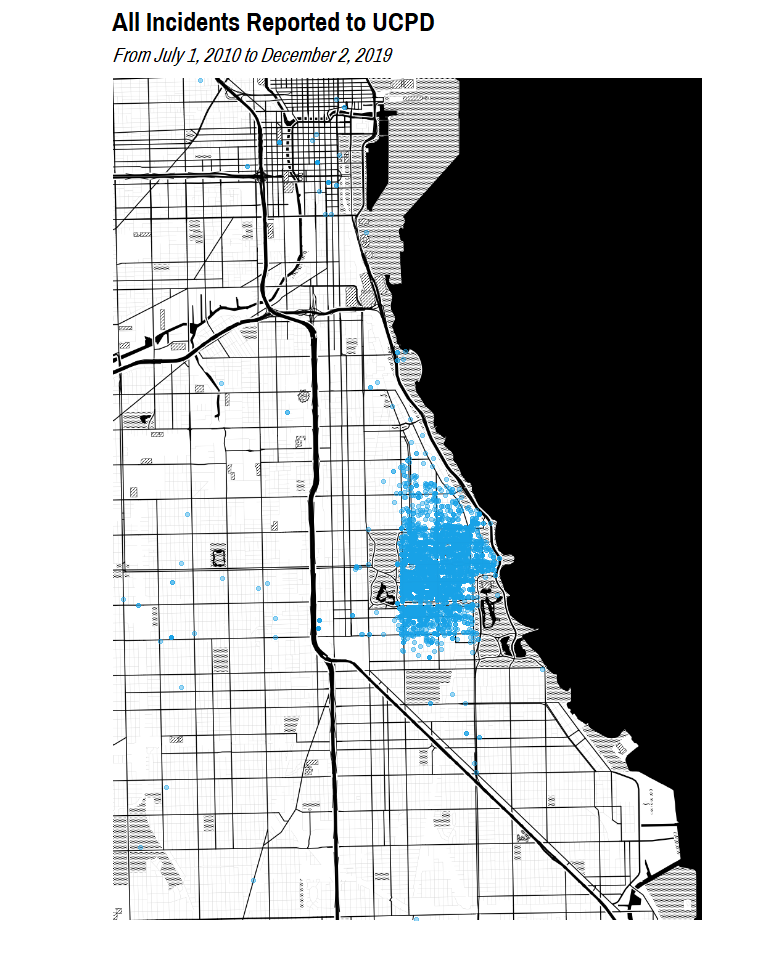
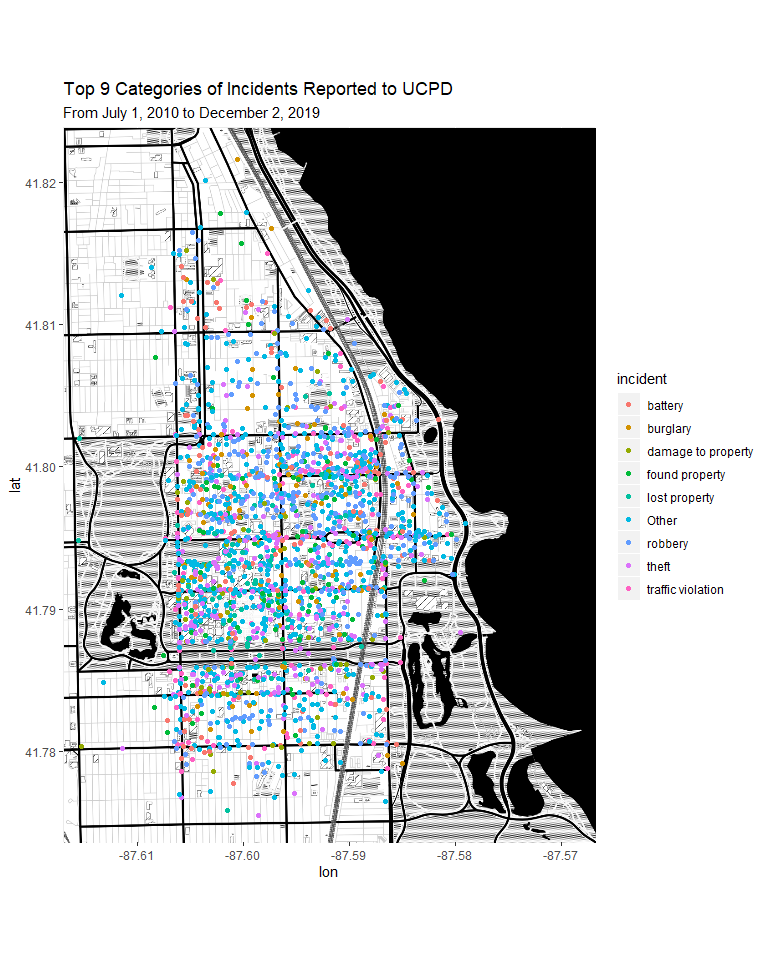
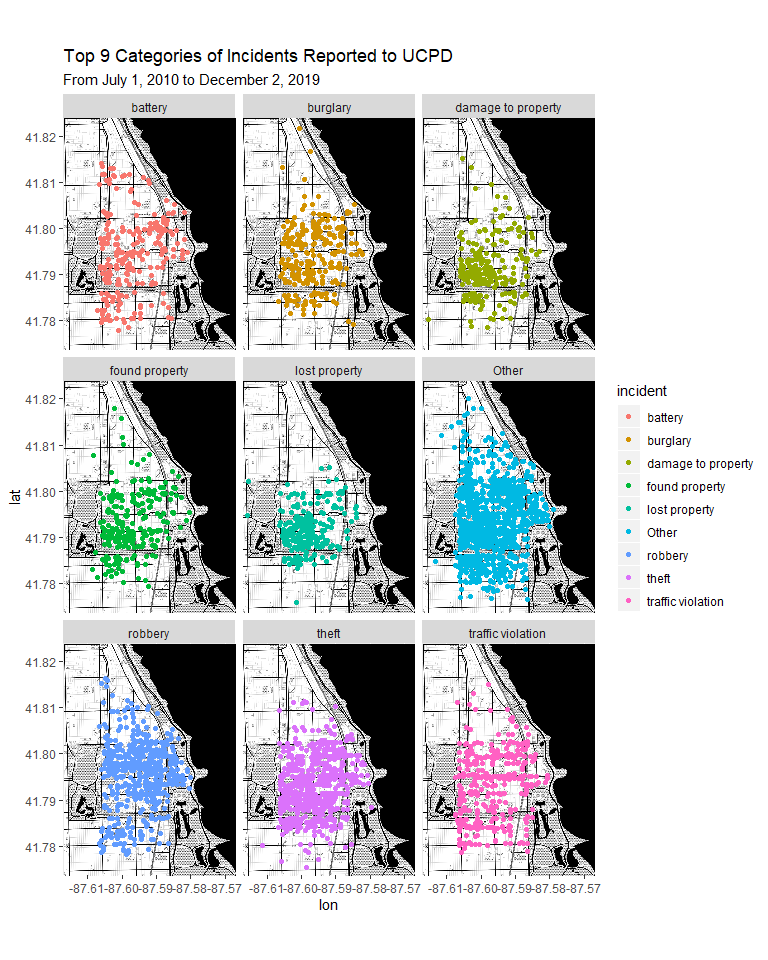
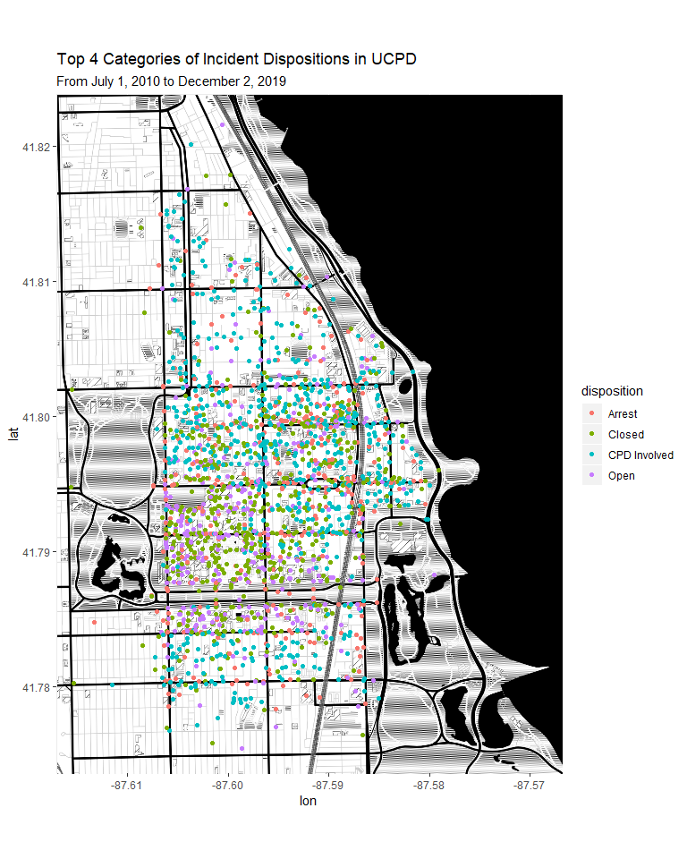
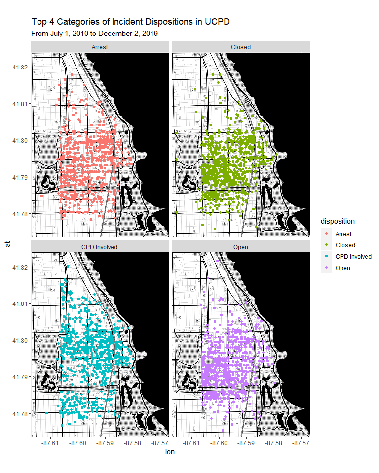
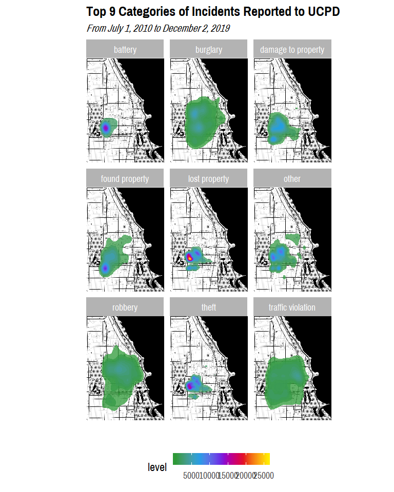
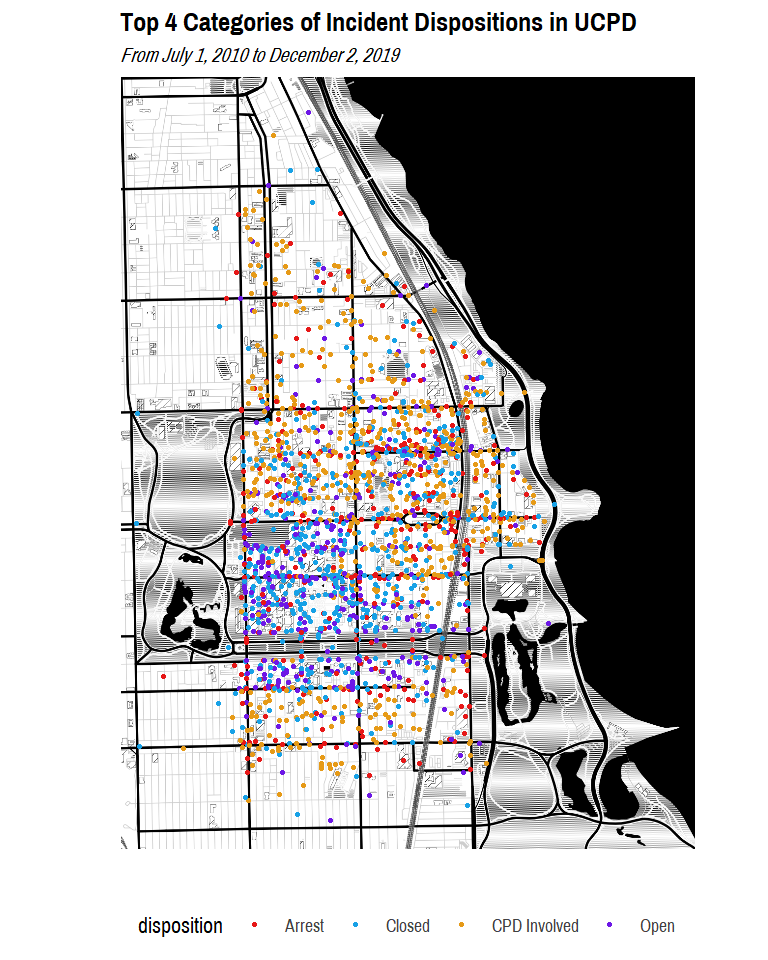
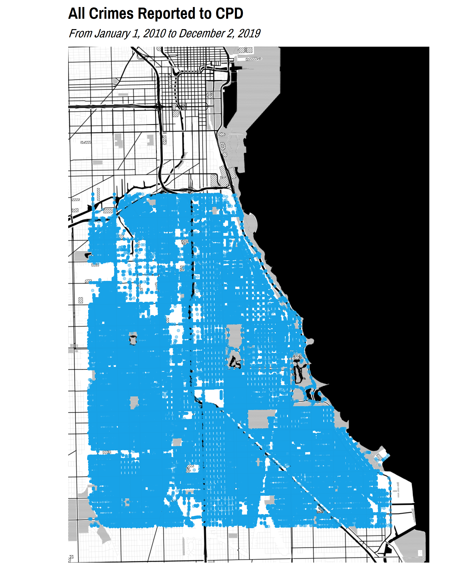
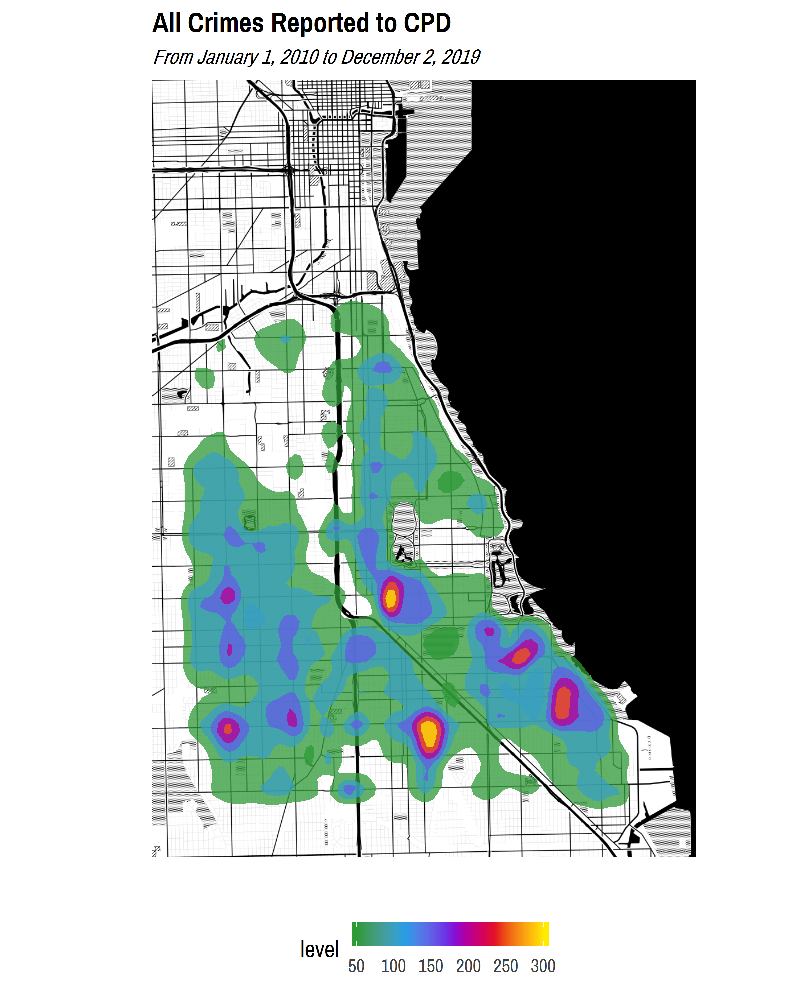

Exploratory Data Analysis
================
Adam Shelton

## UCPD

``` r
incident_data = readRDS(here("Data", "cleaned_incident_data.rds"))
```

### Incident Reports

#### Descriptive Statistics

``` r
incident_desc_stats = incident_data %>% select(-location, -reported, -occurred, -comments) %>% mutate(incident = factor(incident), disposition = factor(disposition)) %>% skim() %>% partition()

incident_desc_stats$character %>% kable()
```

| skim\_variable | n\_missing | complete\_rate | min | max | empty | n\_unique | whitespace |
| :------------- | ---------: | -------------: | --: | --: | ----: | --------: | ---------: |
| building       |       4460 |      0.6182487 |   3 |  51 |     0 |       995 |          0 |
| ucpdi\#        |        109 |      0.9906702 |   5 |  22 |     0 |     11392 |          0 |

``` r
incident_desc_stats$factor %>% kable()
```

| skim\_variable | n\_missing | complete\_rate | ordered | n\_unique | top\_counts                                |
| :------------- | ---------: | -------------: | :------ | --------: | :----------------------------------------- |
| incident       |       1317 |      0.8872721 | FALSE   |       145 | the: 3150, los: 740, tra: 723, rob: 663    |
| disposition    |          5 |      0.9995720 | FALSE   |        10 | Clo: 3843, Ope: 3647, Arr: 1768, CPD: 1509 |

``` r
incident_desc_stats$logical %>% kable()
```

| skim\_variable        | n\_missing | complete\_rate |      mean | count                |
| :-------------------- | ---------: | -------------: | --------: | :------------------- |
| in\_jurisdiction      |          3 |      0.9997432 | 0.9982877 | TRU: 11660, FAL: 20  |
| information           |          2 |      0.9998288 | 0.1883400 | FAL: 9481, TRU: 2200 |
| assist\_other\_agency |          2 |      0.9998288 | 0.0239706 | FAL: 11401, TRU: 280 |
| non\_criminal         |          2 |      0.9998288 | 0.0161801 | FAL: 11492, TRU: 189 |
| attempted             |          2 |      0.9998288 | 0.0101875 | FAL: 11562, TRU: 119 |
| warrant               |          2 |      0.9998288 | 0.0142111 | FAL: 11515, TRU: 166 |
| armed                 |          2 |      0.9998288 | 0.0242274 | FAL: 11398, TRU: 283 |
| aggravated            |          2 |      0.9998288 | 0.0196045 | FAL: 11452, TRU: 229 |

``` r
incident_desc_stats$numeric %>% kable()
```

| skim\_variable | n\_missing | complete\_rate |       mean |        sd |         p0 |        p25 |        p50 |        p75 |       p100 | hist  |
| :------------- | ---------: | -------------: | ---------: | --------: | ---------: | ---------: | ---------: | ---------: | ---------: | :---- |
| lat            |          0 |              1 |   41.79177 | 0.0732456 |   36.19211 |   41.78831 |   41.79121 |   41.79484 |   43.42786 | ▁▁▁▇▁ |
| lon            |          0 |              1 | \-87.60120 | 0.1229207 | \-95.03836 | \-87.60393 | \-87.59995 | \-87.59528 | \-80.79103 | ▁▁▇▁▁ |

``` r
incident_desc_stats$POSIXct %>% kable()
```

| skim\_variable | n\_missing | complete\_rate | min                 | max                 | median              | n\_unique |
| :------------- | ---------: | -------------: | :------------------ | :------------------ | :------------------ | --------: |
| start          |         57 |      0.9951211 | 1998-04-27 00:00:00 | 2027-02-08 19:35:00 | 2014-10-03 01:05:00 |     11478 |
| end            |       7157 |      0.3874005 | 2010-06-29 17:00:00 | 2019-12-01 07:45:00 | 2014-01-09 13:30:00 |      4472 |

#### Visualizations

``` r
chi_map = ggmap(get_stamenmap(c(left = -87.686839, bottom = 41.720873, right = -87.522685, top = 41.895756), maptype = "toner-background", zoom = 13))
```

    ## Source : http://tile.stamen.com/toner-background/13/2100/3044.png

    ## Source : http://tile.stamen.com/toner-background/13/2101/3044.png

    ## Source : http://tile.stamen.com/toner-background/13/2102/3044.png

    ## Source : http://tile.stamen.com/toner-background/13/2103/3044.png

    ## Source : http://tile.stamen.com/toner-background/13/2104/3044.png

    ## Source : http://tile.stamen.com/toner-background/13/2100/3045.png

    ## Source : http://tile.stamen.com/toner-background/13/2101/3045.png

    ## Source : http://tile.stamen.com/toner-background/13/2102/3045.png

    ## Source : http://tile.stamen.com/toner-background/13/2103/3045.png

    ## Source : http://tile.stamen.com/toner-background/13/2104/3045.png

    ## Source : http://tile.stamen.com/toner-background/13/2100/3046.png

    ## Source : http://tile.stamen.com/toner-background/13/2101/3046.png

    ## Source : http://tile.stamen.com/toner-background/13/2102/3046.png

    ## Source : http://tile.stamen.com/toner-background/13/2103/3046.png

    ## Source : http://tile.stamen.com/toner-background/13/2104/3046.png

    ## Source : http://tile.stamen.com/toner-background/13/2100/3047.png

    ## Source : http://tile.stamen.com/toner-background/13/2101/3047.png

    ## Source : http://tile.stamen.com/toner-background/13/2102/3047.png

    ## Source : http://tile.stamen.com/toner-background/13/2103/3047.png

    ## Source : http://tile.stamen.com/toner-background/13/2104/3047.png

    ## Source : http://tile.stamen.com/toner-background/13/2100/3048.png

    ## Source : http://tile.stamen.com/toner-background/13/2101/3048.png

    ## Source : http://tile.stamen.com/toner-background/13/2102/3048.png

    ## Source : http://tile.stamen.com/toner-background/13/2103/3048.png

    ## Source : http://tile.stamen.com/toner-background/13/2104/3048.png

    ## Source : http://tile.stamen.com/toner-background/13/2100/3049.png

    ## Source : http://tile.stamen.com/toner-background/13/2101/3049.png

    ## Source : http://tile.stamen.com/toner-background/13/2102/3049.png

    ## Source : http://tile.stamen.com/toner-background/13/2103/3049.png

    ## Source : http://tile.stamen.com/toner-background/13/2104/3049.png

``` r
hyde_park_map = ggmap(get_stamenmap(c(left = -87.617020, bottom = 41.773565, right = -87.566863, top = 41.823864), maptype = "toner-background", zoom = 15))
```

    ## 42 tiles needed, this may take a while (try a smaller zoom).

    ## Source : http://tile.stamen.com/toner-background/15/8408/12185.png

    ## Source : http://tile.stamen.com/toner-background/15/8409/12185.png

    ## Source : http://tile.stamen.com/toner-background/15/8410/12185.png

    ## Source : http://tile.stamen.com/toner-background/15/8411/12185.png

    ## Source : http://tile.stamen.com/toner-background/15/8412/12185.png

    ## Source : http://tile.stamen.com/toner-background/15/8413/12185.png

    ## Source : http://tile.stamen.com/toner-background/15/8408/12186.png

    ## Source : http://tile.stamen.com/toner-background/15/8409/12186.png

    ## Source : http://tile.stamen.com/toner-background/15/8410/12186.png

    ## Source : http://tile.stamen.com/toner-background/15/8411/12186.png

    ## Source : http://tile.stamen.com/toner-background/15/8412/12186.png

    ## Source : http://tile.stamen.com/toner-background/15/8413/12186.png

    ## Source : http://tile.stamen.com/toner-background/15/8408/12187.png

    ## Source : http://tile.stamen.com/toner-background/15/8409/12187.png

    ## Source : http://tile.stamen.com/toner-background/15/8410/12187.png

    ## Source : http://tile.stamen.com/toner-background/15/8411/12187.png

    ## Source : http://tile.stamen.com/toner-background/15/8412/12187.png

    ## Source : http://tile.stamen.com/toner-background/15/8413/12187.png

    ## Source : http://tile.stamen.com/toner-background/15/8408/12188.png

    ## Source : http://tile.stamen.com/toner-background/15/8409/12188.png

    ## Source : http://tile.stamen.com/toner-background/15/8410/12188.png

    ## Source : http://tile.stamen.com/toner-background/15/8411/12188.png

    ## Source : http://tile.stamen.com/toner-background/15/8412/12188.png

    ## Source : http://tile.stamen.com/toner-background/15/8413/12188.png

    ## Source : http://tile.stamen.com/toner-background/15/8408/12189.png

    ## Source : http://tile.stamen.com/toner-background/15/8409/12189.png

    ## Source : http://tile.stamen.com/toner-background/15/8410/12189.png

    ## Source : http://tile.stamen.com/toner-background/15/8411/12189.png

    ## Source : http://tile.stamen.com/toner-background/15/8412/12189.png

    ## Source : http://tile.stamen.com/toner-background/15/8413/12189.png

    ## Source : http://tile.stamen.com/toner-background/15/8408/12190.png

    ## Source : http://tile.stamen.com/toner-background/15/8409/12190.png

    ## Source : http://tile.stamen.com/toner-background/15/8410/12190.png

    ## Source : http://tile.stamen.com/toner-background/15/8411/12190.png

    ## Source : http://tile.stamen.com/toner-background/15/8412/12190.png

    ## Source : http://tile.stamen.com/toner-background/15/8413/12190.png

    ## Source : http://tile.stamen.com/toner-background/15/8408/12191.png

    ## Source : http://tile.stamen.com/toner-background/15/8409/12191.png

    ## Source : http://tile.stamen.com/toner-background/15/8410/12191.png

    ## Source : http://tile.stamen.com/toner-background/15/8411/12191.png

    ## Source : http://tile.stamen.com/toner-background/15/8412/12191.png

    ## Source : http://tile.stamen.com/toner-background/15/8413/12191.png

``` r
incident_data_analysis = incident_data  %>% filter(!is.na(incident))  %>% collapse_to_other(9, incident) 

chi_map + geom_point(data = incident_data_analysis, aes(x = lon, y = lat), color = color_pal(3, "cool")[3], alpha = 0.4) + labs(title = "All Incidents Reported to UCPD", subtitle = "From July 1, 2010 to December 2, 2019") + theme_map(base_family = "Pragati Narrow", base_size = 18)
```

    ## Warning: Removed 84 rows containing missing values (geom_point).

<!-- -->

``` r
chi_map + stat_density2d(data = incident_data, aes(x = lon, y = lat, fill = stat(level)),  geom="polygon", alpha = 0.75) +  scale_fill_gradientn(colors = color_pal(5, "heatmap")) + labs(title = "All Incidents Reported to UCPD", subtitle = "From July 1, 2010 to December 2, 2019") + theme_map(base_family = "Pragati Narrow", base_size = 18)
```

    ## Warning: Removed 90 rows containing non-finite values (stat_density2d).

<!-- -->

``` r
hyde_park_map + stat_density2d(data = incident_data, aes(x = lon, y = lat, fill = stat(level)),  geom="polygon", alpha = 0.75) +  scale_fill_gradientn(colors = color_pal(5, "heatmap")) + labs(title = "All Incidents Reported to UCPD", subtitle = "From July 1, 2010 to December 2, 2019") + theme_map(base_family = "Pragati Narrow", base_size = 18)
```

    ## Warning: Removed 322 rows containing non-finite values (stat_density2d).

<!-- -->

``` r
hyde_park_map + geom_point(data = incident_data_analysis, aes(x = lon, y = lat, color = incident)) + scale_color_manual(values = color_pal(9, "discrete")) + labs(title = "Top 9 Categories of Incidents Reported to UCPD", subtitle = "From July 1, 2010 to December 2, 2019") + theme_map(base_family = "Pragati Narrow", base_size = 18) 
```

    ## Warning: Removed 287 rows containing missing values (geom_point).

<!-- -->

``` r
hyde_park_map + geom_point(data = incident_data_analysis, aes(x = lon, y = lat, color = incident)) + scale_color_manual(values = color_pal(9, "discrete")) + facet_wrap(~ incident) + labs(title = "Top 9 Categories of Incidents Reported to UCPD", subtitle = "From July 1, 2010 to December 2, 2019") + theme_map(base_family = "Pragati Narrow", base_size = 18)
```

    ## Warning: Removed 287 rows containing missing values (geom_point).

<!-- -->

``` r
hyde_park_map + geom_point(data = incident_data_analysis %>% filter(disposition %in% c("Arrest", "Closed", "CPD Involved", "Open")), aes(x = lon, y = lat, color = disposition)) + scale_color_manual(values = color_pal(4, "discrete")) + labs(title = "Top 4 Categories of Incident Dispositions in UCPD", subtitle = "From July 1, 2010 to December 2, 2019") + theme_map(base_family = "Pragati Narrow", base_size = 18)
```

    ## Warning: Removed 272 rows containing missing values (geom_point).

<!-- -->

``` r
hyde_park_map + geom_point(data = incident_data_analysis %>% filter(disposition %in% c("Arrest", "Closed", "CPD Involved", "Open")), aes(x = lon, y = lat, color = disposition)) + scale_color_manual(values = color_pal(4, "discrete")) + facet_wrap(~ disposition) + labs(title = "Top 4 Categories of Incident Dispositions in UCPD", subtitle = "From July 1, 2010 to December 2, 2019") + theme_map(base_family = "Pragati Narrow", base_size = 18)
```

    ## Warning: Removed 272 rows containing missing values (geom_point).

<!-- -->

## CPD

``` r
cpd_crime_data = readRDS(here("Data", "cleaned_crime_data.rds"))
```

### Crime Reports

#### Descriptive Statistics

#### Visualizations

``` r
chi_map + geom_point(data = cpd_crime_data, aes(x = longitude, y = latitude), color = color_pal(3, "cool")[3], alpha = 0.4) + labs(title = "All Crimes Reported to CPD", subtitle = "From January 1, 2010 to December 2, 2019") + theme_map(base_family = "Pragati Narrow", base_size = 18)
```

<!-- -->

``` r
chi_map + stat_density2d(data = cpd_crime_data, aes(x = longitude, y = latitude, fill = stat(level)),  geom="polygon", alpha = 0.75) +  scale_fill_gradientn(colors = color_pal(5, "heatmap")) + labs(title = "All Crimes Reported to CPD", subtitle = "From January 1, 2010 to December 2, 2019") + theme_map(base_family = "Pragati Narrow", base_size = 18)
```

<!-- -->
