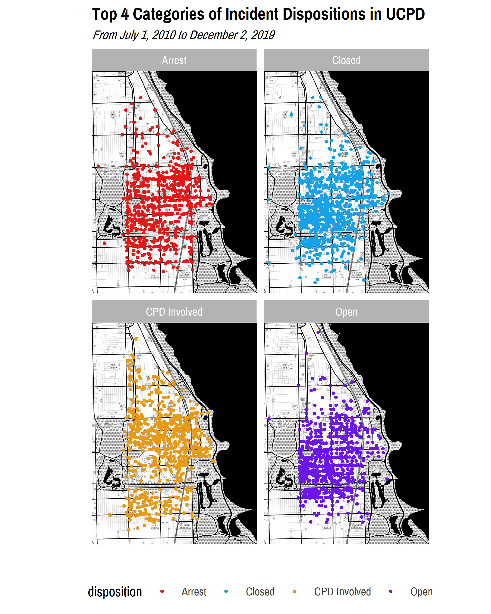
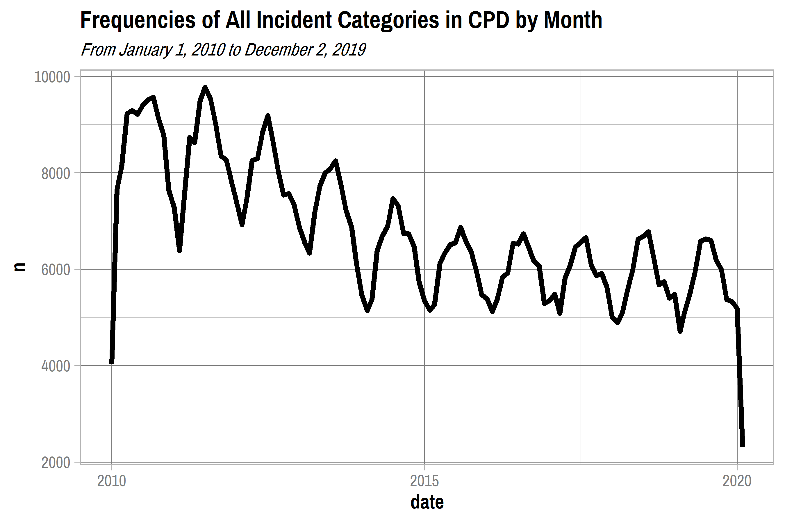
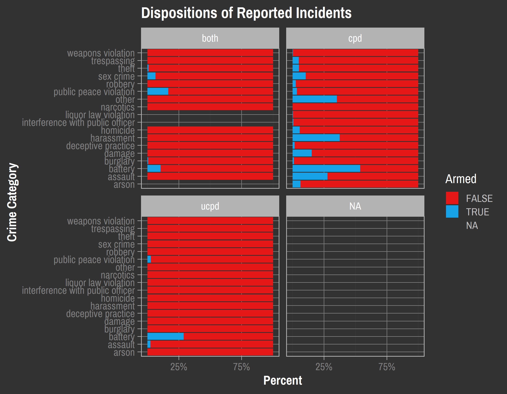
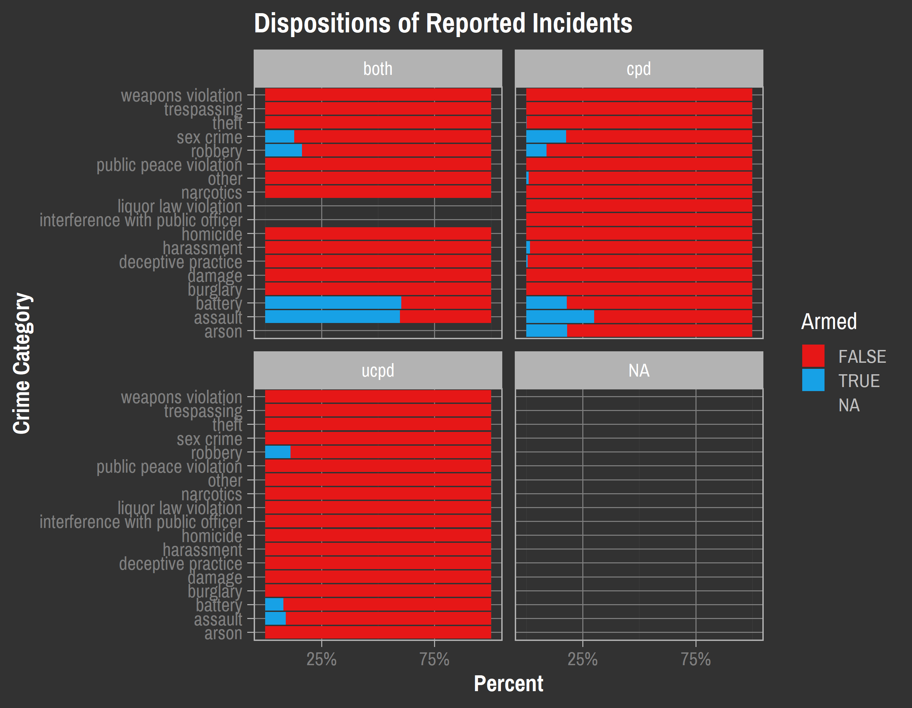

Exploratory Data Analysis
================
Adam Shelton

## UCPD

``` r
incident_data = readRDS(here("Data", "cleaned_incident_data.rds"))
```

### Incident Reports

#### Descriptive Statistics

``` r
incident_desc_stats = incident_data %>% select(-location, -reported, -occurred, -comments) %>% mutate(incident = factor(incident), disposition = factor(disposition)) %>% skim() %>% partition()

incident_desc_stats$character %>% kable()
```

| skim\_variable | n\_missing | complete\_rate | min | max | empty | n\_unique | whitespace |
| :------------- | ---------: | -------------: | --: | --: | ----: | --------: | ---------: |
| building       |       4460 |      0.6182487 |   3 |  51 |     0 |       995 |          0 |
| ucpdi\#        |        109 |      0.9906702 |   5 |  22 |     0 |     11392 |          0 |
| cpd\_case\_id  |      10594 |      0.0932124 |   8 |   8 |     0 |      1086 |          0 |

``` r
incident_desc_stats$factor %>% kable()
```

| skim\_variable | n\_missing | complete\_rate | ordered | n\_unique | top\_counts                                |
| :------------- | ---------: | -------------: | :------ | --------: | :----------------------------------------- |
| incident       |       1317 |      0.8872721 | FALSE   |       145 | the: 3150, los: 740, tra: 723, rob: 663    |
| disposition    |          5 |      0.9995720 | FALSE   |        10 | Clo: 3843, Ope: 3647, Arr: 1768, CPD: 1509 |

``` r
incident_desc_stats$logical %>% kable()
```

| skim\_variable        | n\_missing | complete\_rate |      mean | count                |
| :-------------------- | ---------: | -------------: | --------: | :------------------- |
| in\_jurisdiction      |          3 |      0.9997432 | 0.9982877 | TRU: 11660, FAL: 20  |
| information           |          2 |      0.9998288 | 0.1883400 | FAL: 9481, TRU: 2200 |
| assist\_other\_agency |          2 |      0.9998288 | 0.0239706 | FAL: 11401, TRU: 280 |
| non\_criminal         |          2 |      0.9998288 | 0.0161801 | FAL: 11492, TRU: 189 |
| attempted             |          2 |      0.9998288 | 0.0101875 | FAL: 11562, TRU: 119 |
| warrant               |          2 |      0.9998288 | 0.0142111 | FAL: 11515, TRU: 166 |
| armed                 |          2 |      0.9998288 | 0.0242274 | FAL: 11398, TRU: 283 |
| aggravated            |          2 |      0.9998288 | 0.0196045 | FAL: 11452, TRU: 229 |
| domestic              |          2 |      0.9998288 | 0.0101019 | FAL: 11563, TRU: 118 |
| arrest                |          5 |      0.9995720 | 0.1513958 | FAL: 9910, TRU: 1768 |

``` r
incident_desc_stats$numeric %>% kable()
```

| skim\_variable | n\_missing | complete\_rate |       mean |        sd |          p0 |        p25 |        p50 |        p75 |       p100 | hist  |
| :------------- | ---------: | -------------: | ---------: | --------: | ----------: | ---------: | ---------: | ---------: | ---------: | :---- |
| lat            |          1 |      0.9999144 |   41.79275 | 0.0373953 |    39.87869 |   41.78831 |   41.79121 |   41.79484 |   43.42906 | ▁▁▇▁▁ |
| lon            |          1 |      0.9999144 | \-87.60241 | 0.1713181 | \-102.28243 | \-87.60393 | \-87.59995 | \-87.59526 | \-80.79103 | ▁▁▁▇▁ |

``` r
incident_desc_stats$POSIXct %>% kable()
```

| skim\_variable | n\_missing | complete\_rate | min                 | max                 | median              | n\_unique |
| :------------- | ---------: | -------------: | :------------------ | :------------------ | :------------------ | --------: |
| start          |         57 |      0.9951211 | 1998-04-27 00:00:00 | 2027-02-08 19:35:00 | 2014-10-03 01:05:00 |     11478 |
| end            |       7157 |      0.3874005 | 2010-06-29 17:00:00 | 2019-12-01 07:45:00 | 2014-01-09 13:30:00 |      4472 |

#### Visualizations

``` r
chi_map = ggmap(get_stamenmap(c(left = -87.686839, bottom = 41.720873, right = -87.522685, top = 41.895756), maptype = "toner-background", zoom = 13))

hyde_park_map = ggmap(get_stamenmap(c(left = -87.617020, bottom = 41.773565, right = -87.566863, top = 41.823864), maptype = "toner-background", zoom = 15))
```

``` r
incident_data_analysis = incident_data  %>% filter(!is.na(incident))  %>% mutate(incident = collapse_to_other(incident, 9))

chi_map + geom_point(data = incident_data_analysis, aes(x = lon, y = lat), color = color_pal(3, "cool")[3], alpha = 0.4) + labs(title = "All Incidents Reported to UCPD", subtitle = "From July 1, 2010 to December 2, 2019") + theme_map(base_family = "Pragati Narrow", base_size = 18)
```

<!-- -->

``` r
chi_map + stat_density2d(data = incident_data, aes(x = lon, y = lat, fill = stat(level)),  geom="polygon", alpha = 0.75) +  scale_fill_gradientn(colors = color_pal(5, "heatmap")) + labs(title = "All Incidents Reported to UCPD", subtitle = "From July 1, 2010 to December 2, 2019") + theme_map(base_family = "Pragati Narrow", base_size = 18)
```

<!-- -->

``` r
hyde_park_map + stat_density2d(data = incident_data, aes(x = lon, y = lat, fill = stat(level)),  geom="polygon", alpha = 0.75) +  scale_fill_gradientn(colors = color_pal(5, "heatmap")) + labs(title = "All Incidents Reported to UCPD", subtitle = "From July 1, 2010 to December 2, 2019") + theme_map(base_family = "Pragati Narrow", base_size = 18)
```

<!-- -->

``` r
hyde_park_map + geom_point(data = incident_data_analysis, aes(x = lon, y = lat, color = incident)) + scale_color_manual(values = color_pal(9, "discrete")) + labs(title = "Top 9 Categories of Incidents Reported to UCPD", subtitle = "From July 1, 2010 to December 2, 2019") + theme_map(base_family = "Pragati Narrow", base_size = 18) 
```

<!-- -->

``` r
hyde_park_map + geom_point(data = incident_data_analysis, aes(x = lon, y = lat, color = incident)) + scale_color_manual(values = color_pal(9, "discrete")) + facet_wrap(~ incident) + labs(title = "Top 9 Categories of Incidents Reported to UCPD", subtitle = "From July 1, 2010 to December 2, 2019") + theme_map(base_family = "Pragati Narrow", base_size = 18)
```

<!-- -->

``` r
hyde_park_map + stat_density2d(data = incident_data_analysis, aes(x = lon, y = lat, fill = stat(level)),  geom="polygon", alpha = 0.75) +  scale_fill_gradientn(colors = color_pal(5, "heatmap")) + facet_wrap(~ incident) + labs(title = "Top 9 Categories of Incidents Reported to UCPD", subtitle = "From July 1, 2010 to December 2, 2019") + theme_map(base_family = "Pragati Narrow", base_size = 18)
```

<!-- -->

``` r
hyde_park_map + geom_point(data = incident_data_analysis %>% filter(disposition %in% c("Arrest", "Closed", "CPD Involved", "Open")), aes(x = lon, y = lat, color = disposition)) + scale_color_manual(values = color_pal(4, "discrete")) + labs(title = "Top 4 Categories of Incident Dispositions in UCPD", subtitle = "From July 1, 2010 to December 2, 2019") + theme_map(base_family = "Pragati Narrow", base_size = 18)
```

<!-- -->

``` r
hyde_park_map + geom_point(data = incident_data_analysis %>% filter(disposition %in% c("Arrest", "Closed", "CPD Involved", "Open")), aes(x = lon, y = lat, color = disposition)) + scale_color_manual(values = color_pal(4, "discrete")) + facet_wrap(~ disposition) + labs(title = "Top 4 Categories of Incident Dispositions in UCPD", subtitle = "From July 1, 2010 to December 2, 2019") + theme_map(base_family = "Pragati Narrow", base_size = 18)
```

<!-- -->

``` r
hyde_park_map + stat_density2d(data = incident_data_analysis %>% filter(disposition %in% c("Arrest", "Closed", "CPD Involved", "Open")), aes(x = lon, y = lat, fill = stat(level)),  geom="polygon", alpha = 0.75) + scale_fill_gradientn(colors = color_pal(5, "heatmap")) + facet_wrap(~ disposition) + labs(title = "Top 4 Categories of Incident Dispositions in UCPD", subtitle = "From July 1, 2010 to December 2, 2019") + theme_map(base_family = "Pragati Narrow", base_size = 18)
```

<!-- -->

``` r
incident_data %>% filter(!is.na(incident)) %>% count(incident, sort = TRUE) %>%  ggplot(aes(area = n, fill = incident, label = incident)) + geom_treemap() + geom_treemap_text(grow = TRUE, reflow = TRUE, color = "white", family = "Pragati Narrow") + scale_fill_manual(values = color_pal(5, type = "continuous", levels = length(unique(incident_data$incident)))) + labs(title = "Categories of Incidents in UCPD Reports", subtitle = "From July 1, 2010 to December 2, 2019") + theme_day(base_family = "Pragati Narrow", base_size = 18) + hide_legend 
```

<!-- -->

``` r
top_categories = incident_data %>% filter(!is.na(incident)) %>% count(incident) %>% top_n(10, n) %>% .$incident

incident_data %>% filter(!is.na(incident), incident %in% top_categories) %>% mutate(disposition = collapse_to_other(disposition, 6)) %>% count(incident, disposition) %>% crosstab_percent() %>% arrange(incident) %>% ggplot(aes(x = incident, y = percent, fill = disposition)) + geom_col() + coord_flip() + scale_y_continuous(labels = percent_format()) + scale_fill_manual(values = color_pal(6)) + labs(title = "Dispositions of Top 10 UCPD Incidents", subtitle = "From July 1, 2010 to December 2, 2019") + theme_day(base_family = "Pragati Narrow", base_size = 18) 
```

<!-- -->

``` r
incident_data %>% filter(!is.na(incident), year(start) <= Sys.Date() %>% year()) %>% mutate(start = round_date(start, "month") %>% date()) %>% count(start) %>% ggplot(aes(x = start, y = n), group = 1) + geom_line(size = 2) + labs(title = "Frequencies of All Incident Categories in UCPD by Month") + theme_day(base_family = "Pragati Narrow", base_size = 18) 
```

<!-- -->

``` r
#top_categories = incident_data %>% filter(!is.na(incident)) %>% count(incident) %>% top_n(8, n) %>% .$incident

incident_data %>% filter(!is.na(incident), incident %in% top_categories) %>% mutate(start = round_date(start, "month") %>% date()) %>% count(incident, start) %>% ggplot(aes(x = start, y = n, color = incident, group = incident)) + geom_line(size = 1.5) + facet_wrap(~ incident) + scale_color_manual(values = color_pal(10)) + labs(title = "Frequencies of Top 10 Incident Categories in UCPD by Month", subtitle = "From July 1, 2010 to December 2, 2019") + theme_day(base_family = "Pragati Narrow", base_size = 18) + hide_legend 
```

<!-- -->

``` r
incident_data %>% filter(!is.na(start)) %>% mutate(day = wday(start) %>% factor(levels = 1:7, labels = c("Sunday", "Monday", "Tuesday", "Wednesday", "Thursday", "Friday", "Saturday")), hour = hour(start)) %>% count(day, hour) %>% ggplot(aes(x = hour, y = day)) + geom_raster(aes(fill=n)) + scale_fill_gradientn(colors = color_pal(5, "continuous")) + theme_day(base_family = "Pragati Narrow", base_size = 18) + labs(title = "Frequencies of UCPD Incident Reports by Time", subtitle = "From July 1, 2010 to December 2, 2019", y = "Day of Week", x = "Time of Day", fill = "Number of \nReported Incidents")
```

<!-- -->

``` r
incident_data_analysis %>% filter(incident == "traffic violation") %>% mutate(start = year(start)) %>% count(start) %>% arrange(start) %>% kable(caption = "Number of Traffic Violations Reported by UCPD by Year") 
```

| start |   n |
| ----: | --: |
|  2011 |  39 |
|  2012 | 481 |
|  2013 | 183 |
|  2014 |   8 |
|  2018 |   1 |
|  2019 |   4 |
|    NA |   7 |

Number of Traffic Violations Reported by UCPD by Year

``` r
incident_data %>% filter(is.na(start)) %>% mutate(reported = year(start)) %>% count(start) %>% arrange(start) %>% kable(caption = "Number of Uncategorized Incidents Reported by UCPD by Year") 
```

| start |  n |
| :---- | -: |
| NA    | 57 |

Number of Uncategorized Incidents Reported by UCPD by Year

``` r
incident_data %>% filter(is.na(start))
```

    ## # A tibble: 57 x 23
    ##    incident location building reported            occurred comments disposition
    ##    <chr>    <chr>    <chr>    <dttm>              <chr>    <chr>    <chr>      
    ##  1 damage ~ 6031 s.~ south c~ 2010-07-21 14:13:00 7/1910 ~ Window ~ Closed     
    ##  2 damage ~ ellis b~ <NA>     2010-10-03 13:05:00 Unknown  Complai~ Open       
    ##  3 <NA>     univers~ <NA>     2010-10-26 09:02:00 Unknown  Copper ~ Closed     
    ##  4 damage ~ 5706 s.~ reynold~ 2012-03-04 08:50:00 3/3/112~ Unknown~ Open       
    ##  5 lost pr~ 901 e. ~ mitchel~ 2012-03-09 01:57:00 3/8/112~ Patient~ Closed     
    ##  6 traffic~ 60th & ~ <NA>     2012-06-06 10:43:00 6/6/112~ UCPD of~ Arrest     
    ##  7 theft    935 e. ~ bike ra~ 2012-06-15 09:20:00 6/14/11~ Unknown~ Open       
    ##  8 traffic~ 57th be~ <NA>     2012-07-07 11:07:00 7/7/121~ UCPD of~ Arrest     
    ##  9 theft    53rd be~ <NA>     2012-07-08 19:06:00 7/8/112~ Unknown~ Open       
    ## 10 traffic~ 6300 s.~ <NA>     2012-08-14 10:33:00 8/14/12~ UCPD of~ Arrest     
    ## # ... with 47 more rows, and 16 more variables: `ucpdi#` <chr>, start <dttm>,
    ## #   end <dttm>, in_jurisdiction <lgl>, information <lgl>,
    ## #   assist_other_agency <lgl>, non_criminal <lgl>, attempted <lgl>,
    ## #   warrant <lgl>, armed <lgl>, aggravated <lgl>, domestic <lgl>,
    ## #   cpd_case_id <chr>, arrest <lgl>, lat <dbl>, lon <dbl>

## CPD

``` r
cpd_crime_data = readRDS(here("Data", "cleaned_crime_data.rds")) %>% mutate(primary_type = factor(primary_type), location_description = factor(location_description))

#left = -87.617020, bottom = 41.773565, right = -87.566863, top = 41.823864
cpd_crime_data_hp = cpd_crime_data %>% filter(longitude < -87.566863, longitude > -87.617020, latitude > 41.773565, latitude < 41.823864)
```

### Crime Reports

#### Descriptive Statistics

``` r
cpd_stats = cpd_crime_data %>% skim() %>% partition()

cpd_stats$character %>% kable()
```

| skim\_variable | n\_missing | complete\_rate | min | max | empty | n\_unique | whitespace |
| :------------- | ---------: | -------------: | --: | --: | ----: | --------: | ---------: |
| id             |          0 |              1 |   5 |   8 |     0 |    822414 |          0 |
| case\_number   |          0 |              1 |   6 |   9 |     0 |    822322 |          0 |
| block          |          0 |              1 |  14 |  35 |     0 |      7047 |          0 |
| iucr           |          0 |              1 |   4 |   4 |     0 |       356 |          0 |
| description    |          0 |              1 |   5 |  59 |     0 |       333 |          0 |

``` r
cpd_stats$factor %>% kable()
```

| skim\_variable        | n\_missing | complete\_rate | ordered | n\_unique | top\_counts                                        |
| :-------------------- | ---------: | -------------: | :------ | --------: | :------------------------------------------------- |
| primary\_type         |          0 |      1.0000000 | FALSE   |        33 | BAT: 176569, THE: 143341, CRI: 89385, NAR: 69073   |
| location\_description |        733 |      0.9991087 | FALSE   |       137 | STR: 191442, APA: 147960, RES: 147087, SID: 85142  |
| beat                  |          0 |      1.0000000 | FALSE   |        98 | 042: 23861, 062: 21158, 041: 19060, 062: 18961     |
| district              |          0 |      1.0000000 | FALSE   |        14 | 007: 169159, 006: 160550, 003: 148368, 002: 125690 |
| ward                  |          0 |      1.0000000 | FALSE   |        21 | 17: 93904, 20: 92831, 6: 90334, 3: 72645           |
| community\_area       |        105 |      0.9998723 | FALSE   |        31 | 43: 99210, 67: 83321, 71: 82523, 68: 75540         |
| fbi\_code             |          0 |      1.0000000 | FALSE   |        26 | 08B: 147927, 06: 143341, 14: 89385, 26: 79945      |

``` r
cpd_stats$logical %>% kable()
```

| skim\_variable | n\_missing | complete\_rate |      mean | count                    |
| :------------- | ---------: | -------------: | --------: | :----------------------- |
| arrest         |          0 |              1 | 0.2555343 | FAL: 612259, TRU: 210155 |
| domestic       |          0 |              1 | 0.1979064 | FAL: 659653, TRU: 162761 |
| aggravated     |          0 |              1 | 0.0697508 | FAL: 765050, TRU: 57364  |
| attempted      |          0 |              1 | 0.0111270 | FAL: 813263, TRU: 9151   |
| armed          |          0 |              1 | 0.0228997 | FAL: 803581, TRU: 18833  |

``` r
cpd_stats$numeric %>% kable()
```

| skim\_variable | n\_missing | complete\_rate |       mean |        sd |         p0 |        p25 |        p50 |        p75 |       p100 | hist  |
| :------------- | ---------: | -------------: | ---------: | --------: | ---------: | ---------: | ---------: | ---------: | ---------: | :---- |
| year           |          0 |              1 | 2014.10194 | 2.9318026 | 2010.00000 | 2011.00000 | 2014.00000 | 2017.00000 | 2020.00000 | ▇▅▃▃▂ |
| latitude       |          0 |              1 |   41.77554 | 0.0276718 |   41.73299 |   41.75269 |   41.77000 |   41.79451 |   41.84588 | ▇▇▅▃▂ |
| longitude      |          0 |              1 | \-87.62164 | 0.0343465 | \-87.67754 | \-87.65092 | \-87.62252 | \-87.59936 | \-87.54017 | ▇▇▇▅▃ |

``` r
cpd_stats$POSIXct %>% kable()
```

| skim\_variable | n\_missing | complete\_rate | min                 | max                 | median              | n\_unique |
| :------------- | ---------: | -------------: | :------------------ | :------------------ | :------------------ | --------: |
| date           |         35 |      0.9999574 | 2010-01-01 06:00:00 | 2020-01-31 05:23:00 | 2014-05-05 04:30:00 |    520781 |
| updated\_on    |          0 |      1.0000000 | 2015-08-17 20:03:40 | 2020-02-06 21:56:30 | 2018-02-10 21:50:01 |      1684 |

#### Visualizations

``` r
chi_map + geom_point(data = cpd_crime_data, aes(x = longitude, y = latitude), color = color_pal(3, "cool")[3], alpha = 0.4) + labs(title = "All Crimes Reported to CPD", subtitle = "From January 1, 2010 to December 2, 2019") + theme_map(base_family = "Pragati Narrow", base_size = 18)
```

<!-- -->

``` r
chi_map + stat_density2d(data = cpd_crime_data, aes(x = longitude, y = latitude, fill = stat(level)),  geom="polygon", alpha = 0.75) +  scale_fill_gradientn(colors = color_pal(5, "heatmap")) + labs(title = "All Crimes Reported to CPD", subtitle = "From January 1, 2010 to December 2, 2019") + theme_map(base_family = "Pragati Narrow", base_size = 18)
```

<!-- -->

``` r
hyde_park_map + stat_density2d(data = cpd_crime_data_hp, aes(x = longitude, y = latitude, fill = stat(level)),  geom="polygon", alpha = 0.75) +  scale_fill_gradientn(colors = color_pal(5, "heatmap")) + labs(title = "All Crimes Reported to CPD", subtitle = "From January 1, 2010 to December 2, 2019, surrounding Hyde Park") + theme_map(base_family = "Pragati Narrow", base_size = 18)
```

<!-- -->

``` r
hyde_park_map + stat_density2d(data = mutate(cpd_crime_data_hp, primary_type = collapse_to_other(primary_type, 9) %>% str_to_lower()), aes(x = longitude, y = latitude, fill = stat(level)),  geom="polygon", alpha = 0.75) +  scale_fill_gradientn(colors = color_pal(5, "heatmap")) + facet_wrap(~ primary_type) + labs(title = "Top 9 Categories of Incidents Reported to CPD", subtitle = "From January 1, 2010 to December 2, 2019") + theme_map(base_family = "Pragati Narrow", base_size = 18)
```

<!-- -->

``` r
cpd_crime_data %>% filter(!is.na(primary_type)) %>% count(primary_type, sort = TRUE) %>% ggplot(aes(area = n, fill = primary_type, label = str_to_lower(primary_type))) + geom_treemap() + geom_treemap_text(grow = TRUE, reflow = TRUE, color = "white", family = "Pragati Narrow") + scale_fill_manual(values = color_pal(5, type = "continuous", levels = length(unique(cpd_crime_data$primary_type)))) + labs(title = "Categories of Incidents in CPD Reports", subtitle = "From January 1, 2010 to December 2, 2019") + theme_day(base_family = "Pragati Narrow", base_size = 18) + hide_legend 
```

<!-- -->

``` r
cpd_top_categories = cpd_crime_data %>% filter(!is.na(primary_type)) %>% count(primary_type) %>% top_n(10, n) %>% .$primary_type

cpd_crime_data %>% filter(!is.na(primary_type), primary_type %in% cpd_top_categories) %>% count(primary_type, arrest) %>% crosstab_percent() %>% arrange(primary_type) %>% ggplot(aes(x = primary_type, y = percent, fill = arrest)) + geom_col() + coord_flip() + scale_y_continuous(labels = percent_format()) + scale_fill_manual(values = color_pal(2)) + labs(title = "Dispositions of Top 10 CPD Incidents", subtitle = "From January 1, 2010 to December 2, 2019") + theme_day(base_family = "Pragati Narrow", base_size = 18) 
```

<!-- -->

``` r
cpd_crime_data %>% filter(!is.na(primary_type), year(date) <= Sys.Date() %>% year()) %>% mutate(date = round_date(date, "month") %>% date()) %>% count(date) %>% ggplot(aes(x = date, y = n), group = 1) + geom_line(size = 2) + labs(title = "Frequencies of All Incident Categories in CPD by Month", subtitle = "From January 1, 2010 to December 2, 2019") + theme_day(base_family = "Pragati Narrow", base_size = 18) 
```

<!-- -->

``` r
#top_categories = incident_data %>% filter(!is.na(incident)) %>% count(incident) %>% top_n(8, n) %>% .$incident

cpd_crime_data %>% filter(!is.na(primary_type), primary_type %in% cpd_top_categories) %>% mutate(date = round_date(date, "month") %>% date()) %>% count(primary_type, date) %>% ggplot(aes(x = date, y = n, color = primary_type, group = primary_type)) + geom_line(size = 1.5) + facet_wrap(~ primary_type) + scale_color_manual(values = color_pal(10)) + labs(title = "Frequencies of Top 10 Incident Categories in CPD by Month") + theme_day(base_family = "Pragati Narrow", base_size = 18) + hide_legend
```

<!-- -->

``` r
cpd_crime_data %>% filter(!is.na(date)) %>% mutate(day = wday(date) %>% factor(levels = 1:7, labels = c("Sunday", "Monday", "Tuesday", "Wednesday", "Thursday", "Friday", "Saturday")), hour = hour(date)) %>% count(day, hour) %>% ggplot(aes(x = hour, y = day)) + geom_raster(aes(fill=n)) + scale_fill_gradientn(colors = color_pal(5, "continuous")) + theme_day(base_family = "Pragati Narrow", base_size = 18) + labs(title = "Frequencies of CPD Crime Reports by Time", subtitle = "From January 1, 2010 to December 2, 2019", y = "Day of Week", x = "Time of Day", fill = "Number of \nReported Crimes")
```

<!-- -->

``` r
cpd_crime_data_hp %>% filter(!is.na(date)) %>% mutate(day = wday(date) %>% factor(levels = 1:7, labels = c("Sunday", "Monday", "Tuesday", "Wednesday", "Thursday", "Friday", "Saturday")), hour = hour(date)) %>% count(day, hour) %>% ggplot(aes(x = hour, y = day)) + geom_raster(aes(fill=n)) + scale_fill_gradientn(colors = color_pal(5, "continuous")) + theme_day(base_family = "Pragati Narrow", base_size = 18) + labs(title = "Frequencies of CPD Crime Reports by Time", subtitle = "Surrounding Hyde Park, from January 1, 2010 to December 2, 2019", y = "Day of Week", x = "Time of Day", fill = "Number of \nReported Crimes")
```

<!-- -->

### Comparing Categories Between Datasets

``` r
cat_comp = incident_data %>% count(incident, sort = TRUE) %>% .[1:33,] %>% bind_cols(cpd_crime_data %>% count(primary_type, sort = TRUE)) %>% mutate(primary_type = str_to_lower(primary_type))
```

## Merged and Cleaned Data

``` r
merged_crime_data = readRDS(here("Data", "merged_crime_data_final.rds"))
```

``` r
merged_crime_data %>% count(primary_type, responding_dept) %>% na.omit() %>% crosstab_percent(vars = c("responding_dept")) %>% ggplot(aes(x = responding_dept, color = primary_type, fill =  primary_type, y = percent)) + geom_col() + coord_flip() + scale_y_continuous(labels = percent) + scale_fill_manual(values = color_pal(7, "discrete", levels = length(unique(merged_crime_data$primary_type)))) + scale_color_manual(values = color_pal(7, "discrete", levels = length(unique(merged_crime_data$primary_type)))) + labs(title = "Categories of Crimes by Department", x = "Responding Department", y = "Percent", color = "Crime\nCategory", fill = "Crime\nCategory") + theme_night(base_family = "Pragati Narrow", base_size = 18)
```

    ## Warning: Factor `responding_dept` contains implicit NA, consider using
    ## `forcats::fct_explicit_na`

<!-- -->

``` r
merged_crime_data %>% count(primary_type, responding_dept, arrest) %>% crosstab_percent() %>% arrange(primary_type) %>% ggplot(aes(x = primary_type, y = percent, fill = arrest)) + facet_wrap(~ responding_dept) + geom_col() + coord_flip() + scale_y_continuous(breaks=c(0.25, 0.75), labels = percent_format()) + scale_fill_manual(values = color_pal(2)) + labs(title = "Dispositions of Reported Incidents", x = "Crime Category", y = "Percent", fill = "Arrest Made") + theme_night(base_family = "Pragati Narrow", base_size = 18)  
```

    ## Warning: Factor `responding_dept` contains implicit NA, consider using
    ## `forcats::fct_explicit_na`

<!-- -->

``` r
merged_crime_data %>% count(primary_type, responding_dept, armed) %>% crosstab_percent() %>% arrange(primary_type) %>% ggplot(aes(x = primary_type, y = percent, fill = armed)) + facet_wrap(~ responding_dept) + geom_col() + coord_flip() + scale_y_continuous(breaks=c(0.25, 0.75), labels = percent_format()) + scale_fill_manual(values = color_pal(2)) + labs(title = "Dispositions of Reported Incidents", x = "Crime Category", y = "Percent", fill = "Armed") + theme_night(base_family = "Pragati Narrow", base_size = 18)
```

    ## Warning: Factor `responding_dept` contains implicit NA, consider using
    ## `forcats::fct_explicit_na`

    ## Warning: Removed 1 rows containing missing values (geom_col).

<!-- -->

``` r
merged_crime_data %>% count(primary_type, responding_dept, domestic) %>% crosstab_percent() %>% arrange(primary_type) %>% ggplot(aes(x = primary_type, y = percent, fill = domestic)) + facet_wrap(~ responding_dept) + geom_col() + coord_flip() + scale_y_continuous(breaks=c(0.25, 0.75), labels = percent_format()) + scale_fill_manual(values = color_pal(2)) + labs(title = "Dispositions of Reported Incidents", x = "Crime Category", y = "Percent", fill = "Armed") + theme_night(base_family = "Pragati Narrow", base_size = 18)
```

    ## Warning: Factor `responding_dept` contains implicit NA, consider using
    ## `forcats::fct_explicit_na`
    
    ## Warning: Removed 1 rows containing missing values (geom_col).

<!-- -->

``` r
merged_crime_data %>% count(primary_type, responding_dept, attempted) %>% crosstab_percent() %>% arrange(primary_type) %>% ggplot(aes(x = primary_type, y = percent, fill = attempted)) + facet_wrap(~ responding_dept) + geom_col() + coord_flip() + scale_y_continuous(breaks=c(0.25, 0.75), labels = percent_format()) + scale_fill_manual(values = color_pal(2)) + labs(title = "Dispositions of Reported Incidents", x = "Crime Category", y = "Percent", fill = "Armed") + theme_night(base_family = "Pragati Narrow", base_size = 18)
```

    ## Warning: Factor `responding_dept` contains implicit NA, consider using
    ## `forcats::fct_explicit_na`
    
    ## Warning: Removed 1 rows containing missing values (geom_col).

<!-- -->

``` r
merged_crime_data %>% count(primary_type, responding_dept, aggravated) %>% crosstab_percent() %>% arrange(primary_type) %>% ggplot(aes(x = primary_type, y = percent, fill = aggravated)) + facet_wrap(~ responding_dept) + geom_col() + coord_flip() + scale_y_continuous(breaks=c(0.25, 0.75), labels = percent_format()) + scale_fill_manual(values = color_pal(2)) + labs(title = "Dispositions of Reported Incidents", x = "Crime Category", y = "Percent", fill = "Armed") + theme_night(base_family = "Pragati Narrow", base_size = 18)
```

    ## Warning: Factor `responding_dept` contains implicit NA, consider using
    ## `forcats::fct_explicit_na`
    
    ## Warning: Removed 1 rows containing missing values (geom_col).

<!-- -->

``` r
hyde_park_map + stat_density2d(data = merged_crime_data, aes(x = lon_x, y = lat_y, fill = stat(level)),  geom="polygon", alpha = 0.75) +  scale_fill_gradientn(colors = color_pal(5, "heatmap")) + facet_wrap(~ responding_dept) + labs(title = "Incidents by Responding Department", subtitle = "From January 1, 2010 to December 2, 2019") + theme_map(base_family = "Pragati Narrow", base_size = 18, dark_theme = TRUE)
```

    ## Warning: Removed 714778 rows containing non-finite values (stat_density2d).

<!-- -->

``` r
top_categories = merged_crime_data %>% count(primary_type) %>% top_n(12, n)
hyde_park_map + stat_density2d(data = filter(merged_crime_data, primary_type %in% top_categories$primary_type), aes(x = lon_x, y = lat_y, fill = stat(level)),  geom="polygon", alpha = 0.75) +  scale_fill_gradientn(colors = color_pal(5, "heatmap")) + facet_wrap(~ primary_type) + labs(title = "Top 12 Categories of All Incidents", subtitle = "From January 1, 2010 to December 2, 2019") + theme_map(base_family = "Pragati Narrow", base_size = 18, dark_theme = TRUE)
```

    ## Warning: Removed 700760 rows containing non-finite values (stat_density2d).

<!-- -->

``` r
hyde_park_map + stat_density2d(data = filter(merged_crime_data, primary_type %in% top_categories$primary_type, responding_dept == "cpd"), aes(x = lon_x, y = lat_y, fill = stat(level)),  geom="polygon", alpha = 0.75) +  scale_fill_gradientn(colors = color_pal(5, "heatmap")) + facet_wrap(~ primary_type) + labs(title = "Top 12 Categories of Incidents reported to CPD", subtitle = "From January 1, 2010 to December 2, 2019") + theme_map(base_family = "Pragati Narrow", base_size = 18, dark_theme = TRUE)
```

    ## Warning: Removed 700518 rows containing non-finite values (stat_density2d).

<!-- -->

``` r
hyde_park_map + stat_density2d(data = filter(merged_crime_data, primary_type %in% top_categories$primary_type, responding_dept == "ucpd"), aes(x = lon_x, y = lat_y, fill = stat(level)),  geom="polygon", alpha = 0.75) +  scale_fill_gradientn(colors = color_pal(5, "heatmap")) + facet_wrap(~ primary_type) + labs(title = "Top 12 Categories of Incidents reported to UCPD", subtitle = "From January 1, 2010 to December 2, 2019") + theme_map(base_family = "Pragati Narrow", base_size = 18, dark_theme = TRUE)
```

    ## Warning: Removed 173 rows containing non-finite values (stat_density2d).

<!-- -->

``` r
hyde_park_map + stat_density2d(data = filter(merged_crime_data, primary_type %in% top_categories$primary_type, responding_dept == "both"), aes(x = lon_x, y = lat_y, fill = stat(level)),  geom="polygon", alpha = 0.75) +  scale_fill_gradientn(colors = color_pal(5, "heatmap")) + facet_wrap(~ primary_type) + labs(title = "Top 12 Categories of Incidents reported to Both CPD and UCPD", subtitle = "From January 1, 2010 to December 2, 2019") + theme_map(base_family = "Pragati Narrow", base_size = 18, dark_theme = TRUE)
```

    ## Warning: Removed 67 rows containing non-finite values (stat_density2d).

<!-- -->

### Census Data
