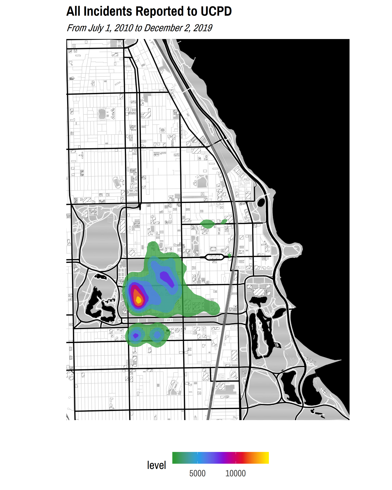
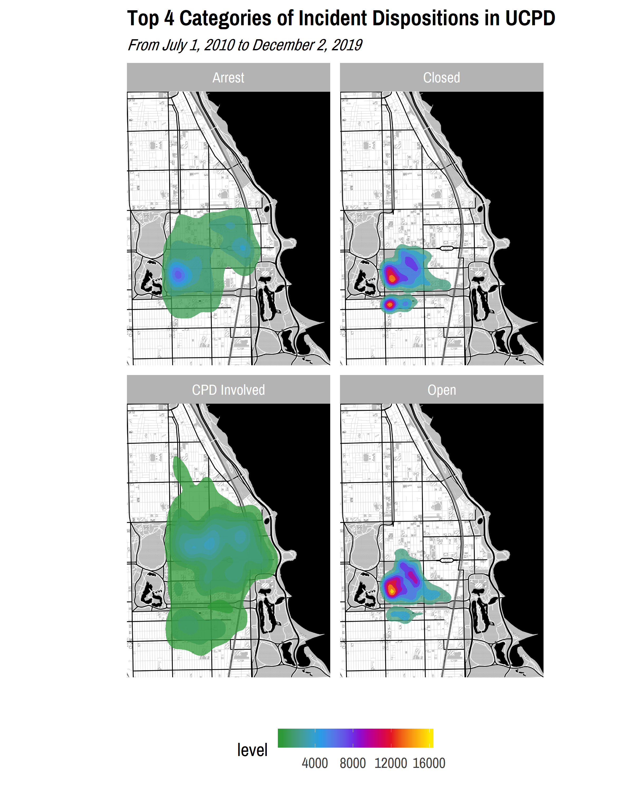
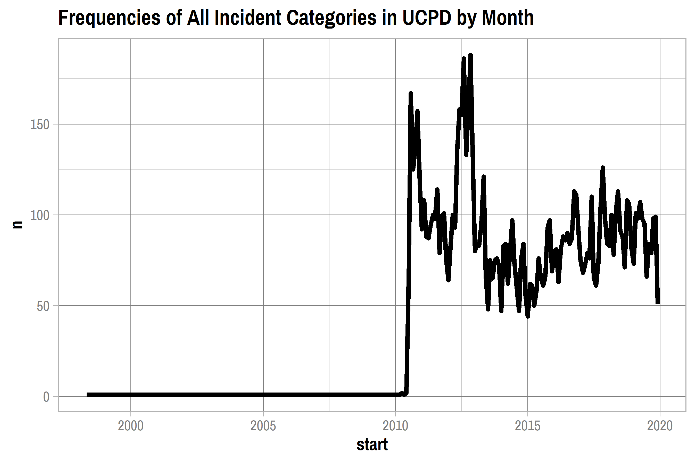

Exploratory Data Analysis
================
Adam Shelton

## UCPD

``` r
incident_data = readRDS(here("Data", "cleaned_incident_data.rds"))
```

### Incident Reports

#### Descriptive Statistics

``` r
incident_desc_stats = incident_data %>% select(-location, -reported, -occurred, -comments) %>% mutate(incident = factor(incident), disposition = factor(disposition)) %>% skim() %>% partition()

incident_desc_stats$character %>% kable()
```

| skim\_variable | n\_missing | complete\_rate | min | max | empty | n\_unique | whitespace |
| :------------- | ---------: | -------------: | --: | --: | ----: | --------: | ---------: |
| building       |       4460 |      0.6182487 |   3 |  51 |     0 |       995 |          0 |
| ucpdi\#        |        109 |      0.9906702 |   5 |  22 |     0 |     11392 |          0 |

``` r
incident_desc_stats$factor %>% kable()
```

| skim\_variable | n\_missing | complete\_rate | ordered | n\_unique | top\_counts                                |
| :------------- | ---------: | -------------: | :------ | --------: | :----------------------------------------- |
| incident       |       1317 |      0.8872721 | FALSE   |       145 | the: 3150, los: 740, tra: 723, rob: 663    |
| disposition    |          5 |      0.9995720 | FALSE   |        10 | Clo: 3843, Ope: 3647, Arr: 1768, CPD: 1509 |

``` r
incident_desc_stats$logical %>% kable()
```

| skim\_variable        | n\_missing | complete\_rate |      mean | count                |
| :-------------------- | ---------: | -------------: | --------: | :------------------- |
| in\_jurisdiction      |          3 |      0.9997432 | 0.9982877 | TRU: 11660, FAL: 20  |
| information           |          2 |      0.9998288 | 0.1883400 | FAL: 9481, TRU: 2200 |
| assist\_other\_agency |          2 |      0.9998288 | 0.0239706 | FAL: 11401, TRU: 280 |
| non\_criminal         |          2 |      0.9998288 | 0.0161801 | FAL: 11492, TRU: 189 |
| attempted             |          2 |      0.9998288 | 0.0101875 | FAL: 11562, TRU: 119 |
| warrant               |          2 |      0.9998288 | 0.0142111 | FAL: 11515, TRU: 166 |
| armed                 |          2 |      0.9998288 | 0.0242274 | FAL: 11398, TRU: 283 |
| aggravated            |          2 |      0.9998288 | 0.0196045 | FAL: 11452, TRU: 229 |

``` r
incident_desc_stats$numeric %>% kable()
```

| skim\_variable | n\_missing | complete\_rate |       mean |        sd |         p0 |        p25 |        p50 |        p75 |       p100 | hist  |
| :------------- | ---------: | -------------: | ---------: | --------: | ---------: | ---------: | ---------: | ---------: | ---------: | :---- |
| lat            |          0 |              1 |   41.79177 | 0.0732456 |   36.19211 |   41.78831 |   41.79121 |   41.79484 |   43.42786 | ▁▁▁▇▁ |
| lon            |          0 |              1 | \-87.60120 | 0.1229207 | \-95.03836 | \-87.60393 | \-87.59995 | \-87.59528 | \-80.79103 | ▁▁▇▁▁ |

``` r
incident_desc_stats$POSIXct %>% kable()
```

| skim\_variable | n\_missing | complete\_rate | min                 | max                 | median              | n\_unique |
| :------------- | ---------: | -------------: | :------------------ | :------------------ | :------------------ | --------: |
| start          |         57 |      0.9951211 | 1998-04-27 00:00:00 | 2027-02-08 19:35:00 | 2014-10-03 01:05:00 |     11478 |
| end            |       7157 |      0.3874005 | 2010-06-29 17:00:00 | 2019-12-01 07:45:00 | 2014-01-09 13:30:00 |      4472 |

#### Visualizations

``` r
chi_map = ggmap(get_stamenmap(c(left = -87.686839, bottom = 41.720873, right = -87.522685, top = 41.895756), maptype = "toner-background", zoom = 13))

hyde_park_map = ggmap(get_stamenmap(c(left = -87.617020, bottom = 41.773565, right = -87.566863, top = 41.823864), maptype = "toner-background", zoom = 15))

incident_data_analysis = incident_data  %>% filter(!is.na(incident))  %>% mutate(incident = collapse_to_other(incident, 9))

chi_map + geom_point(data = incident_data_analysis, aes(x = lon, y = lat), color = color_pal(3, "cool")[3], alpha = 0.4) + labs(title = "All Incidents Reported to UCPD", subtitle = "From July 1, 2010 to December 2, 2019") + theme_map(base_family = "Pragati Narrow", base_size = 18)
```

<!-- -->

``` r
chi_map + stat_density2d(data = incident_data, aes(x = lon, y = lat, fill = stat(level)),  geom="polygon", alpha = 0.75) +  scale_fill_gradientn(colors = color_pal(5, "heatmap")) + labs(title = "All Incidents Reported to UCPD", subtitle = "From July 1, 2010 to December 2, 2019") + theme_map(base_family = "Pragati Narrow", base_size = 18)
```

<!-- -->

``` r
hyde_park_map + stat_density2d(data = incident_data, aes(x = lon, y = lat, fill = stat(level)),  geom="polygon", alpha = 0.75) +  scale_fill_gradientn(colors = color_pal(5, "heatmap")) + labs(title = "All Incidents Reported to UCPD", subtitle = "From July 1, 2010 to December 2, 2019") + theme_map(base_family = "Pragati Narrow", base_size = 18)
```

<!-- -->

``` r
hyde_park_map + geom_point(data = incident_data_analysis, aes(x = lon, y = lat, color = incident)) + scale_color_manual(values = color_pal(9, "discrete")) + labs(title = "Top 9 Categories of Incidents Reported to UCPD", subtitle = "From July 1, 2010 to December 2, 2019") + theme_map(base_family = "Pragati Narrow", base_size = 18) 
```

<!-- -->

``` r
hyde_park_map + geom_point(data = incident_data_analysis, aes(x = lon, y = lat, color = incident)) + scale_color_manual(values = color_pal(9, "discrete")) + facet_wrap(~ incident) + labs(title = "Top 9 Categories of Incidents Reported to UCPD", subtitle = "From July 1, 2010 to December 2, 2019") + theme_map(base_family = "Pragati Narrow", base_size = 18)
```

<!-- -->

``` r
hyde_park_map + stat_density2d(data = incident_data_analysis, aes(x = lon, y = lat, fill = stat(level)),  geom="polygon", alpha = 0.75) +  scale_fill_gradientn(colors = color_pal(5, "heatmap")) + facet_wrap(~ incident) + labs(title = "Top 9 Categories of Incidents Reported to UCPD", subtitle = "From July 1, 2010 to December 2, 2019") + theme_map(base_family = "Pragati Narrow", base_size = 18)
```

<!-- -->

``` r
hyde_park_map + geom_point(data = incident_data_analysis %>% filter(disposition %in% c("Arrest", "Closed", "CPD Involved", "Open")), aes(x = lon, y = lat, color = disposition)) + scale_color_manual(values = color_pal(4, "discrete")) + labs(title = "Top 4 Categories of Incident Dispositions in UCPD", subtitle = "From July 1, 2010 to December 2, 2019") + theme_map(base_family = "Pragati Narrow", base_size = 18)
```

<!-- -->

``` r
hyde_park_map + geom_point(data = incident_data_analysis %>% filter(disposition %in% c("Arrest", "Closed", "CPD Involved", "Open")), aes(x = lon, y = lat, color = disposition)) + scale_color_manual(values = color_pal(4, "discrete")) + facet_wrap(~ disposition) + labs(title = "Top 4 Categories of Incident Dispositions in UCPD", subtitle = "From July 1, 2010 to December 2, 2019") + theme_map(base_family = "Pragati Narrow", base_size = 18)
```

<!-- -->

``` r
hyde_park_map + stat_density2d(data = incident_data_analysis %>% filter(disposition %in% c("Arrest", "Closed", "CPD Involved", "Open")), aes(x = lon, y = lat, fill = stat(level)),  geom="polygon", alpha = 0.75) + scale_fill_gradientn(colors = color_pal(5, "heatmap")) + facet_wrap(~ disposition) + labs(title = "Top 4 Categories of Incident Dispositions in UCPD", subtitle = "From July 1, 2010 to December 2, 2019") + theme_map(base_family = "Pragati Narrow", base_size = 18)
```

<!-- -->

``` r
incident_data %>% filter(!is.na(incident)) %>% count(incident, sort = TRUE) %>%  ggplot(aes(area = n, fill = incident, label = incident)) + geom_treemap() + geom_treemap_text(grow = TRUE, reflow = TRUE, color = "white", family = "Pragati Narrow") + scale_fill_manual(values = color_pal(5, type = "continuous", levels = length(unique(incident_data$incident)))) + labs(title = "Categories of Incidents in UCPD Reports", subtitle = "From July 1, 2010 to December 2, 2019") + theme_day(base_family = "Pragati Narrow", base_size = 18) + hide_legend 
```

<!-- -->

``` r
top_categories = incident_data %>% filter(!is.na(incident)) %>% count(incident) %>% top_n(10, n) %>% .$incident

incident_data %>% filter(!is.na(incident), incident %in% top_categories) %>% mutate(disposition = collapse_to_other(disposition, 6)) %>% count(incident, disposition) %>% crosstab_percent() %>% arrange(incident) %>% ggplot(aes(x = incident, y = percent, fill = disposition)) + geom_col() + coord_flip() + scale_y_continuous(labels = percent_format()) + scale_fill_manual(values = color_pal(6)) + labs(title = "Dispositions of Top 10 UCPD Incidents", subtitle = "From July 1, 2010 to December 2, 2019") + theme_day(base_family = "Pragati Narrow", base_size = 18) 
```

<!-- -->

``` r
incident_data %>% filter(!is.na(incident), year(reported) <= Sys.Date() %>% year()) %>% mutate(reported = round_date(reported, "month") %>% date()) %>% count(reported) %>% ggplot(aes(x = reported, y = n), group = 1) + geom_line(size = 2) + theme_day(base_family = "Pragati Narrow", base_size = 18) 
```

<!-- -->

``` r
#top_categories = incident_data %>% filter(!is.na(incident)) %>% count(incident) %>% top_n(8, n) %>% .$incident

incident_data %>% filter(!is.na(incident), incident %in% top_categories) %>% mutate(reported = round_date(reported, "month") %>% date()) %>% count(incident, reported) %>% ggplot(aes(x = reported, y = n, color = incident, group = incident)) + geom_line(size = 1.5) + facet_wrap(~ incident) + scale_fill_manual(values = color_pal(8)) + theme_day(base_family = "Pragati Narrow", base_size = 18) + hide_legend
```

<!-- -->

## CPD

``` r
cpd_crime_data = readRDS(here("Data", "cleaned_crime_data.rds")) %>% mutate(primary_type = factor(primary_type), location_description = factor(location_description))

#left = -87.617020, bottom = 41.773565, right = -87.566863, top = 41.823864
cpd_crime_data_hp = cpd_crime_data %>% filter(longitude < -87.566863, longitude > -87.617020, latitude > 41.773565, latitude < 41.823864)
```

### Crime Reports

#### Descriptive Statistics

``` r
cpd_stats = cpd_crime_data %>% skim() %>% partition()

cpd_stats$character %>% kable()
```

| skim\_variable | n\_missing | complete\_rate | min | max | empty | n\_unique | whitespace |
| :------------- | ---------: | -------------: | --: | --: | ----: | --------: | ---------: |
| id             |          0 |              1 |   5 |   8 |     0 |    811693 |          0 |
| case\_number   |          0 |              1 |   6 |   9 |     0 |    811604 |          0 |
| block          |          0 |              1 |  14 |  35 |     0 |      7030 |          0 |
| iucr           |          0 |              1 |   4 |   4 |     0 |       355 |          0 |
| description    |          0 |              1 |   5 |  59 |     0 |       332 |          0 |

``` r
cpd_stats$factor %>% kable()
```

| skim\_variable        | n\_missing | complete\_rate | ordered | n\_unique | top\_counts                                        |
| :-------------------- | ---------: | -------------: | :------ | --------: | :------------------------------------------------- |
| primary\_type         |          0 |      1.0000000 | FALSE   |        33 | BAT: 174284, THE: 141338, CRI: 88211, NAR: 68556   |
| location\_description |        686 |      0.9991549 | FALSE   |       137 | STR: 189036, APA: 145673, RES: 145009, SID: 84582  |
| beat                  |          0 |      1.0000000 | FALSE   |        97 | 042: 23530, 062: 20890, 041: 18822, 062: 18718     |
| district              |          0 |      1.0000000 | FALSE   |        14 | 007: 167016, 006: 158291, 003: 146384, 002: 124061 |
| ward                  |          0 |      1.0000000 | FALSE   |        20 | 17: 92978, 20: 91596, 6: 88812, 3: 71781           |
| community\_area       |        104 |      0.9998719 | FALSE   |        30 | 43: 97775, 67: 82343, 71: 81401, 68: 74563         |
| fbi\_code             |          0 |      1.0000000 | FALSE   |        26 | 08B: 145990, 06: 141338, 14: 88211, 26: 79003      |

``` r
cpd_stats$logical %>% kable()
```

| skim\_variable | n\_missing | complete\_rate |      mean | count                    |
| :------------- | ---------: | -------------: | --------: | :----------------------- |
| arrest         |          0 |              1 | 0.2558960 | FAL: 603984, TRU: 207709 |
| domestic       |          0 |              1 | 0.1976326 | FAL: 651276, TRU: 160417 |

``` r
cpd_stats$numeric %>% kable()
```

| skim\_variable | n\_missing | complete\_rate |       mean |        sd |         p0 |        p25 |        p50 |        p75 |       p100 | hist  |
| :------------- | ---------: | -------------: | ---------: | --------: | ---------: | ---------: | ---------: | ---------: | ---------: | :---- |
| year           |          0 |              1 | 2014.03128 | 2.8849086 | 2010.00000 | 2011.00000 | 2014.00000 | 2017.00000 | 2019.00000 | ▇▇▆▆▅ |
| latitude       |          0 |              1 |   41.77555 | 0.0276700 |   41.73299 |   41.75269 |   41.77002 |   41.79451 |   41.84588 | ▇▇▅▃▂ |
| longitude      |          0 |              1 | \-87.62165 | 0.0343565 | \-87.67754 | \-87.65093 | \-87.62253 | \-87.59936 | \-87.54017 | ▇▇▇▅▃ |

``` r
cpd_stats$POSIXct %>% kable()
```

| skim\_variable | n\_missing | complete\_rate | min                 | max                 | median              | n\_unique |
| :------------- | ---------: | -------------: | :------------------ | :------------------ | :------------------ | --------: |
| date           |         35 |      0.9999569 | 2010-01-01 06:00:00 | 2019-11-30 05:32:00 | 2014-04-10 22:32:30 |    512882 |
| updated\_on    |          0 |      1.0000000 | 2015-08-17 20:03:40 | 2019-12-06 21:54:36 | 2018-02-10 21:50:01 |      1560 |

#### Visualizations

``` r
chi_map + geom_point(data = cpd_crime_data, aes(x = longitude, y = latitude), color = color_pal(3, "cool")[3], alpha = 0.4) + labs(title = "All Crimes Reported to CPD", subtitle = "From January 1, 2010 to December 2, 2019") + theme_map(base_family = "Pragati Narrow", base_size = 18)
```

<!-- -->

``` r
chi_map + stat_density2d(data = cpd_crime_data, aes(x = longitude, y = latitude, fill = stat(level)),  geom="polygon", alpha = 0.75) +  scale_fill_gradientn(colors = color_pal(5, "heatmap")) + labs(title = "All Crimes Reported to CPD", subtitle = "From January 1, 2010 to December 2, 2019") + theme_map(base_family = "Pragati Narrow", base_size = 18)
```

<!-- -->

``` r
hyde_park_map + stat_density2d(data = cpd_crime_data_hp, aes(x = longitude, y = latitude, fill = stat(level)),  geom="polygon", alpha = 0.75) +  scale_fill_gradientn(colors = color_pal(5, "heatmap")) + labs(title = "All Crimes Reported to CPD", subtitle = "From January 1, 2010 to December 2, 2019, surrounding Hyde Park") + theme_map(base_family = "Pragati Narrow", base_size = 18)
```

<!-- -->

``` r
hyde_park_map + stat_density2d(data = mutate(cpd_crime_data_hp, primary_type = collapse_to_other(primary_type, 9) %>% str_to_lower()), aes(x = longitude, y = latitude, fill = stat(level)),  geom="polygon", alpha = 0.75) +  scale_fill_gradientn(colors = color_pal(5, "heatmap")) + facet_wrap(~ primary_type) + labs(title = "Top 9 Categories of Incidents Reported to CPD", subtitle = "From January 1, 2010 to December 2, 2019") + theme_map(base_family = "Pragati Narrow", base_size = 18)
```

<!-- -->

``` r
cpd_crime_data %>% filter(!is.na(primary_type)) %>% count(primary_type, sort = TRUE) %>% ggplot(aes(area = n, fill = primary_type, label = str_to_lower(primary_type))) + geom_treemap() + geom_treemap_text(grow = TRUE, reflow = TRUE, color = "white", family = "Pragati Narrow") + scale_fill_manual(values = color_pal(5, type = "continuous", levels = length(unique(cpd_crime_data$primary_type)))) + labs(title = "Categories of Incidents in CPD Reports", subtitle = "From January 1, 2010 to December 2, 2019") + theme_day(base_family = "Pragati Narrow", base_size = 18) + hide_legend 
```

<!-- -->

``` r
cpd_top_categories = cpd_crime_data %>% filter(!is.na(primary_type)) %>% count(primary_type) %>% top_n(10, n) %>% .$primary_type

cpd_crime_data %>% filter(!is.na(primary_type), primary_type %in% cpd_top_categories) %>% count(primary_type, arrest) %>% crosstab_percent() %>% arrange(primary_type) %>% ggplot(aes(x = primary_type, y = percent, fill = arrest)) + geom_col() + coord_flip() + scale_y_continuous(labels = percent_format()) + scale_fill_manual(values = color_pal(2)) + labs(title = "Dispositions of Top 10 CPD Incidents", subtitle = "From January 1, 2010 to December 2, 2019") + theme_day(base_family = "Pragati Narrow", base_size = 18) 
```

<!-- -->

``` r
cpd_crime_data %>% filter(!is.na(primary_type), year(date) <= Sys.Date() %>% year()) %>% mutate(date = round_date(date, "month") %>% date()) %>% count(date) %>% ggplot(aes(x = date, y = n), group = 1) + geom_line(size = 2) + theme_day(base_family = "Pragati Narrow", base_size = 18) 
```

<!-- -->

``` r
#top_categories = incident_data %>% filter(!is.na(incident)) %>% count(incident) %>% top_n(8, n) %>% .$incident

cpd_crime_data %>% filter(!is.na(primary_type), primary_type %in% cpd_top_categories) %>% mutate(date = round_date(date, "month") %>% date()) %>% count(primary_type, date) %>% ggplot(aes(x = date, y = n, color = primary_type, group = primary_type)) + geom_line(size = 1.5) + facet_wrap(~ primary_type) + scale_fill_manual(values = color_pal(8)) + theme_day(base_family = "Pragati Narrow", base_size = 18) + hide_legend
```

<!-- -->
