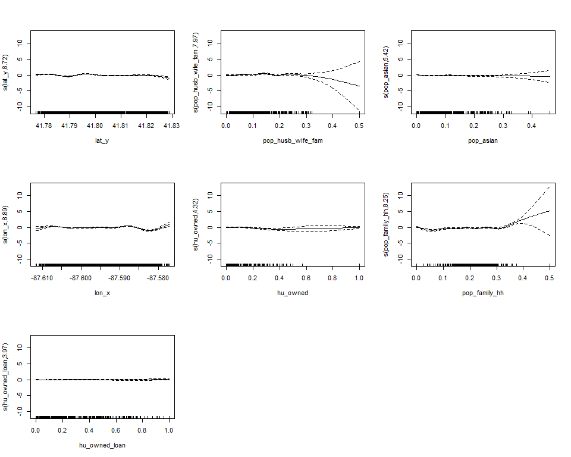
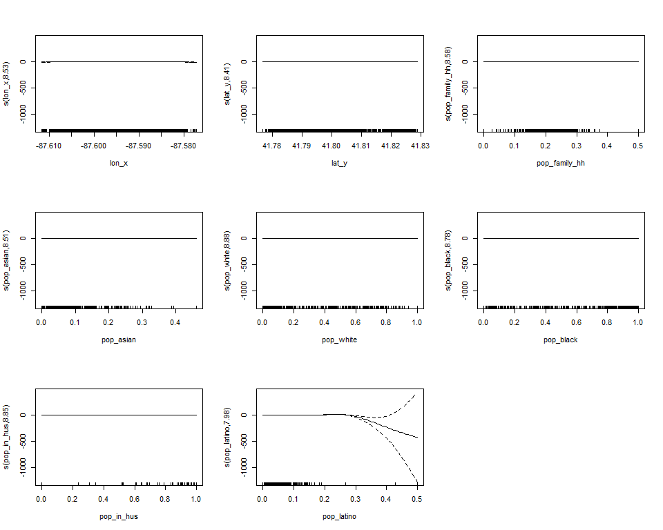
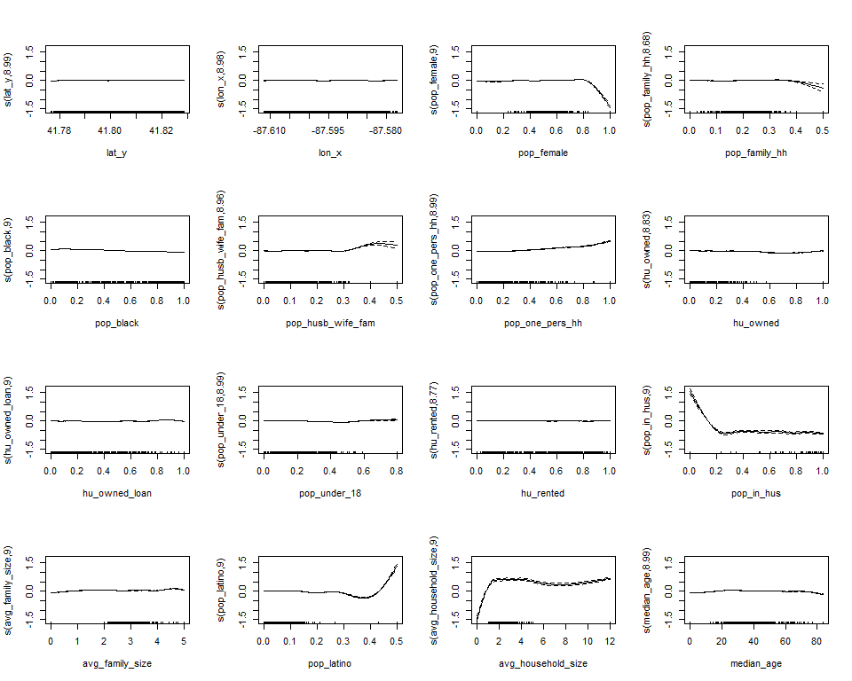
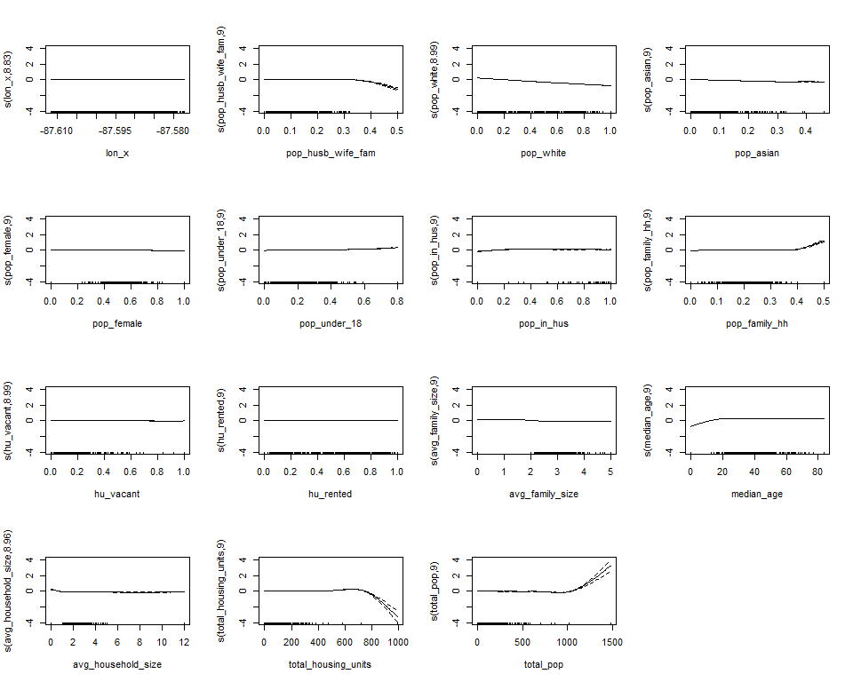
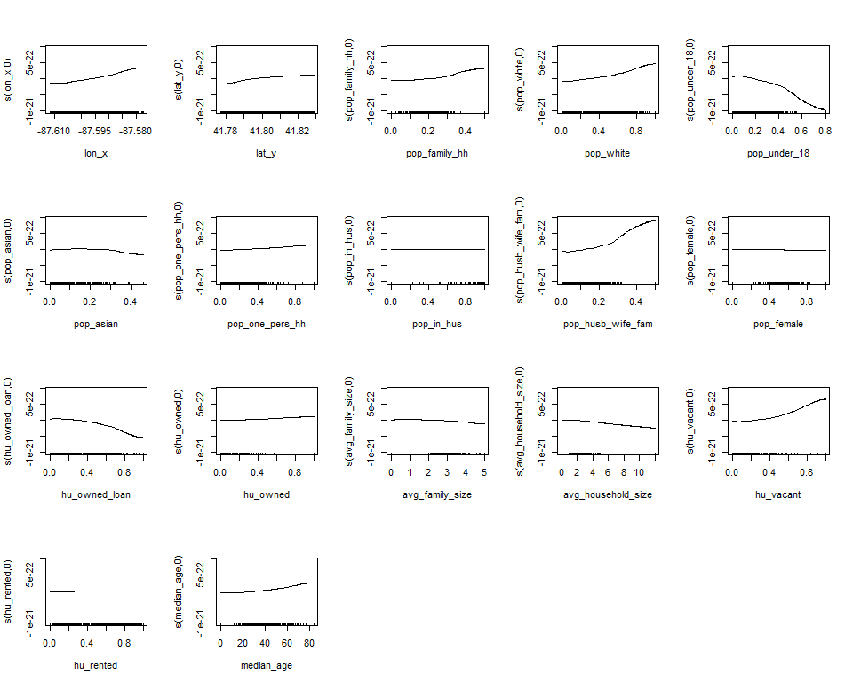
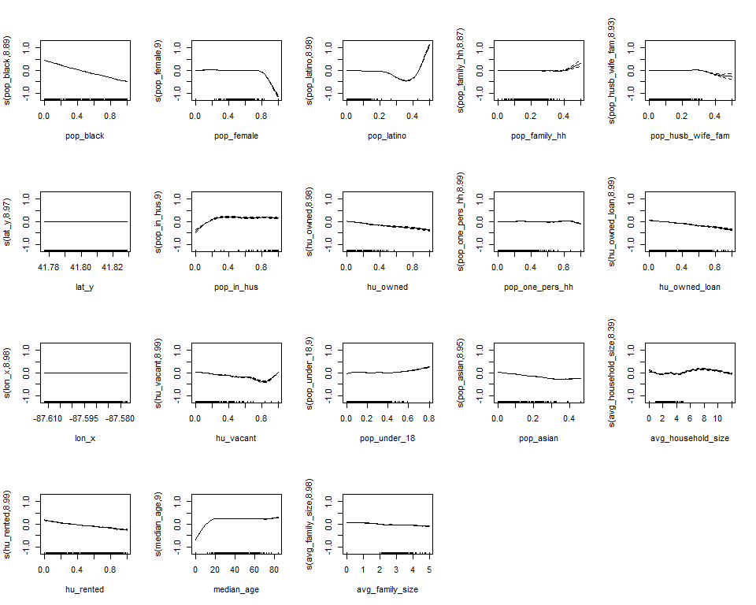

```{r setup, include=FALSE}
library(tidyverse)
library(knitr)
library(kableExtra)
library(skimr)
library(lubridate)
library(scales)
library(pROC)
library(mgcv)
library(here)

logit_to_prob = function(x) {
  exp(x) %>% (function(z) z / (1 + z))
}

logit_diff = function(x, y) {
  old = x %>% filter(Variable == "(Intercept)") %>% .$`Est.` %>% sum() %>% logit_to_prob()
  new = x %>% filter(Variable == "(Intercept)" | Variable == y) %>% .$`Est.` %>% sum() %>% logit_to_prob()
  abs(new - old)
}

logit_effect = function(x, y) {
  new = x %>% filter(Variable == "(Intercept)" | Variable == y) %>% .$`Est.` %>% sum() %>% logit_to_prob()
  abs(new)
}

knitr::opts_chunk$set(echo = TRUE, dpi = 300, echo=FALSE, message=FALSE, warning=FALSE, cache = TRUE)
```

# Introduction

The United States has a complicated history of policing entangled with racial injustices. Police patrols in the United States can trace their roots to slave patrols during the formative years of the country [@Capers2009; @Sklansky1999]. These white vigilante groups used fear and intimidation tactics to exert control over slaves and those thought to be helping them [@Sklansky1999]. During the period of Jim Crow laws, blacks still endured police intimidation and brutality, justified through laws designed to relegate black Americans to the bottom of the social order [@Wynes1967; @Ross1983]. However, these punitive measures were not applied equally, with  police rarely charging those who participated in lynch mobs against people of color [@Ross1983]. These inequities still echo through policing today, with minorities and inhabitants of low-income areas experiencing documented over-policing, mass incarceration, and increased police violence [@Tuch1997; @Weitzer2000; @Alpert2006].

Across the country public and private policing efforts have grown to counter criminal activity [@Strom2010; @Sklansky1999]. Many businesses hire or contract security guards to protect their establishments, goods, and customers [@Strom2010]. These personnel typically operate within extremely narrow bounds, with limited jurisdiction and the ability to exert force [@Sklansky1999]. These security guards are typically intended to act as a deterrent and trustworthy witness of criminal activity, rather than intervening force [@Sklansky1999].

However, organizations or individuals can hire private police forces that are able to operate with much wider latitude [@Sklansky1999]. Many states allow for armed private police with fully equipped patrol cars [@Strom2010; @Sklansky1999]. Increasingly, universities are operating their own police departments with this kind of far-reaching authority [@Strom2010; @Reaves2015]. Yet, while public universities must maintain some amount of transparency, and are susceptible to FOIA requests, private universities are under no obligation to provide information if requested [@Newman2016]. Therefore, private universities have the ability to operate, in many cases quite large, police forces with little to no accountability and oversight. Under Illinois state law, the police departments of private universities, are only beholden to the university's Board of Trustees, not the communities on or off campus that they police [@110ILCS1020]. 

Considering the long-running entanglement of racism and violence with policing, the combination of far-reaching authority, lack of accountability and oversight, abundance of resources, and interaction with vulnerable populations typically found at private universities is alarming. There are few better places to study possible inequities as a result of private university policing than at the University of Chicago, which has an extensive history of supporting gentrification efforts to push out people of color in Hyde Park [@Sherman2019; @Larson2012]. The campus in Hyde Park is surrounded by lower income neighborhoods, predominantly composed of people of color, which are policed by the University of Chicago Police Department (UCPD) [@Sherman2019]. The UCPD has been accused of racially biased policing practices, which have been exhibited in data on stops released by the university [@Newman2016]. As the UCPD and Chicago Police Department (CPD) both share jurisdiction, this offers us a unique opportunity to observe the interactions of public and private police forces and their respective inequities.

# Literature Review

## Inequity in Policing

Since the 1970's, mass incarceration produced by an increase in punitive policing, such as the War on Drugs, have been used to perpetuate racial injustices, with "African Americans are incarcerated at nearly six times the rate of whites, and Hispanics are incarcerated at almost twice the rate of whites" [@Fortner2015]. America still lives in segregated communities, leading to separated communities of color exhibiting higher crime rates, not due to residents but the lack of jobs, education, and other opportunities [@Capers2009]. The absence of social capital "...that can increase the likelihood of upward mobility is likely to be self-perpetuating..." [@Capers2009]. This leads to higher unemployment and lower property values in minority neighborhoods, which coupled with decreased trust and perceived legitimacy of police officers, can exacerbate issues of crime and policing in these communities [@Capers2009]. 

This creates serious consequences for all people, but especially affects those in society that are already disadvantaged. There is a long history of public policing being racialized or otherwise not applied equally across the population [@Alpert2006; @Tuch1997]. Communities of color have been consistently more likely to be subjected to excessive force, exacerbating inequality through social ramifications, like distrust for police and authority [@Tuch1997]. Residents in black neighborhoods are also more likely to say that "police stop people in the neighborhood without good reason, verbally abuse neighborhood residents, and and use excessive force against neighborhood residents" [@Weitzer2000]. These problems exist in public police departments across the country, but often goes unaddressed, as white people are less likely to think racism in policing exists [@Tuch1997; @Weitzer2000]. Yet, in many areas, white officers make up a greater proportion of the police force [@Tuch1997] and are more likely to give out tickets [@Alpert2006]. Due to high levels of racial segregation, white police officers are likely to come from predominately white neighborhoods, while predominately interacting with people of color only on patrol, which can reinforce stereotypes and racialized policing [@Capers2009].

Gentrification, while reducing the intensity of policing in the immediate area, can increase policing activity outside of the gentrifying area [@Laniyonu2018]. However, despite a decrease in policing, it appears crime increases in gentrifying areas [@Laniyonu2018]. While Broken Windows policing, which focused on reducing physical disorder in an attempt to reduce crime, was very popular during the 1980's and 1990's, there is contradictory evidence about its effectiveness [@Laniyonu2018]. Likely due to the stereotypical associations of people of color and poor with crime, there is strong evidence that the proportion of black Americans in an area is correlated with the distribution of police officers [@Laniyonu2018; @Capers2009]

Typically, the decision-making by police officers leading up to a stop is driven by a person appearing "different" or "out of place" [@Alpert2006]. As a result, minorities are frequently stopped in white neighborhoods, despite data showing that police suspicions about criminality in most stop and frisks are wrong [@Capers2009]. Policing guided by these philosophies invites bias into the policing process, resulting in the targeting of males and minorities [@Alpert2006]. Policing that does not adequately address the concerns of the community, expectedly can have as detrimental effects on the community as crime can [@Daniel1970]. While crime drives down patronage of businesses, churches, and community organizations, that communities of color revolve around, ineffective policing only increases feelings of danger in the community [@Daniel1970]. Policies that emphasize transparency and accountability in policing to the community are not only comforting to residents but result in more effective enforcement of laws.

## Private Policing

Despite racial and socioeconomic tensions in policing, and a historical distrust of private police, there is a large and growing industry surrounding private policing. In 2015, companies spent approximately $30 billion on private security [@Pappas2012]. The United States Department of Labor estimated that in 2018 1.15 million people in the United States were employed as Security Guards or Gaming Surveillance Officers [@USDepartmentofLabor2018]. Guarding represents approximately half of all private security services, with 35 percent of services utilizing armed guards [@Strom2010]. Retail, restaurants, and food service was the industry sector with the highest percentage of security officers per employees in 2009 at about 17 percent [@Strom2010]. Colleges and universities were ranked tenth with a four percent ratio of security officers to employees [@Strom2010]. The State of Illinois requires that any private detective, private security contractor, private alarm contractor, fingerprint vendor, or locksmith be licensed by the state [@225ILCS4472004]. However, it is likely for these measurements to be *underestimates* of the size of private policing [@Sklansky2011]. Quantitatively measuring the scope of private police is incredibly difficult, due to the secrecy and ambiguity surrounding the number of employees performing security work [@Sparrow2014; @Sklansky2011].

With private police these issues with accountability and representativeness become even more difficult to address, especially as they have become a more integral part of society. In the United States, there has been considerable growth in private policing in the last half century, sparking questions about the motivations of these private forces [@Shearing1992]. It is now common for public and private police departments to collaborate within their jurisdictions [@Shearing1992; @Sparrow2014], effectively creating a "network of public police and private security that is often overlapping, complimentary [sic] and mutually supportive" [@Bouthillier2006]. As governments have sought to cut costs, and private organizations have seen it more cost effective to hire their own workforce for protection, there has been a shift in social control out of the public sphere [@Shearing1992; @Joh2006]. 

Americans quickly became disillusioned of private policing in the early years of the mining and railroad industries. Private police forces used by the companies in these industries lead to a protection of assets over employees and went against the public interest [@Spitzer2011; @Joh2006]. This resulted in a long period where the state held a "monopoly" on policing. However, starting in the 1960's private policing began to expand, partly in response to a RAND report that re-framed private policing as "an 'industry' providing a 'service'" [@Shearing1992; @Joh2006].

Supporters of this expansion of private police forces claimed that public police had not been provided enough resources to adequately patrol their jurisdictions, creating this "vacuum" which private police were filling. This was framed as a win for everyone, as private police were now performing a role which taxpayers needed but also did not have to fund, and regulations would limit their power [@Shearing1992; @Joh2006]. Critics were concerned that now companies could give employees "state authority", and that this cooperation between governments and corporations would only protect the interests of the elite [@Shearing1992]. 

In recent history, private policing within corporations has shifted to focus on investigative labor [@Spitzer2011]. This shift represents a growing emphasis on obtaining "restitution" versus "revenge" [@Spitzer2011]. Thorough investigations allow for a better likelihood of restitution through legal means, while minimizing the risk of valuable information becoming public [@Spitzer2011]. However, any company's goal is to maximize profits, which means occasionally relying on public police, as that incurs no costs to the company [@Spitzer2011].

Privatized police officers are particularly problematic when it comes to accountability, as there is a much lower legal standard for how private forces should operate. Private police forces are now under much less government scrutiny, as public police departments rely on the partnership they have with private forces [@Joh2006]. Citizens also have fewer legal protections from private police, who are not under any constitutional obligation to follow due process regulations [@Sklansky1999]. This means that private police forces are not obligated to provide Miranda warnings before interrogation, and evidence discovered by a search is almost always admissible, although the officer could be charged with assault, trespassing, or false imprisonment [@Sklansky1999]. 

Yet, despite this lack of regulation, private police officers often have the same or similar powers of public police, over that of which other citizens have [@Sklansky1999]. Additionally, private police forces formed by companies are oftentimes allowed to sit in on regional or federal task forces, giving companies access to sensitive information they did not have before [@Joh2006]. 

This creates far-reaching implications, especially in the case of university police forces, where private police patrol large areas outside of the campus. When these officers have the power to police citizens other than students, there is little to no oversight on whether this power is being exercised fairly and justly, which is antithetical to the strict limitations imposed on police in the Constitution. There will always be instances where the interests of private police are against that of the public's [@Sparrow2014]. It is important that citizens understand when these private forces are acting against the public's interests, not only to help protect themselves, but to also spread awareness for this alarming status quo, motivating law makers to more heavily regulate private police forces. 

## Campus Policing

Private and public policing has also expanded on college campuses, with approximately two-thirds of four-year colleges or universities with more than 2,500 students employ sworn police officers, with 92 percent of public institutions and 38 percent of private institutions doing so [@Reaves2015]. About three quarters of campus officers overall are armed and about eight in ten campus officers could arrest and patrol beyond campus boundaries [@Reaves2015]. A larger proportion of police departments at public institutions met regularly with advocacy groups than private institutions [@Reaves2015]. The increase in law enforcement personnel has outpaced student enrollment [@Reaves2015]. Campuses with sworn officers, on average employed 2.4 full-time sworn officers per 1000 students, with private institutions having higher ratios than public institutions [@Reaves2015].

Under the Jeanne Clery Disclosure of Campus Security Policy and Campus Crime Statistics Act of 1990, institutions of higher education that participate in federal financial aid programs must keep and disclose information about crime on and around campus [@Reaves2015; @Bauman2014]. On average, overall crime rates are higher at private institutions, both both public and private institutions reported handling about 40 violent crimes per 100,000 students during the 2011-2012 school year [@Reaves2015]. Usually, "sworn officers must undergo a considerably more rigorous screening process prior to hiring than their non-sworn counterparts", but a majority of departments require a college degree for both types of officer [@Reaves2015]. While the proportion of minority officers and female officers increased from the previous survey in 2004, the majority of sworn officers were both white and male during the 2011-2012 school year [@Reaves2015].

In some ways, campus police can better serve the public's interests than public police departments. While campus police work to maintain a "good image" of the school by enforcing campus rules for students [@Jacobsen2015], they can still benefit the public, sometimes more effectively than municipal police departments. More small campus agencies were found to have formed problem-solving partnerships and provided training to citizens than small city agencies [@Bromley2003]. Overall, campus police feel their job is to keep students safe and make them feel comfortable [@Williams2016]. Police officers employed by universities must undergo Title IX training as all university employees must, and often complete more training about sexual harassment than their municipal counterparts [@Smith2016]. Officers with specialized training pertaining to sexual crimes typically scored lower on scales of rape myth acceptance [@Smith2016]. Perhaps a testament to this focus on safety by campus police, students generally regard their campus as a "protected space" which is safer than other areas and feel that campus police are responsible for this safe environment [@Williams2016; @Jacobsen2015]. 

Yet, while in a 1998 survey of white college students and faculty only ten percent of respondents felt unsafe on their campus, 36 percent supported arming campus police officers and an additional 26 percent were undecided [@Hummer1998]. Of the 38 percent of respondents that felt campus police should not be armed, "50 percent felt
that "campus life" is not that life-threatening and therefore did not warrant the carrying of firearms by officers" [@Hummer1998]. 63 percent of respondents who were undecided felt that "the use of firearms should be dependent on the severity of the situation" [@Hummer1998].

Campus police officers also play different roles in the lives of those within their jurisdiction. Police on campuses often must play the role of a more parental figure, as most young adults at college are growing into and adjusting to their first experiences living on their own [@Williams2016]. Students feel that campus police officers should protect them while simultaneously not interfering with their lives, such as "overreacting" to students participating in under-age drinking [@Jacobsen2015]. This puts campus police officers in an interesting situation, where they are thought of by many students to be "not real cops", while oftentimes still having the same legal powers as public law enforcement officers [@Williams2016]. Students also delegitamize campus police by popularizing rumors that campus police are officers that could not get a job with the state or municipal police [@Jacobsen2015] or anecdotes of excessive force [@Williams2016]. 

This lack of legitimacy of campus police in students' eyes may also stem from the history of campus police. Early campus police in the first half of the twentieth century were little more than security guards, who could investigate and detain, but only refer to the administration for punishment [@Sloan1992]. As unrest became widespread on campuses across the country in the late 1960's, college administrators faced losing control of their student populations, and a reliance on outsiders to keep peace on campus [@Sloan1992]. Colleges were also growing rapidly during this time, which was accompanied by increases in crime [@Sloan1992]. This led to the founding of official campus police departments made up of sworn law enforcers whose training, duties, and organization mirrored that of traditional urban police departments [@Sloan1992].  

However, the attitudes of university police officers greatly contrast that of students attending the university. Overwhelmingly, campus police felt that students were, in general, respectful of the rules and cooperative with officers [@Sloan1992]. Officers felt that while a minority of students created most of the trouble, outsiders posed the greatest threat to campus security [@Sloan1992]. Campus police felt a strong sense of duty towards serving the university community and enforcing campus rules [@Gelber1972]. This gives evidence that while campus police officers must police a much different population with different types of crimes than municipal police traditionally do, that they will react and operate in a similar manner. 

This commitment to serving is also portrayed through campus police departments' interaction with the community at large. Campus police departments are slightly more likely to have a community policing plan, either written or not, and provide at least eight hours of community police training, when compared to city police [@Bromley2003]. Campus and city police departments have roughly the same proportion of full-time community police officers, about seven in ten [@Bromley2003]. While campus police forces are more likely to have problem solving partnerships with citizens, city departments are more likely to have trained citizens in problem solving [@Bromley2003]. Campus officers are overwhelmingly more likely to be assigned to foot or bike patrols than city police officers [@Bromley2003].

Traditionally, while public universities are considered an extension of the state, private universities are not considered state actors, even when university police forces are involved [@Jahnig2015]. The Supreme Court of North Carolina determined that religious colleges do not violate the Establishment Clause, which designates the separation of religious institutions and the law, as long police officers from religious colleges are enforcing the laws of the state, and therefore not advancing one religion through their actions [@Hopkins2014]. However, the Ohio Supreme Court ruled in May 2015 that the police department of Otterbein University, a private institution, was a public office that can be compelled to release records as "its officers are sworn, state-certified police officers who exercise plenary police power", which goes against the traditional legal precedent in this regard [@142OhioSt.3d5352015]. 

Under the federal 1033 program, municipal police departments, including departments operated by universities can receive military surplus for only the cost of shipping and receiving [@Bauman2014]. At least 124 colleges have received equipment through this program, ranging from outer wear to assault rifles, grenade launchers and armored vehicles [@Bauman2014]. Campus police personnel claim these are only for "serious incidents", but critics argue the equipment is unnecessary and concerning, especially in the wake of incidents of police brutality, like those that occurred in Ferguson [@Bauman2014]. While departments must show proof that officers have received training to use any new weapon, vehicle, or tool to maintain accreditation from the International Association of Campus Law Enforcement Administrators, there is no requirement for campus police departments to attain accreditation [@Bauman2014].

Institutions of higher education cannot create their own police departments without some kind of state authorization [@Hopkins2014]. At least 44 states have authorized campus policing, but the method and the degree to which these policing powers are vested to universities and colleges varies greatly by state, with some states granting full policing powers to campus officers, while others force campuses to have their officers deputized by municipal departments [@Hopkins2014]. In Illinois, the Private College Campus Police Act gives private colleges and universities the power to appoint members of a campus police department with "...the powers of municipal peace officers and county sheriffs, including the power to make arrests...for violations of state statutes or municipal or county ordinances, including the ability to regulate and control traffic on the public way contiguous to the college or university property...in the county where the college or university is located" [@110ILCS1020]. 

## The University of Chicago

The University of Chicago Police Department (UCPD) is the largest private police force in Chicago [@Reaves2008], encompassing a jurisdiction of approximately 6.5 miles and 65,000 people [@Larson2012]. The University of Chicago had the twelfth largest campus police force by number of full-time employees in the country during the 2011-2012 school year [@BureauofJusticeStatistics2015]. UCPD officers, like those on many other campuses across the United States, are fully accredited, armed, and sworn [@Heaton2016] and authorized to operate throughout all of Cook County [@Sherman2019]. The UCPD patrols Hyde Park and five surrounding neighborhoods, sharing the area with Chicago Police patrols [@Sherman2019]. 

The University of Chicago has a rich history of using the policing of "things", through urban renewal policies, and the policing of people to further their own agenda [@Sherman2019; @Larson2012]. The university created their own police department in the 1960's in response to parents' concern about the safety of their children, and the administration's concern about enrollment [@Sherman2019; @Larson2012]. While the university started by convincing the Chicago police commissioner to deputize their officers, an Illinois law passed in 1989 gave universities the power to swear in their own police officers [@Sherman2019; @Larson2012]. 

Racial tensions surrounding the UCPD have persisted to this day. Students of color attending The University of Chicago have reported carrying a backpack and frequently wearing UChicago branded clothing to avoid being hassled by UCPD [@Honig2014; @Gold2014]. A bill in introduced by a representative for the Hyde Park area in the Illinois General Assembly requiring universities to release information died in committee after the University of Chicago promised to release policing data [@Newman2015]. In response to community outcries about racial profiling and transparency, the University agreed to publicly release information on the UCPD and their interactions with civilians in 2015, despite having no legal obligation to do so [@TheUniversityofChicago2015; @Newman2016]. However, the released data does not appear to clear the UCPD of racial bias, as "African-Americans make up approximately 59 percent of the population in UCPD’s patrol area but 93 percent of UCPD’s field interviews" [@Newman2016]. These well-documented systematic issues within the UCPD warrant additional research to better equip activists and policy makers seeking to make policing in the surrounding community more equitable and in the interest of the public.

Modern campuses have spread beyond buildings owned by the university, to residences and businesses that students frequent, necessitating extended jurisdictions beyond campus [@Hopkins2014]. While the Chicago Police Department has entered into jurisdiction agreements with the University of Chicago Police Department and Northwestern University Police Department, whereas those agencies generally patrol defined geographical areas, the CPD still retains the authority to provide "all required police services" in these jurisdictions [@ChicagoPoliceDepartment2017].

## Crime Rates

Crime rates have been used extensively to study patterns of deviance and policing. While biases in the reporting process can be problematic for estimating actual criminal activity, these biases actually work in our favor for studying policing, as they reflect certain characteristics about the police force patrolling the area [@Mccleary1982; @Black1970]. @Thomas1996 takes this one step further, suggesting that police have very little impact on crime, just crime rates. Police officers exercise a large amount of discretionary action that can affect whether an official report is made or not [@Mccleary1982]. While officers are more likely to create a report in the case that the victim is respectful, there is little evidence that race effects whether a report is submitted [@Black1970]. However, there is a greater likelihood of an officer making a report when the victim is from a higher socioeconomic status or when a more serious crime has been committed [@Black1970]. An increase in police officers can cause an increase in reporting, while a department can also drive down reports by creating incentives for low crime rates [@Mccleary1982; @Thomas1996]. Therefore, while it may occasionally be difficult to discern how a police department has changed its practices, there is justification in using crime rates to identify how practices have changed systematically. 

# Research Questions

This project aims to tackle three main research questions to identify the role each department plays in policing the Hyde Park area:

1. Does the UCPD and CDP report responses to different types of crimes? 
1. Do the outcomes of these reported responses differ by department?
1. Are there any differences in the policing equity of each department?

It is expected that the university and the city both have slightly differing goals within the same jurisdiction. Because of these differences in expected results and accountability structure, there are also likely to be measurable differences in each department's focus on equity and punitiveness. As there is evidence that crime reports capture more about police departments' policies than actual crimes, we should be able to discern differences between the practices of the CPD and UCPD with the crimes they report. Based on the demographic makeups of the areas where these crimes were reported, we should also be able to discern whether each department is responding to reports in an equitable manner. 

Due to the extensive history of prejudiced policing in America, it is clear there is a significant risk of individuals abusing the power to police, even when there is a clear chain of accountability as with municipal police. However, currently private police, specifically private university police have been given just as much power with much less oversight. Answering these research questions will help determine if private universities may be using their policing power responsibly, and if not, offer guidance to policy makers on how to restrict their powers in a way that balances the needs of private universities while also protecting the rights of all community members equally.

# Data and Methods

## Data

```{r descr-stats}
merged_crime_data = readRDS(here("Data", "merged_crime_data_final.rds")) %>% filter(date > ymd_hm("2010-06-30 23:59"), date < ymd("2019-12-03"))

descr_stats = merged_crime_data %>% skim() %>% partition()

descr_stats$factor %>% mutate_if(is.numeric, round, digits = 3) %>% kable(caption = "Categorical Variables", booktabs = TRUE, format = "latex") %>% kable_styling(latex_options = "scale_down")

descr_stats$logical %>% mutate_if(is.numeric, round, digits = 3) %>% kable(caption = "Binary Variables", booktabs = TRUE)

descr_stats$numeric %>% mutate_if(is.numeric, round, digits = 3) %>% kable(caption = "Continuous Variables", booktabs = TRUE, format = "latex") %>% kable_styling(latex_options = "scale_down")

descr_stats$POSIXct %>% mutate_if(is.numeric, round, digits = 3) %>% kable(caption = "Date-time Variables", booktabs = TRUE) %>% kable_styling(latex_options = "scale_down")
```

```{r cat-counts}
cat_counts = merged_crime_data %>% filter(in_ucpd_bound, !is.na(responding_dept)) %>% mutate(responding_dept = factor(responding_dept, c("cpd", "ucpd", "both"), c("CPD", "UCPD", "Both"))) %>% count(primary_type, responding_dept) %>% na.omit() %>% pivot_wider(names_from = responding_dept, values_from = n) 


cat_counts %>% bind_rows(cat_counts %>% summarise_if(is.numeric, sum, na.rm = TRUE) %>% mutate(primary_type = "TOTAL")) %>% kable(caption = "Counts of Reports by Department and Category")
```


```{r in-ucpd-means}
ucpd_means = merged_crime_data %>% filter(in_ucpd_bound) %>% summarise_if((function(x) is.numeric(x) | is.logical(x)), mean, na.rm = TRUE) %>% pivot_longer(everything(), names_to = "Variable", values_to = "Mean") %>% mutate(Mean = round(Mean, 3))

ucpd_means %>% kable(caption = "Mean Values for Crimes in UCPD's Patrol Area", booktabs = TRUE, format = "latex")
```

The merged and processed data has `r nrow(merged_crime_data)` observations, although for the models only `r merged_crime_data %>% filter(in_ucpd_bound) %>% nrow()` observations that are within UCPD's defined boundaries are used. All crimes in the data were reported to have occurred between `r min(merged_crime_data$date)` and `r max(merged_crime_data$date)`. Within UCPD's patrol boundaries, approximately `r merged_crime_data %>% filter(in_ucpd_bound) %>% count(responding_dept) %>% mutate(perc = percent(n / sum(n))) %>% filter(responding_dept == "cpd") %>% .$perc` of reported crimes were responded to by CPD alone. Crimes in UCPD's patrol area were reported to be on average in areas with a household size of `r ucpd_means %>% filter(Variable == "avg_household_size") %>% select(Mean) %>% unlist()` people, a median age of `r ucpd_means %>% filter(Variable == "median_age") %>% select(Mean) %>% unlist()` years, `r ucpd_means %>% filter(Variable == "pop_family_hh") %>% select(Mean) %>% unlist()` of households containing families. Crimes are reported in areas where the people are, on average,  `r ucpd_means %>% filter(Variable == "pop_female") %>% select(Mean) %>% unlist() %>% percent()` female, `r ucpd_means %>% filter(Variable == "pop_black") %>% select(Mean) %>% unlist() %>% percent()` black, `r ucpd_means %>% filter(Variable == "pop_white") %>% select(Mean) %>% unlist() %>% percent()` white, `r ucpd_means %>% filter(Variable == "pop_asian") %>% select(Mean) %>% unlist() %>% percent()` Asian, `r ucpd_means %>% filter(Variable == "pop_latino") %>% select(Mean) %>% unlist() %>% percent()` Latino, and `r ucpd_means %>% filter(Variable == "pop_under_18") %>% select(Mean) %>% unlist() %>% percent()` are minors.

### Retrieval

This project combines data from three sources, the University of Chicago, the Chicago Police Department, and the United States Census Bureau. The University of Chicago publishes data on incidents responded to by the University of Chicago Police Department on the website for the university's department of Safety and Security [@TheUniversityofChicagob]. While this data is publicly view-able, the university does not provide an option to download the data in an easy to analyze format, so the data was web-scraped using the `rvest` package in R. Data on reported incidents published by the university and the city include time, location, descriptions, and outcomes of crimes reported to both agencies. However, as neither agencies publish demographic data of suspects or victims involved with a reported crime, this is inferred from the characteristics of the census block where the crime was reported to have happened. The University of Chicago publishes the UCPD's "area of patrol" via a PDF map online [@TheUniversityofChicago]. This was copied by hand into a shapefile via Google Maps, to geocode whether a crime was reported to have happened in the area the UCPD regularly patrols. Crime Reports from CPD were retrieved from the City of Chicago's data portal through their Socrata API with the `RSocrata` package. 2010 decennial census block level data was retrieved from the US Census API using the `tidycensus` package.

### Processing

Data from the University of Chicago included incidents that the UCPD responded to that were not possible crimes, such as medical emergencies, which were removed from the dataset used for analysis. However, incidents that could be related to a crime, such as "missing property" or "information [related to a possible crime]" were kept in the dataset for analysis. Categories were hand-coded and collapsed into as few matching categories between data from the University and the city as much as possible, with any categories that only appeared in the data from one department re-categorized as "other". The University of Chicago includes a hand-entered location for each report, typically a street corner or a city block. This provided location data was geocoded into coordinates with the Google Maps API using the `ggmap` package. Date-time information was stored as text for both datasets, necessitating the use of the `lubridate` package to parse out when crimes were reported to have occurred. 

Data from the University of Chicago specifies whether a crime responded to by UCPD was also responded to by CPD. In the comments section, the majority of these reports marked as handled by both departments by the UCPD, there is also a CPD case number, which allowed for those cases to be matched in the data from the CPD. Unfortunately, not all cases could be matched, meaning some amount of crime reports from the CPD are mismarked as handled only by CPD. Even after matching categories of attributes for reported crimes for each department, some reports matched by CPD case number had different information for, allegedly, the same incident. Therefore, all reports marked as responded to by both departments from both departments were kept. Census block data was converted from raw counts of people or housing units with a given demographic trait in the block to proportions. Since the `tidycensus` package includes geometry data with the Census variables, the data on crime reports could be merged with the Census data based on geographic location. Using the `st_within()` function from the `sf` package, it was determined which census block each crime was reported to have occurred in, linking the attributes of that block to the reported crime.  

## Methods

All of the analyses were conducted in RStudio version 1.2.5033 using R version `r paste0(version$major, ".", version$minor)`. All R packages and their information used throughout this project are listed below. 

```{r r-packages}
tibble("Name" = c("tidyverse", "knitr", "kableExtra", "rmarkdown", "skimr", "glmnet", "caret", "pROC", "cowpoke", "ggmap", "sf", "beachball", "extrafont", "treemapify", "scales", "lubridate", "Cairo", "HDCI", "mgcv", "tictoc", "doParallel", "RSocrata", "jsonlite", "tidycensus")) %>% mutate("Version" = sapply(Name, (function(x) as.character(packageVersion(x)))), "From" = ifelse(Name %in% c("cowpoke", "beachball"), "github.com/tonofshell", "CRAN")) %>% arrange(Name) %>% kable(caption = "R Packages")
```


### Visual Analysis

Especially in the case of geo-temporal data, such as crime reports, a visual analysis is an essential tool to study the data. Finding relationships and patterns in a data-frame of numbers is a much harder task for humans compared to performing the same task with numbers and shapes [@Tory2004; @Keim2006]. Therefore, we broke down several dimensions of our crime report data into much easier to understand visualizations using the `ggplot2` package in R. 

### Lasso Regression

Due to the large number of variables in the dataset, a modeling method with built-in feature selection was essential. Lasso regressions, and more recently, Random Forest models have proved incredibly effective for feature selection [@Tibshirani1996; @Buhlmann2006] on top of modeling relationships in crime report data [@Kadar2018; @Chalfin2019]. Their popularity not only stems from their performance, but also their ease of use and compatibility with a wide selection of different categorical outcomes. However, there can be variance between models fit on the same data, which for significant robustness, necessitates the use of bootstrapping with lasso regression models [@AAlves2018]. However, bootstrapped lasso models using the `bootLasso()` in the `HDCI` produced models with only one variable for predicting whether an arrest had occurred, and no variables for other models, resulting in the use of Lasso regression without bootstrapping.

The lasso models were built using the `glmnet` package in R, specifically using the `cv.glmnet()` function which performs k-fold cross-validation to determine the optimal lambda value. The default value of 10 folds for cross validation were used. For binary outcomes logistic lasso regression was used, with cross-validation optimizing on the area under the receiver operator characteristic (ROC) curve, while for multiple-categorical outcomes multinomial lasso regression was used, optimizing on the misclassification rate. Lasso models with continuous outcomes used the default optimization metric of mean squared error. Data was partitioned into a 75/25 training/testing split using the `caret` package. 

### General Additive Models

While lasso regression models perform well with feature selection, other linear-based models such as General Additive Models (GAMs) are superior for predictive performance [@Kadar2018]. GAMs are well suited for research applications due to their flexibility, quick building times (especially compared to ensemble methods like Random Forests), and ease of interpretation. GAMs increase predictive performance by accounting for non-linear relationships while also using a smoother to avoid over-fitting, having been used with crime data with promising results [@Hastie1987; @Mitchell2007; @Gedeborg2017]. The output of a GAM in R is very similar to those for other linear models using the `lm()` and `glm()` functions, making the results accessible to anyone already familiar with linear models. For this project, GAMs were built using the `mgcv` package in R, using variables selected using the previously generated lasso regression models. For the models predicting arrests and responding department, only the 10 most influential variables from the lasso regression model were used to reduce training time. All continuous variables were fitted using smoothers, with smoothing parameters selected using the default Generalized Cross Validation method. Data was partitioned into a 75/25 training/testing split using the `caret` package. 

### Assessing Performance

For both models, predictive performance assessment depends on the type of outcome variable. When the model used a binary outcome the area under the ROC curve was assessed, while categorical outcomes used classification accuracy, and for continuous outcomes, root mean square error. Predictive performance was determined using the testing data that was partitioned before the modeling process.

# Results

## Visual Analysis

{width=100%}

Crime typically ebbs and flows temporally, with some relation to the natural day-night rhythms of people. Naturally, crimes are more likely to occur and be reported when more people are out and about, although certain types of crimes may contradict these patterns. For example, burglaries frequently happen at night, as the darkness and lack of people gives cover to a criminal attempting to surpass theft prevention devices. For all crimes in UCPD's patrol area we see a distinct offset in the peak times of reported crimes, even though both departments are responding to the same exact geographical space. The lull in reported crimes for UCPD, while covering a similar interval, starts much earlier than for city police. On weekdays, this nightly lull starts around 1 AM and lasting until about 5 AM for the University, but goes from about 6 AM to 10 AM for CPD. This drop in reports is much shorter and later on the weekends for city officers, from about 10 AM to 12 PM, but only slightly later for UCPD from about 4 AM to 8 AM. 

{width=100%}

Over a larger temporal scale, crimes reported to the city show a stronger seasonal effect than those handled by the University. While most types of crimes seem to increase and decrease similarly for both departments, incidents involving narcotics or robbery appear to be more independent. While the CPD reports have exhibited a large, steady decrease in narcotics related crimes, the UCPD has seen a slight uptick in recent years, with robberies following a similar but less divergent pattern. As expected, the University handles a much smaller volume of reported crimes across the board than CPD does in the same area.

{width=100%}

```{r cat-dept-tab}
readRDS(here("EDA", "cat_dept_results.rds")) %>% rename("Crime Category" = primary_type) %>% kable(caption = "Categories of Crime Reports by Responding Department")
```


Within the same area, departments proportionally respond to different types of crimes with varying frequencies. The CPD alone responds to a larger proportion of violent crimes, such as burglary, battery, and assault in contrast to University officers. The UCPD alone responds to a large proportion of thefts and "other" crimes, the latter of which is likely more an artifact of the data collection process than the incidents themselves. Interestingly, despite each department alone responding to a similar proportion of thefts and robberies, when both departments respond, it is overwhelmingly likely to be a robbery instead of a theft, in stark contrast to the reports each department receives on their own.

{width=100%}

Overall, both departments respond very similarly to crimes when it comes to making an arrest. Thefts, harassment, damage to property, burglary, and deceptive practice, all have similarly low arrest rates among both departments, while interference with a public officer is very likely to end in arrest regardless of who responds. However, the UCPD appears to be much more lenient with crimes involving, substance abuse, as for both narcotics crimes and liquor law violations, the CPD has quite a high arrest rate, while University officers are much less likely to perform an arrest. However, the UCPD does have a slightly greater tendency to make an arrest for trespassing and battery than officers from the city.

{width=100%}

{width=100%}

As we might expect, responses involving just University officers are tightly confined to campus, while those involving city officers typically do not. However, reported crimes where both departments responded are spread evenly across the entirety of the UCPD's patrol area. Similarly, most types of crime are reported to have occurred all across the UCPD's patrol area. Reports of deceptive practice occur with much higher density around "downtown" Hyde Park on the east end of 53rd street, with burglaries happening on the west end of 53rd by Washington Park. Violent crimes and narcotics offenses are commonly reported north and south of Hyde Park, concentrated along Cottage Grove Avenue. Overall, the campus seems to have much lower reported crime rates than the surrounding area, especially with reports of violent crimes.

{width=100%}

These differences in departmental responses also exist in the demographics of the areas each department responds to. The UCPD is more likely to respond to reports in their jurisdiction in areas with higher proportions of whites and Asians, while handling fewer reports in areas with a greater black population. Conversely, CPD is more likely to respond to areas with a greater proportion of blacks, while tackling fewer reports in white and Asian areas. A report is slightly more likely to be responded to by both departments in white areas than neighborhoods with a greater proportion of black residents.

{width=100%}

{width=100%}

While, there are only small racial differences in a report ending in an arrest, dispositions vary greatly by department. The probability of an arrest occurring varies little across differing neighborhood demographics, when CPD responds either alone or with the UCPD. Only areas that are almost entirely white have a much greater risk of arrest by CPD. In contrast, there is a clear trend of racialized differences in arrests to reports responded to by the UCPD. Areas with a higher proportion of people of color, tend to have greater probabilities of an arrest occurring by UCPD, while ares with a larger white population exhibit a decreased probability of arrest.

{width=100%}

{width=100%}

Racialized differences can also be observed in the types of crimes that are reported and the responses to those reports by police officers. Overall, greater numbers of reports per capita come from white areas than predominately black areas. This is especially true for thefts. However, for some more violent crimes like weapons violations and assaults, more reports per capita come from black neighborhoods. Similarly, while some types of crimes like those involving narcotics and interference with public officer are universally likely to end in arrest, other categories have clear racial disparities. In the case of a reported public peace violations and liquor law violations, if the report came from a black area there is a much higher chance of arrest than in white neighborhoods. In contrast reports of weapons violations, theft, and arson are more likely to end in arrest when they are reported in predominately white areas compared to black neighborhoods.

## Model Analysis

### Arrests

```{r arrest-lasso}
lasso_arrests_results = readRDS(here("Modeling", "lasso_arrests_results.rds"))
lasso_arrests_results$coefs %>% arrange(-abs(`Est.`)) %>% kable(caption = "Arrest Model Coefficient Estimates - Lasso Regression")
```

The lasso regression model determined that the type of reported crime to be most influential in predicting whether an arrest would occur, especially when the reported crime was a crime involving narcotics, interference with a public officer, a weapons violation, trespassing, public peace violation, or homicide, which all increased the chance of an arrest occurring. Crimes such as burglary, deceptive practice, and theft, areas with a higher proportion of Asians and homeowners were associated with a lower chance of arrest. As latitude increased, or as the location of a crime was reported to be farther north, the chance of arrest also decreased significantly. Areas with a higher proportion of two-parent households were associated with an increased chance of arrest. This model had a ROC AUC of `r round(auc(lasso_arrests_results$roc), 3)`.

```{r arrest-gam}
gam_arrests_results = readRDS(here("Modeling", "gam_arrests_results.rds"))

gam_coef_table = function(obj) {
  sum_obj = summary(obj)
  lin_terms = sum_obj$p.coeff %>% enframe("Variable", "Est.") %>% left_join(sum_obj$se %>% enframe("Variable", "Std. Error")) %>% mutate("Z Value" = sum_obj$p.t, "P Value" = sum_obj$p.pv)
  smooth_terms = sum_obj$chi.sq %>% enframe("Variable", "Chi Sq.") %>% mutate("Est. Df" = sum_obj$edf, "P Value" = sum_obj$s.pv) %>% select("Variable", "Est. Df", "Chi Sq.", "P Value")
  list("linear" = lin_terms, "smooth" = smooth_terms)
}

gam_coef_table(gam_arrests_results$model)$linear %>% mutate_if(is.numeric, round, digits = 3) %>% kable(caption = "Arrest Model Linear Coefficient Estimates - GAM")
gam_coef_table(gam_arrests_results$model)$smooth %>% mutate_if(is.numeric, round, digits = 3) %>% kable(caption = "Arrest Model Smooth Coefficient Estimates - GAM")
```

{width=100%}

Similarly, the most significant coefficients in the GAM model are primarily types of violent crimes. Interference with a public officer has a predicted `r logit_effect(gam_coef_table(gam_arrests_results$model)$linear, "primary_typeinterference with public officer") %>% percent()` chance of ending in arrest. Crimes involving narcotics have a similarly high `r logit_effect(gam_coef_table(gam_arrests_results$model)$linear, "primary_typenarcotics") %>% percent()` chance. Interestingly, crimes where the suspect was reported as being armed have a very low probability of ending in arrest, at `r logit_effect(gam_coef_table(gam_arrests_results$model)$linear, "armedTRUE") %>% percent()`. This appears to indicate that instigators of weapons violations are less likely to be apprehended following the crime. While the nonlinear terms are all highly significant, except for proportion of one person households, none of them have a very strong relationship with the dependent variable. This model had a ROC AUC of `r round(auc(gam_arrests_results$roc), 3)`, indicating good predictive performance.

### Responding Department

#### UCPD Versus CPD
```{r ucpd-lasso}
lasso_ucpd_results = readRDS(here("Modeling", "lasso_ucpd_results.rds"))
lasso_ucpd_results$coefs %>% arrange(-abs(`Est.`)) %>% kable(caption = "UCPD vs. CPD Model Coefficient Estimates - Lasso Regression")
```

From this lasso regression model, it appears the UCPD is less likely to respond to incidents to the north and west, in areas where there are more families and blacks, and to domestic crimes. However, it appears that officers from the university are more likely to respond to crimes reported where there is a higher proportion of any other race than black, and to crimes involving liquor law violations and harassment. This model had a ROC AUC of `r round(auc(lasso_ucpd_results$roc), 3)`, indicating good predictive performance.

```{r ucpd-gam}
gam_ucpd_results = readRDS(here("Modeling", "gam_ucpd_results.rds"))

gam_coef_table(gam_ucpd_results$model)$linear %>% mutate_if(is.numeric, round, digits = 3) %>% kable(caption = "UCPD vs. CPD Linear Coefficient Estimates - GAM")
gam_coef_table(gam_ucpd_results$model)$smooth %>% mutate_if(is.numeric, round, digits = 3) %>% kable(caption = "UCPD vs. CPD Smooth Coefficient Estimates - GAM")
```

{width=100%}

The estimates from the lasso closely match those from the GAM model. Crimes reported to have involved a domestic incident, liquor law violation, and deceptive practice are all significant. There is an estimated `r logit_effect(gam_coef_table(gam_ucpd_results$model)$linear, "primary_typeliquor law violation") %>% percent()` probability of UCPD responding to a liquor law violation, estimated `r logit_effect(gam_coef_table(gam_ucpd_results$model)$linear, "primary_typedeceptive practice") %>% percent()` probability of responding to an incident of deceptive practice, and a `r logit_effect(gam_coef_table(gam_ucpd_results$model)$linear, "primary_typedeceptive practice") %>% percent()` chance of responding to a domestic incident. While the nonlinear terms are all highly significant, none of them have a very strong relationship with the dependent variable.  This model had a ROC AUC of `r round(auc(gam_ucpd_results$roc), 3)`, indicating good predictive performance.

#### Both Departments Versus Each Department 
```{r both-lasso}
lasso_both_results = readRDS(here("Modeling", "lasso_both_results.rds"))
lasso_both_results$coefs %>% arrange(-abs(`Est.`)) %>% kable(caption = "Both vs. Each Model Coefficient Estimates - Lasso Regression")
```

The lasso regression model indicates that both departments are less likely to respond to crimes toward the south and east, crimes located in areas with higher proportions of blacks, and crimes involving domestic incidents, deceptive practice, or liquor law violations. However, both departments are more likely to respond to reported crimes involving homicide, robbery, and to a lesser degree burglary and weapons violations. Crimes that were reported to have occurred in areas with higher populations of Asians or Latinos are also more likely to have both departments respond. This model had a ROC AUC of `r round(auc(lasso_both_results$roc), 3)`, indicating good predictive performance.

```{r both-gam}
gam_both_results = readRDS(here("Modeling", "gam_both_results.rds"))

gam_coef_table(gam_both_results$model)$linear %>% mutate_if(is.numeric, round, digits = 3) %>% kable(caption = "Both vs. Each Linear Coefficient Estimates - GAM")
gam_coef_table(gam_both_results$model)$smooth %>% mutate_if(is.numeric, round, digits = 3) %>% kable(caption = "Both vs. Each Smooth Coefficient Estimates - GAM")
```

{width=100%}

However, while the GAM model had a ROC AUC of `r round(auc(gam_both_results$roc), 3)`, indicating good predictive performance, it appears that this model is not very accurate. Many of the linear estimates for this GAM model are wildly large and highly insignificant. This could be due, in part, to a number of variables specified as non-linear terms that should be linear terms. The smooth estimates for proportion Asian and proportion black both have estimated degrees of freedom close to 1, indicating they should be linear terms, not non-linear terms. While the nonlinear terms are all highly significant, except for proportion black, Asian, and Latino, none of them have a very strong relationship with the dependent variable. 


### Race

```{r asian-lasso}
lasso_asian_results = readRDS(here("Modeling", "lasso_asian_results.rds"))
lasso_asian_results$coefs %>% arrange(-abs(`Est.`)) %>% kable(caption = "Asian Model Coefficient Estimates - Lasso Regression")
```

```{r asian-gam}
gam_asian_results = readRDS(here("Modeling", "gam_asian_results.rds"))

gam_coef_table(gam_asian_results$model)$linear %>% mutate_if(is.numeric, round, digits = 3) %>% kable(caption = "Asian Linear Coefficient Estimates - GAM")
gam_coef_table(gam_asian_results$model)$smooth %>% mutate_if(is.numeric, round, digits = 3) %>% kable(caption = "Asian Smooth Coefficient Estimates - GAM")
```

{width=100%}

```{r black-lasso}
lasso_black_results = readRDS(here("Modeling", "lasso_black_results.rds"))
lasso_black_results$coefs %>% arrange(-abs(`Est.`)) %>% kable(caption = "Black Model Coefficient Estimates - Lasso Regression")
```

```{r black-gam}
gam_black_results = readRDS(here("Modeling", "gam_black_results.rds"))

gam_coef_table(gam_black_results$model)$linear %>% mutate_if(is.numeric, round, digits = 3) %>% kable(caption = "Black Linear Coefficient Estimates - GAM")
gam_coef_table(gam_black_results$model)$smooth %>% mutate_if(is.numeric, round, digits = 3) %>% kable(caption = "Black Smooth Coefficient Estimates - GAM")
```

{width=100%}

```{r latino-lasso, eval=FALSE, include=FALSE}
lasso_latino_results = readRDS(here("Modeling", "lasso_latino_results.rds"))
lasso_latino_results$coefs %>% arrange(-abs(`Est.`)) %>% kable(caption = "Latino Model Coefficient Estimates - Lasso Regression")
```

```{r latino-gam, eval=FALSE, include=FALSE}
 gam_latino_results = readRDS(here("Modeling", "gam_latino_results.rds"))

gam_coef_table(gam_latino_results$model)$linear %>% mutate_if(is.numeric, round, digits = 3) %>% kable(caption = "Latino Linear Coefficient Estimates - GAM")
gam_coef_table(gam_latino_results$model)$smooth %>% mutate_if(is.numeric, round, digits = 3) %>% kable(caption = "Latino Smooth Coefficient Estimates - GAM")
```

<!--{width=100%}-->

```{r white-lasso}
lasso_white_results = readRDS(here("Modeling", "lasso_white_results.rds"))
lasso_white_results$coefs %>% arrange(-abs(`Est.`)) %>% kable(caption = "White Model Coefficient Estimates - Lasso Regression")
```

```{r white-gam}
gam_white_results = readRDS(here("Modeling", "gam_white_results.rds"))

gam_coef_table(gam_white_results$model)$linear %>% mutate_if(is.numeric, round, digits = 3) %>% kable(caption = "White Linear Coefficient Estimates - GAM")
gam_coef_table(gam_white_results$model)$smooth %>% mutate_if(is.numeric, round, digits = 3) %>% kable(caption = "White Smooth Coefficient Estimates - GAM")
```

{width=100%}

```{r race-performance}
tibble("Model" = c("Asian Lasso", "Asian GAM", 
                   "Black Lasso", "Black GAM", 
                   #"Latino Lasso", "Latino GAM", 
                   "White Lasso", "White GAM"), 
       "RMSE" = c(lasso_asian_results$rmse, 
                  gam_asian_results$rmse, 
                  lasso_black_results$rmse, 
                  gam_black_results$rmse, 
                  # lasso_latino_results$rmse, 
                  # gam_latino_results$rmse, 
                  lasso_white_results$rmse, 
                  gam_white_results$rmse)) %>%
  mutate(RMSE = round(RMSE, 3)) %>% 
  kable(caption = "Performance of Race Models")
```

When predicting racial makeup of an area where a crime occurred, it appears that other demographic variables account for most of the variation in the outcome. Proportion Asian and black both have a significant negative relationship with the responding department being UCPD. However, this accompanies only a small change of a few tenths of a percentage less of each race in the areas where UCPD responds to reported crimes. For the proportion of whites, the only significant relationships are with the reported crime type being homicide or interference with a public officer. Both account for approximately 1% less white people in the areas where those types of crimes occur.

# Discussion

It is clear that the actions of each department reflect the community for which they are policing. The UCPD is more likely to respond to a liquor law violation, but much less likely to make an arrest for it. While the UCPD handles an equivalent proportion of crimes involving narcotics as the CPD, they proportionally also made much fewer arrests. While both departments handle a large amount of thefts on their own, UCPD responds to a larger proportion of theft, and many other incidents such as missing property where a crime may have occurred. It appears that the UCPD does try to fit this "parental" role as referenced by @Williams2016. Instead of being excessively punitive, as they could for petty crimes like liquor law violations, they appear to simply respond and nothing more in the vast majority of cases. Likely campus officers are administering verbal warnings for crimes like under-aged drinking, that university students are likely to engage in, but pose little threat to other community members. 

However, there are some cases where UCPD officers appear to be equally or more punitive than their city counterparts. Officers from either department are highly likely to make an arrest when someone is interfering in their policing activities. Furthermore, when campus police respond to crimes of trespassing or sex crimes there is a higher likelihood of an arrest being made. Again, this seems to be indicative of differences in the communities each department polices. Especially at a private university, there are many amenities only accessible to the university community, and not the public at large. University officers may be more likely to punish people who are not affiliated with the university, trespassing on private university property, to reinforce the exclusivity of those spaces. Additionally, University members are unlikely to be sympathetic to these trespassers, who students and faculty are likely to see as taking resources that outsiders are not entitled to.

Sex crimes could be a similar situation, where stakeholders in the community view the issue as one warranting more putative measures. Serious sexual crimes such as sexual assault and rape are more likely to occur on college campuses than in the general population [@Fisher2000; @DeKeseredy1993; @Koss1987]. This alone could account for a higher proportion of arrests, but university officers may also be more likely to make an arrest. Bringing a suspect into custody can aid in the investigation and building a case against an offender, but also prohibit additional possible attacks from the offender, or even negative PR about the university. Certainly, the university not only wants to maintain an image of safety, but also to not appear to be protecting a possible sexual offender.

Relationships between race and reported crimes, also appear to be an artifact of the different populations each department polices. There is a strong positive relationship between the proportion of Asians and whites living in an area where a crime occurred and the likelihood that UCPD responded to a crime, while crimes happening in areas where blacks live are less likely to have campus officers respond. Considering that the UCPD is more likely to make an arrest in black neighborhoods, but typically respond alone to non-violent crimes, this suggests that UCPD officers are over-policing or being overly puntative when operating in predominantly black areas [@Laniyonu2018; @Capers2009]. The university community is not representative of the surrounding community, with the tendency of a much higher proportion of whites and Asians, and lower proportion of blacks, to attend and work at the university than to live in the area surrounding the university [@Results2016, @CMAP2019]. As the UCPD does not police much outside of the Hyde Park / Kenwood area, they do not interact with as many black community members as CPD patrols who patrol the entire area, perhaps reinforcing racial biases.

```{r}
tibble("Race/Ethnicity" = c("Asian", "Black", "Hispanic", "White", "Other"), "UC Students" = c("14%", "4%", "8%", "41%", "33%"), "UC Academics" = c("18%", "3%", "2%", "61%", "16%"), "UC Staff" = c("10%", "17%", "6%", "60%", "7%"), "Hyde Park" = c("13%", "28%", "8%", "46%", "5%"), "Woodlawn" = c("3%", "83%", "3%", "9%", "2%"), "Kenwood" = c("9%", "68%", "2%", "17%", "4%"), "Washington Park" = c("0%", "94%", "2%", "1%", "3%")) %>% kable(caption = "Race/Ethnicity Comparison of UChicago and Surrounding Areas") %>% kable_styling(latex_options = "scale_down")
```

# Conclusion

Certainly, we could expect the University of Chicago to prioritize the concerns of university members over the surrounding community. However, this becomes particularly problematic when these two communities differ so greatly. Whether purposeful or coincidental, the university's policing practices appear to be reinforcing discriminatory norms, which municipal police have been more effective at avoiding within the same jurisdiction. This provides some evidence that despite CPD's history with discriminatory policing practices, governmental oversight has been decently successful in steering the department away from such traditions.  

It is unclear why the police departments private of universities have been given such wide latitude to operate under Illinois state law. Americans widely supported the restriction of private policing when it was performed by railroads and considered them to be working against the public good [@Spitzer2011; @Joh2006]. Yet, private universities are allowed to create their own police force, with the full authority of municipal departments, with the only requirement being that officers must meet minimum training qualifications [@110ILCS1020]. The UCPD overwhelmingly responds to reports of non-violent crimes reported to have occurred on or immediately surrounding campus. Rarely do university officers respond alone to reports of violent crimes farther off campus, instead relying on city police officers to handle more serious safety concerns in the surrounding area. If the focus of a campus police force is to keep university members and their property safe, then it appears the UCPD can accomplish that goal without the far-reaching powers they currently possess.

In 2016, UCPD's police chief declined to confront the department's current issues with racial profiling, deflecting the issue by claiming that "two-thirds of investigatory stops are initiated by community members, rather than UCPD officers" [@Newman2016]. While the UCPD appears to be addressing the needs of university community members, it remains unclear if they are listening to residents from surrounding communities, who are more likely to be negatively impacted by the university's policing efforts. In 2017, 94% of people stopped by the University of Chicago Police Department were black, compared to 72% of all stops conducted by CPD [@IDOT2017]. While the University of Chicago has made great progress towards becoming more transparent about their policing practices, it has only done so under the threat from community activists of forced transparency through a proposed state law [@Newman2016].

Illinois state law specifically states that private universities may use their police departments "for the protection of students, employees, visitors and their property, and the property branches, __*and interests of the college or university*__" [@110ILCS1020]. Considering the university's racialized policing and their historical efforts to promote urban renewal at the expense of residents of color in Hyde Park, it seems the UCPD is as much a tool to protect the interests of university, as it is intended to protect university community members and their property. There remains a chance that community activists can persuade the university to curtail their own powers, just as they convinced university leaders to release data on the UCPD's practices. However, as long as these broad private policing powers for universities remain enshrined in state law, the risk of purposeful abuse or neglectful misuse of those to powers to sustain social stratification will continue to persist. 

# References

\setlength{\parindent}{-0.2in}
\setlength{\leftskip}{0.2in}
\setlength{\parskip}{8pt}
\noindent