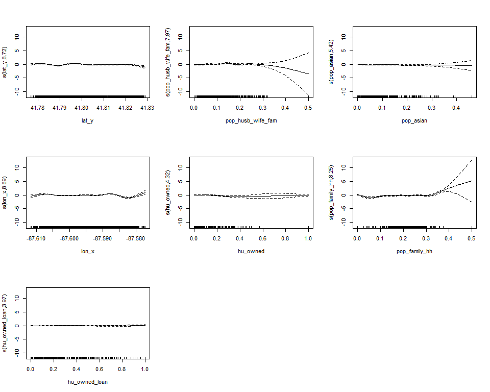
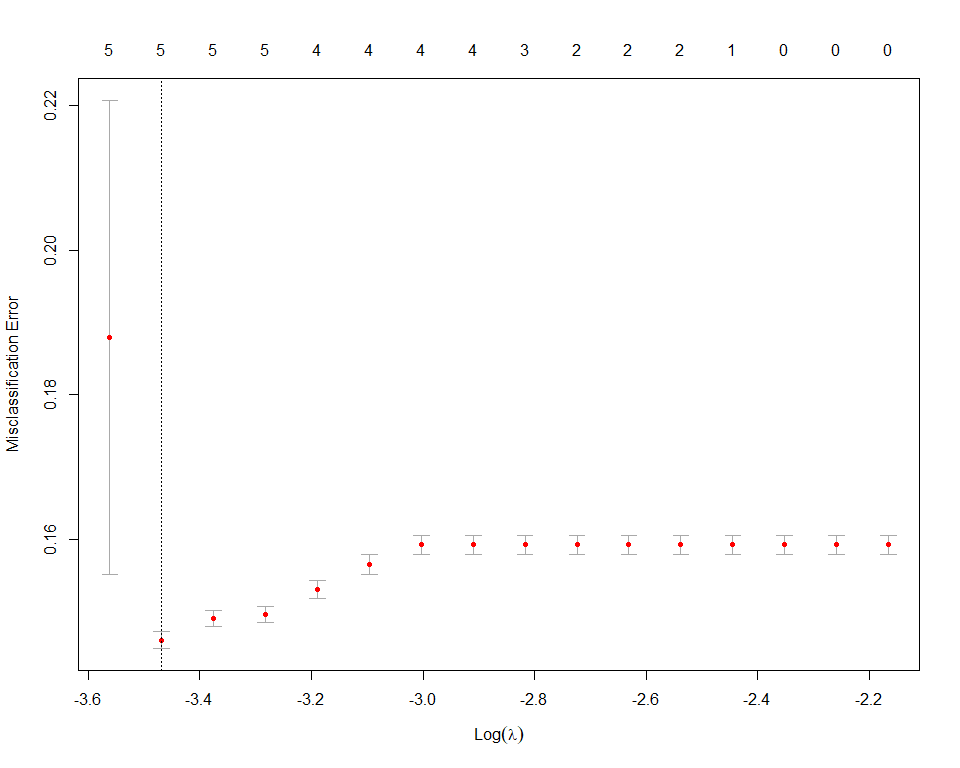
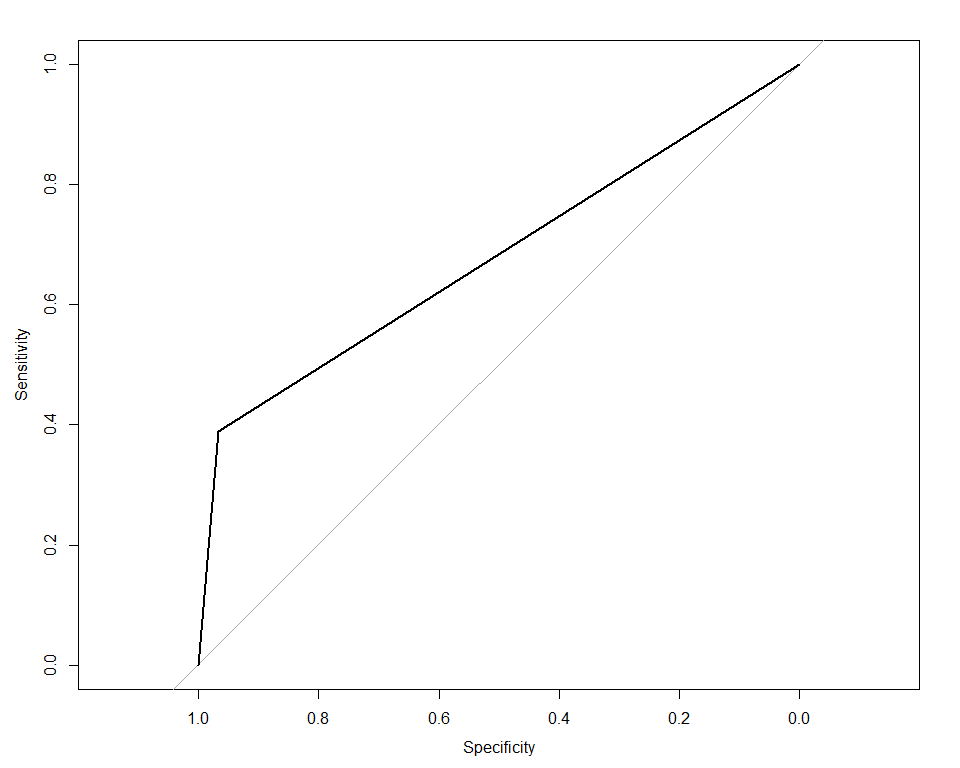
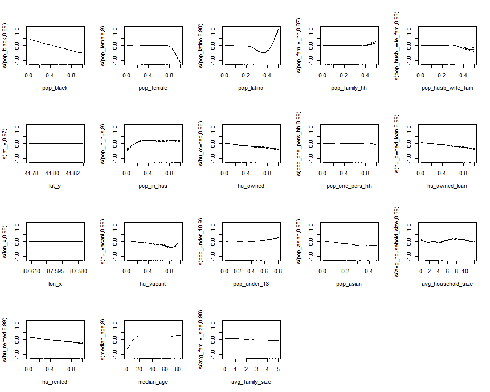
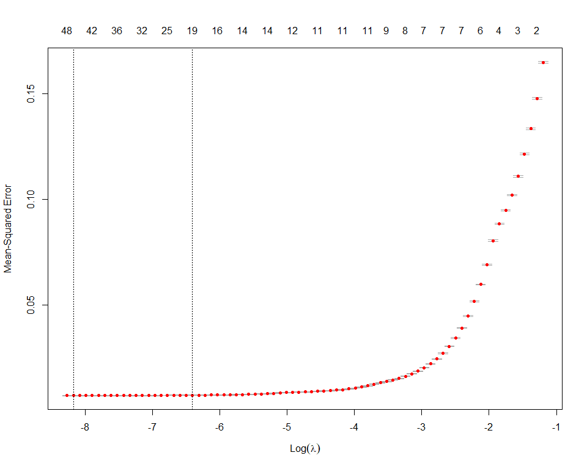

Modeling
================
Adam Shelton
2/19/2020

## Data Preparation

``` r
cont_vars_w_low_vari = function(x, num_unique_cutoff = 10) {
  bad_names = x %>% select_if(is.numeric) %>% summarise_all((function(x) length(unique(x)))) %>% pivot_longer(everything()) %>% arrange(value) %>% filter(value < num_unique_cutoff) %>% .$name
  names(x) %in% bad_names
}

analysis_data = merged_crime_data %>% select(-c(id, case_number, description, block_id, location_description, reporting_dept, pop_male, pop_latino_asian, pop_latino_black, pop_latino_native, pop_latino_other_race, pop_latino_two_plus_races, pop_latino_white, pop_native, pop_other_race, pop_two_plus_races, hu_occupied)) %>% filter(in_ucpd_bound) %>% select(-in_ucpd_bound) %>% na.omit() %>% select_if(!cont_vars_w_low_vari(.))

analysis_data %>% count(responding_dept) %>% kable()
```

| responding\_dept |     n |
| :--------------- | ----: |
| both             |  2083 |
| cpd              | 49589 |
| ucpd             |  7313 |

``` r
partition_data = function(data_set, y, p = 0.75, ...) {
  train_indices = createDataPartition(unlist(data_set[y]), p = p, ...) %>% unlist()
  list("training" = data_set[train_indices, ], "testing" = data_set[-train_indices, ])
}

arrest_data = analysis_data %>% partition_data("arrest")
dept_data = analysis_data %>% partition_data("responding_dept")
ucpd_data = analysis_data %>% filter(responding_dept != "both") %>% mutate(responding_dept = responding_dept == "ucpd") %>% rename("ucpd_respond" = "responding_dept") %>% partition_data("ucpd_respond")
both_alone_data = analysis_data %>% mutate(responding_dept = responding_dept == "both") %>% rename("both_respond" = "responding_dept") %>% partition_data("both_respond")

white_data = analysis_data %>% partition_data("pop_white")
black_data = analysis_data %>% partition_data("pop_black")
asian_data = analysis_data %>% partition_data("pop_asian")
latino_data = analysis_data %>% partition_data("pop_latino")
```

``` r
glmnet_coefs_table = . %>% coef(s = .$lambda.1se) %>% as.matrix() %>% as_tibble(rownames = "var") %>% filter(`1` != 0) %>% mutate(`1` = round(`1`, 3)) %>% rename("Variable" = "var", "Est." = "1")

#type.measure = "auc", family = "binomial"
build_lasso = function(part_data, dep_var, ...) {
  mod_form = as.formula(paste(dep_var, "~", "."))
  tic()
  lasso_mod = part_data$training %>% 
    select(-dep_var) %>% 
    rename_if(is.factor, (function(x) paste0(x, "."))) %>% 
    rename_if(is.logical, (function(x) paste0(x, "."))) %>% 
    bind_cols(select(part_data$training, dep_var)) %>%
    {model.matrix(mod_form, .)} %>% 
    cv.glmnet(unlist(part_data$training[dep_var]), alpha = 1, ...)
  toc()
  lasso_test_roc = NULL
  lasso_test_rmse = NULL
  if (is.logical(unlist(part_data$training[dep_var]))) {
    lasso_test_roc = predict(lasso_mod, part_data$testing %>% {model.matrix(mod_form, .)}, type = "class") %>%
    as.logical() %>% 
    as.numeric() %>%  
    roc(part_data$testing[dep_var] %>% unlist() %>% as.numeric())
  } else {
    lasso_test_rmse = sqrt(mean((predict(lasso_mod, part_data$testing %>% {model.matrix(mod_form, .)}) - part_data$testing[dep_var] %>% unlist() %>% as.numeric())^2))
  }
  
  list("model" = lasso_mod, "coefs" = glmnet_coefs_table(lasso_mod), "roc" = lasso_test_roc, "rmse" = lasso_test_rmse)
}

mn_glmnet_coefs_table = function(obj) {
  coefs = coef(obj)
  out = coefs[[1]] %>% {tibble("Variable" = .@Dimnames[[1]], `1` = rep("", length(Variable)))}
  out$`1`[(coefs[[1]]@i)+1] = coefs[[1]]@x
  for (i in 2:length(coefs)) {
    out[as.character(i+1)] = rep("", nrow(out))
    out[as.character(i+1)][(coefs[[i]]@i+1),] = coefs[[i]]@x
  }
  names(out) = c("Variable", names(coefs))
  out
}

build_boot_lasso_logit = function(data_set, y_var) {
  train_data = data_set$training %>% mutate_all(as.numeric) %>% as.matrix()
  y_index = which(colnames(train_data) == y_var)
  if (y_index == 0) {
    stop("Invalid Y variable name")
  }
  list("model" = bootLasso(train_data[, -y_index], train_data[, y_index], type.boot = "paired", parallel = TRUE, parallel.boot = TRUE, type.measure = "auc", family = "binomial"), "y_index" = y_index, "data" = train_data)
}

boot_lasso_table = function(list_obj, filter = TRUE) {
  obj = list_obj$model
  data_set = list_obj$data
  y_ind = list_obj$y_index
  results = tibble("Variable" = colnames(data_set)[-y_ind], "Est." = obj$Beta) %>% bind_cols(obj$interval %>% t() %>% (function(x) {colnames(x) = c("Lower", "Upper");x}) %>% as_tibble()) %>% arrange(-abs(`Est.`)) 
  if (filter) {
    results = results %>% filter(`Est.` != 0)
  }
  results %>% mutate_if(is.numeric, round, digits = 3) %>% mutate("Non-zero" = !(Lower < 0 & Upper > 0))
}

make_gam_form = function(data_set, y_var) {
  cont_names =  data_set %>% select_if(is.numeric) %>% colnames() %>% .[. != y_var]
  cat_names = names(data_set) %>% .[!(. %in% cont_names)] %>% .[. != y_var]
  cat_names %>% paste0(collapse = " + ") %>% {paste0(y_var, " ~ ", ., " + s(", paste0(cont_names, collapse = ") + s(") , ")")} %>% as.formula()
}

build_gam_lasso_mod = function(lasso_obj, part_data, y_var, n_vars = 10, ...) {
  lasso_selected_vars = lasso_obj$coefs %>% arrange(-abs(`Est.`)) %>% filter(Variable != "(Intercept)") %>% .$Variable %>% str_split("\\.") %>% sapply((function(x) x[1])) %>% unique()
  n_vars = ifelse(n_vars > length(lasso_selected_vars), length(lasso_selected_vars), n_vars)
  tic()
  gam_mod = part_data$training %>% select(y_var, lasso_selected_vars[1:n_vars]) %>% {gam(make_gam_form(., y_var), data= ., ...)}
  toc()
  test_roc = NULL
  test_rmse = NULL
  if (is.logical(unlist(part_data$training[y_var]))) {
    test_roc = predict(gam_mod, part_data$testing %>% select(y_var, lasso_selected_vars[1:n_vars]), type = "response") %>% (function(x) x > 0.5) %>% 
    as.logical() %>% 
    as.numeric() %>% 
    roc(part_data$testing[y_var] %>% unlist() %>% as.numeric())
  } else {
    test_rmse = sqrt(mean((predict(gam_mod, part_data$testing %>% select(y_var, lasso_selected_vars[1:n_vars])) - part_data$testing[y_var] %>% unlist() %>% as.numeric())^2))
  }
  list("model" = gam_mod, "roc" = test_roc, "rmse" = test_rmse)
}
```

## Arrests

### Logistic Lasso

``` r
lasso_arrests_mod = build_lasso(arrest_data, "arrest", type.measure = "auc", family = "binomial")
```

    ## Note: Using an external vector in selections is ambiguous.
    ## i Use `all_of(dep_var)` instead of `dep_var` to silence this message.
    ## i See <https://tidyselect.r-lib.org/reference/faq-external-vector.html>.
    ## This message is displayed once per session.

    ## 48.42 sec elapsed

    ## Setting levels: control = 0, case = 1

    ## Setting direction: controls < cases

``` r
lasso_arrests_mod$coefs %>% arrange(-abs(`Est.`)) %>% kable(caption = "Arrest Model")
```

| Variable                                       |    Est. |
| :--------------------------------------------- | ------: |
| (Intercept)                                    | 108.946 |
| lat\_y                                         | \-4.874 |
| primary\_type.narcotics                        |   4.539 |
| primary\_type.interference with public officer |   4.253 |
| primary\_type.weapons violation                |   2.911 |
| pop\_husb\_wife\_fam                           |   2.617 |
| primary\_type.trespassing                      |   2.297 |
| pop\_asian                                     | \-2.270 |
| primary\_type.public peace violation           |   2.055 |
| primary\_type.homicide                         |   1.730 |
| lon\_x                                         | \-1.083 |
| primary\_type.damage                           | \-0.926 |
| hu\_owned                                      | \-0.896 |
| primary\_type.deceptive practice               | \-0.712 |
| primary\_type.burglary                         | \-0.700 |
| primary\_type.battery                          |   0.613 |
| primary\_type.harassment                       | \-0.526 |
| pop\_family\_hh                                |   0.492 |
| armed.TRUE                                     | \-0.366 |
| primary\_type.theft                            | \-0.345 |
| aggravated.TRUE                                |   0.345 |
| primary\_type.sex crime                        |   0.287 |
| hu\_owned\_loan                                | \-0.272 |
| pop\_one\_pers\_hh                             | \-0.217 |
| primary\_type.assault                          |   0.190 |
| primary\_type.robbery                          | \-0.135 |
| hu\_vacant                                     |   0.112 |
| primary\_type.liquor law violation             |   0.086 |
| month.mar                                      |   0.078 |
| avg\_family\_size                              | \-0.077 |
| responding\_dept.cpd                           |   0.068 |
| responding\_dept.ucpd                          |   0.034 |
| month.nov                                      | \-0.029 |
| day\_of\_week.wed                              |   0.014 |
| hu\_rented                                     | \-0.012 |
| month.jul                                      | \-0.005 |
| time                                           |   0.004 |
| month.may                                      |   0.002 |
| median\_age                                    | \-0.002 |
| domestic.TRUE                                  | \-0.001 |
| total\_pop                                     | \-0.001 |
| date                                           |   0.000 |

Arrest Model

``` r
plot(lasso_arrests_mod$model)
```

<!-- -->

``` r
plot(lasso_arrests_mod$roc)
```

<!-- -->

``` r
auc(lasso_arrests_mod$roc)
```

    ## Area under the curve: 0.8412

``` r
saveRDS(lasso_arrests_mod, here("Modeling", "lasso_arrests_results.rds"))
```

### Logistic GAM

``` r
# tic()
# gam_arrest_mod_car = train(arrest ~ ., data = arrest_data$training %>% mutate(arrest = factor(arrest)) %>% mutate_if(is.factor, make.names), method="gam", metric = "ROC", family = binomial(), tuneLength = 1, trControl = "none")
# toc()

#method = "REML",

gam_arrests_mod = build_gam_lasso_mod(lasso_arrests_mod, arrest_data, "arrest", 10, select = FALSE, family = binomial())
```

    ## Note: Using an external vector in selections is ambiguous.
    ## i Use `all_of(y_var)` instead of `y_var` to silence this message.
    ## i See <https://tidyselect.r-lib.org/reference/faq-external-vector.html>.
    ## This message is displayed once per session.

    ## 200.75 sec elapsed

    ## Setting levels: control = 0, case = 1

    ## Setting direction: controls < cases

``` r
saveRDS(gam_arrests_mod, here("Modeling", "gam_arrests_results.rds"))

summary(gam_arrests_mod$model)
```

    ## 
    ## Family: binomial 
    ## Link function: logit 
    ## 
    ## Formula:
    ## arrest ~ primary_type + armed + aggravated + s(lat_y) + s(pop_husb_wife_fam) + 
    ##     s(pop_asian) + s(lon_x) + s(hu_owned) + s(pop_family_hh) + 
    ##     s(hu_owned_loan)
    ## 
    ## Parametric coefficients:
    ##                                              Estimate Std. Error z value
    ## (Intercept)                                  -2.76245    0.74013  -3.732
    ## primary_typeassault                           0.81642    0.74182   1.101
    ## primary_typebattery                           1.24333    0.74053   1.679
    ## primary_typeburglary                         -0.19302    0.74583  -0.259
    ## primary_typedamage                           -0.44093    0.74397  -0.593
    ## primary_typedeceptive practice               -0.36177    0.74691  -0.484
    ## primary_typeharassment                       -0.61598    0.86912  -0.709
    ## primary_typehomicide                          2.63759    0.78135   3.376
    ## primary_typeinterference with public officer  5.59659    0.94901   5.897
    ## primary_typeliquor law violation              0.82756    0.76641   1.080
    ## primary_typenarcotics                         5.41679    0.74738   7.248
    ## primary_typeother                             0.71087    0.74170   0.958
    ## primary_typepublic peace violation            2.77604    0.74874   3.708
    ## primary_typerobbery                           0.39339    0.74621   0.527
    ## primary_typesex crime                         1.13640    0.75213   1.511
    ## primary_typetheft                             0.21883    0.74085   0.295
    ## primary_typetrespassing                       2.98886    0.74277   4.024
    ## primary_typeweapons violation                 3.62982    0.74866   4.848
    ## armedTRUE                                    -0.52989    0.16240  -3.263
    ## aggravatedTRUE                                0.35367    0.06445   5.487
    ##                                              Pr(>|z|)    
    ## (Intercept)                                  0.000190 ***
    ## primary_typeassault                          0.271083    
    ## primary_typebattery                          0.093156 .  
    ## primary_typeburglary                         0.795793    
    ## primary_typedamage                           0.553403    
    ## primary_typedeceptive practice               0.628128    
    ## primary_typeharassment                       0.478486    
    ## primary_typehomicide                         0.000736 ***
    ## primary_typeinterference with public officer 3.70e-09 ***
    ## primary_typeliquor law violation             0.280239    
    ## primary_typenarcotics                        4.24e-13 ***
    ## primary_typeother                            0.337844    
    ## primary_typepublic peace violation           0.000209 ***
    ## primary_typerobbery                          0.598069    
    ## primary_typesex crime                        0.130815    
    ## primary_typetheft                            0.767704    
    ## primary_typetrespassing                      5.72e-05 ***
    ## primary_typeweapons violation                1.24e-06 ***
    ## armedTRUE                                    0.001103 ** 
    ## aggravatedTRUE                               4.08e-08 ***
    ## ---
    ## Signif. codes:  0 '***' 0.001 '**' 0.01 '*' 0.05 '.' 0.1 ' ' 1
    ## 
    ## Approximate significance of smooth terms:
    ##                        edf Ref.df Chi.sq  p-value    
    ## s(lat_y)             8.716  8.974 153.06  < 2e-16 ***
    ## s(pop_husb_wife_fam) 7.971  8.584  38.19 7.41e-06 ***
    ## s(pop_asian)         5.416  6.495  30.45 6.07e-05 ***
    ## s(lon_x)             8.895  8.996 167.84  < 2e-16 ***
    ## s(hu_owned)          4.318  5.186  16.64  0.00687 ** 
    ## s(pop_family_hh)     8.254  8.644  86.21 4.95e-15 ***
    ## s(hu_owned_loan)     3.965  4.843   4.29  0.48906    
    ## ---
    ## Signif. codes:  0 '***' 0.001 '**' 0.01 '*' 0.05 '.' 0.1 ' ' 1
    ## 
    ## R-sq.(adj) =   0.31   Deviance explained =   28%
    ## UBRE = -0.37241  Scale est. = 1         n = 44239

``` r
plot.gam(gam_arrests_mod$model, pages = 1, rug = TRUE )
```

<!-- -->

``` r
auc(gam_arrests_mod$roc)
```

    ## Area under the curve: 0.8342

``` r
plot(gam_arrests_mod$roc)
```

<!-- -->

## Responding Department

### Multinomial Lasso

``` r
lasso_dept_mod = dept_data$training %>% {model.matrix(responding_dept ~ ., .)} %>% cv.glmnet(dept_data$training$responding_dept, alpha = 1, type.measure = "class", family = "multinomial")
plot(lasso_dept_mod)
```

<!-- -->

``` r
dept_results = mn_glmnet_coefs_table(lasso_dept_mod) %>% filter(!((both == "") & (ucpd == "") & (cpd == "")))
dept_results %>% kable()
```

| Variable                          | both             | cpd                 | ucpd                 |
| :-------------------------------- | :--------------- | :------------------ | :------------------- |
| (Intercept)                       | 556.835120892023 | \-282.989998304404  | \-273.845122587619   |
| primary\_typeliquor law violation |                  |                     | 1.17442520934853     |
| primary\_typeother                |                  | \-0.679435065603688 |                      |
| primary\_typerobbery              | 1.4342165770593  |                     |                      |
| domesticTRUE                      |                  | 0.227748816406105   |                      |
| avg\_family\_size                 |                  |                     | \-0.0550227661935477 |
| pop\_asian                        |                  | \-2.98873522992859  |                      |
| pop\_black                        |                  | 0.323600450070076   |                      |
| pop\_family\_hh                   |                  |                     | \-2.55527900948618   |
| pop\_in\_hus                      |                  |                     | \-0.615019013904869  |
| pop\_white                        |                  | \-0.979655655345919 |                      |
| lon\_x                            |                  |                     | \-9.50725772327916   |
| lat\_y                            |                  | 20.1798723383571    |                      |

``` r
dept_results %>% write_csv(here("Modeling", "dept_results_old.csv"))

class_comp = tibble(actual = dept_data$testing$responding_dept, predict = predict(lasso_dept_mod, dept_data$testing %>% {model.matrix(responding_dept ~ ., .)}, type = "class")) %>% mutate(correct = predict == actual) %>% count(actual, correct) %>% kable()
accuracy = tibble(actual = dept_data$testing$responding_dept, predict = predict(lasso_dept_mod, dept_data$testing %>% {model.matrix(responding_dept ~ ., .)}, type = "class")) %>% mutate(correct = predict == actual) %>% select(correct) %>% unlist() %>% mean()
```

### UCPD vs CPD

#### Logistic Lasso

``` r
lasso_ucpd_mod = build_lasso(ucpd_data, "ucpd_respond", type.measure = "auc", family = "binomial")
```

    ## 83.14 sec elapsed

    ## Setting levels: control = 0, case = 1

    ## Setting direction: controls < cases

``` r
lasso_ucpd_mod$coefs %>% arrange(-abs(`Est.`)) %>% kable(caption = "UCPD Model")
```

| Variable                                       |       Est. |
| :--------------------------------------------- | ---------: |
| (Intercept)                                    | \-3516.966 |
| lon\_x                                         |   \-64.051 |
| lat\_y                                         |   \-50.136 |
| pop\_family\_hh                                |    \-5.161 |
| pop\_asian                                     |      4.019 |
| primary\_type.liquor law violation             |      3.650 |
| primary\_type.harassment                       |      2.132 |
| pop\_white                                     |      1.973 |
| domestic.TRUE                                  |    \-1.593 |
| primary\_type.other                            |      1.536 |
| primary\_type.deceptive practice               |    \-1.056 |
| pop\_black                                     |    \-0.880 |
| primary\_type.assault                          |    \-0.651 |
| primary\_type.public peace violation           |      0.371 |
| pop\_in\_hus                                   |    \-0.359 |
| primary\_type.theft                            |      0.248 |
| pop\_latino                                    |      0.233 |
| primary\_type.battery                          |    \-0.182 |
| primary\_type.sex crime                        |    \-0.172 |
| aggravated.TRUE                                |    \-0.172 |
| pop\_one\_pers\_hh                             |      0.164 |
| hu\_vacant                                     |    \-0.163 |
| primary\_type.narcotics                        |    \-0.077 |
| avg\_household\_size                           |    \-0.054 |
| primary\_type.interference with public officer |    \-0.052 |
| avg\_family\_size                              |    \-0.050 |
| hu\_owned\_loan                                |    \-0.028 |
| month.dec                                      |    \-0.021 |
| arrest.TRUE                                    |    \-0.007 |

UCPD Model

``` r
plot(lasso_ucpd_mod$model)
```

<!-- -->

``` r
plot(lasso_ucpd_mod$roc)
```

<!-- -->

``` r
auc(lasso_ucpd_mod$roc)
```

    ## Area under the curve: 0.8704

``` r
saveRDS(lasso_ucpd_mod, here("Modeling", "lasso_ucpd_results.rds"))
```

#### Logistic GAM

``` r
#method = "REML",

gam_ucpd_mod = build_gam_lasso_mod(lasso_ucpd_mod, ucpd_data, "ucpd_respond", 10, select = FALSE, family = binomial())
```

    ## 289.12 sec elapsed

    ## Setting levels: control = 0, case = 1

    ## Setting direction: controls < cases

``` r
saveRDS(gam_ucpd_mod, here("Modeling", "gam_ucpd_results.rds"))

summary(gam_ucpd_mod$model)
```

    ## 
    ## Family: binomial 
    ## Link function: logit 
    ## 
    ## Formula:
    ## ucpd_respond ~ primary_type + domestic + s(lon_x) + s(lat_y) + 
    ##     s(pop_family_hh) + s(pop_asian) + s(pop_white) + s(pop_black) + 
    ##     s(pop_in_hus) + s(pop_latino)
    ## 
    ## Parametric coefficients:
    ##                                                Estimate Std. Error z value
    ## (Intercept)                                  -4.489e+00  1.170e+00  -3.838
    ## primary_typeassault                          -8.297e-01  1.088e+00  -0.763
    ## primary_typebattery                          -3.462e-02  1.081e+00  -0.032
    ## primary_typeburglary                         -1.227e-01  1.082e+00  -0.113
    ## primary_typedamage                           -1.824e-01  1.080e+00  -0.169
    ## primary_typedeceptive practice               -1.982e+00  1.091e+00  -1.817
    ## primary_typeharassment                        2.586e+00  1.120e+00   2.310
    ## primary_typehomicide                         -7.314e+01  1.048e+07   0.000
    ## primary_typeinterference with public officer  2.806e-01  1.259e+00   0.223
    ## primary_typeliquor law violation              4.750e+00  1.147e+00   4.140
    ## primary_typenarcotics                         5.468e-01  1.085e+00   0.504
    ## primary_typeother                             1.640e+00  1.080e+00   1.519
    ## primary_typepublic peace violation            1.554e+00  1.097e+00   1.417
    ## primary_typerobbery                           4.462e-01  1.083e+00   0.412
    ## primary_typesex crime                        -1.529e+00  1.119e+00  -1.366
    ## primary_typetheft                            -1.249e-01  1.079e+00  -0.116
    ## primary_typetrespassing                       8.498e-02  1.088e+00   0.078
    ## primary_typeweapons violation                 1.006e+00  1.105e+00   0.911
    ## domesticTRUE                                 -2.300e+00  1.438e-01 -15.993
    ##                                              Pr(>|z|)    
    ## (Intercept)                                  0.000124 ***
    ## primary_typeassault                          0.445539    
    ## primary_typebattery                          0.974461    
    ## primary_typeburglary                         0.909665    
    ## primary_typedamage                           0.865916    
    ## primary_typedeceptive practice               0.069204 .  
    ## primary_typeharassment                       0.020905 *  
    ## primary_typehomicide                         0.999994    
    ## primary_typeinterference with public officer 0.823674    
    ## primary_typeliquor law violation             3.47e-05 ***
    ## primary_typenarcotics                        0.614458    
    ## primary_typeother                            0.128738    
    ## primary_typepublic peace violation           0.156535    
    ## primary_typerobbery                          0.680282    
    ## primary_typesex crime                        0.171923    
    ## primary_typetheft                            0.907810    
    ## primary_typetrespassing                      0.937727    
    ## primary_typeweapons violation                0.362542    
    ## domesticTRUE                                  < 2e-16 ***
    ## ---
    ## Signif. codes:  0 '***' 0.001 '**' 0.01 '*' 0.05 '.' 0.1 ' ' 1
    ## 
    ## Approximate significance of smooth terms:
    ##                    edf Ref.df  Chi.sq  p-value    
    ## s(lon_x)         8.533  8.901 1166.76  < 2e-16 ***
    ## s(lat_y)         8.405  8.849 1733.67  < 2e-16 ***
    ## s(pop_family_hh) 8.578  8.939  133.82  < 2e-16 ***
    ## s(pop_asian)     8.507  8.926   77.11 1.91e-12 ***
    ## s(pop_white)     8.878  8.992   57.50 3.05e-09 ***
    ## s(pop_black)     8.779  8.984   93.17  < 2e-16 ***
    ## s(pop_in_hus)    8.855  8.992   92.52 2.80e-16 ***
    ## s(pop_latino)    7.978  8.012   86.77 2.93e-15 ***
    ## ---
    ## Signif. codes:  0 '***' 0.001 '**' 0.01 '*' 0.05 '.' 0.1 ' ' 1
    ## 
    ## R-sq.(adj) =  0.573   Deviance explained = 56.7%
    ## UBRE = -0.66374  Scale est. = 1         n = 42677

``` r
plot.gam(gam_ucpd_mod$model, pages = 1, rug = TRUE )
```

<!-- -->

``` r
auc(gam_ucpd_mod$roc)
```

    ## Area under the curve: 0.8721

``` r
plot(gam_ucpd_mod$roc)
```

<!-- -->

### Both vs Alone

#### Logistic Lasso

``` r
lasso_both_mod = build_lasso(both_alone_data, "both_respond", type.measure = "auc", family = "binomial")
```

    ## 65.61 sec elapsed

    ## Setting levels: control = 0, case = 1

    ## Setting direction: controls < cases

``` r
lasso_both_mod$coefs %>% arrange(-abs(`Est.`)) %>% kable(caption = "Both Model")
```

| Variable                           |     Est. |
| :--------------------------------- | -------: |
| (Intercept)                        | 1233.884 |
| lat\_y                             | \-16.482 |
| lon\_x                             |    6.412 |
| primary\_type.homicide             |    3.996 |
| primary\_type.robbery              |    2.717 |
| domestic.TRUE                      |  \-1.719 |
| primary\_type.burglary             |    1.691 |
| primary\_type.other                |    1.573 |
| pop\_latino                        |    1.556 |
| aggravated.TRUE                    |    1.341 |
| pop\_asian                         |    1.285 |
| primary\_type.deceptive practice   |  \-1.142 |
| pop\_black                         |  \-0.894 |
| hu\_owned                          |    0.846 |
| primary\_type.weapons violation    |    0.845 |
| pop\_white                         |    0.786 |
| primary\_type.liquor law violation |  \-0.668 |
| primary\_type.sex crime            |    0.632 |
| primary\_type.battery              |    0.609 |
| arrest.TRUE                        |  \-0.344 |
| pop\_in\_hus                       |    0.324 |
| hu\_rented                         |    0.300 |
| armed.TRUE                         |    0.291 |
| primary\_type.theft                |  \-0.250 |
| primary\_type.damage               |  \-0.210 |
| month.feb                          |  \-0.129 |
| avg\_family\_size                  |    0.092 |
| hu\_vacant                         |  \-0.084 |
| day\_of\_week.tue                  |    0.082 |
| day\_of\_week.mon                  |  \-0.042 |
| time                               |    0.007 |
| date                               |    0.000 |

Both Model

``` r
plot(lasso_both_mod$model)
```

<!-- -->

``` r
plot(lasso_both_mod$roc)
```

<!-- -->

``` r
auc(lasso_both_mod$roc)
```

    ## Area under the curve: 0.8507

``` r
saveRDS(lasso_both_mod, here("Modeling", "lasso_both_results.rds"))
```

#### Logistic GAM

``` r
#method = "REML",

gam_both_mod = build_gam_lasso_mod(lasso_both_mod, both_alone_data, "both_respond", 10, select = FALSE, family = binomial())
```

    ## 251.42 sec elapsed

    ## Setting levels: control = 0, case = 1

    ## Setting direction: controls < cases

``` r
saveRDS(gam_both_mod, here("Modeling", "gam_both_results.rds"))

summary(gam_both_mod$model)
```

    ## 
    ## Family: binomial 
    ## Link function: logit 
    ## 
    ## Formula:
    ## both_respond ~ primary_type + domestic + aggravated + s(lat_y) + 
    ##     s(lon_x) + s(pop_latino) + s(pop_asian) + s(pop_black) + 
    ##     s(hu_owned) + s(pop_white)
    ## 
    ## Parametric coefficients:
    ##                                                Estimate Std. Error z value
    ## (Intercept)                                  -2.376e+01  9.049e+03  -0.003
    ## primary_typeassault                           1.900e+01  9.049e+03   0.002
    ## primary_typebattery                           1.983e+01  9.049e+03   0.002
    ## primary_typeburglary                          2.051e+01  9.049e+03   0.002
    ## primary_typedamage                            1.838e+01  9.049e+03   0.002
    ## primary_typedeceptive practice                1.630e+01  9.049e+03   0.002
    ## primary_typeharassment                        1.899e+01  9.049e+03   0.002
    ## primary_typehomicide                          2.330e+01  9.049e+03   0.003
    ## primary_typeinterference with public officer -5.127e+01  7.964e+06   0.000
    ## primary_typeliquor law violation             -5.237e+01  4.039e+06   0.000
    ## primary_typenarcotics                         1.689e+01  9.049e+03   0.002
    ## primary_typeother                             2.053e+01  9.049e+03   0.002
    ## primary_typepublic peace violation            1.811e+01  9.049e+03   0.002
    ## primary_typerobbery                           2.181e+01  9.049e+03   0.002
    ## primary_typesex crime                         1.993e+01  9.049e+03   0.002
    ## primary_typetheft                             1.845e+01  9.049e+03   0.002
    ## primary_typetrespassing                       1.894e+01  9.049e+03   0.002
    ## primary_typeweapons violation                 2.039e+01  9.049e+03   0.002
    ## domesticTRUE                                 -2.462e+00  2.432e-01 -10.122
    ## aggravatedTRUE                                1.372e+00  1.029e-01  13.335
    ##                                              Pr(>|z|)    
    ## (Intercept)                                     0.998    
    ## primary_typeassault                             0.998    
    ## primary_typebattery                             0.998    
    ## primary_typeburglary                            0.998    
    ## primary_typedamage                              0.998    
    ## primary_typedeceptive practice                  0.999    
    ## primary_typeharassment                          0.998    
    ## primary_typehomicide                            0.998    
    ## primary_typeinterference with public officer    1.000    
    ## primary_typeliquor law violation                1.000    
    ## primary_typenarcotics                           0.999    
    ## primary_typeother                               0.998    
    ## primary_typepublic peace violation              0.998    
    ## primary_typerobbery                             0.998    
    ## primary_typesex crime                           0.998    
    ## primary_typetheft                               0.998    
    ## primary_typetrespassing                         0.998    
    ## primary_typeweapons violation                   0.998    
    ## domesticTRUE                                   <2e-16 ***
    ## aggravatedTRUE                                 <2e-16 ***
    ## ---
    ## Signif. codes:  0 '***' 0.001 '**' 0.01 '*' 0.05 '.' 0.1 ' ' 1
    ## 
    ## Approximate significance of smooth terms:
    ##                 edf Ref.df  Chi.sq  p-value    
    ## s(lat_y)      6.395  7.418 203.265  < 2e-16 ***
    ## s(lon_x)      8.932  8.997  76.005 9.91e-13 ***
    ## s(pop_latino) 1.001  1.003   1.586 0.207975    
    ## s(pop_asian)  1.001  1.001   0.658 0.417631    
    ## s(pop_black)  1.015  1.030   0.074 0.791385    
    ## s(hu_owned)   7.535  8.140  28.923 0.000410 ***
    ## s(pop_white)  8.313  8.862  28.801 0.000591 ***
    ## ---
    ## Signif. codes:  0 '***' 0.001 '**' 0.01 '*' 0.05 '.' 0.1 ' ' 1
    ## 
    ## R-sq.(adj) =  0.183   Deviance explained = 31.1%
    ## UBRE = -0.78687  Scale est. = 1         n = 44240

``` r
plot.gam(gam_ucpd_mod$model, pages = 1, rug = TRUE )
```

<!-- -->

``` r
auc(gam_both_mod$roc)
```

    ## Area under the curve: 0.6783

``` r
plot(gam_both_mod$roc)
```

<!-- -->

## Race

### White

#### Lasso

``` r
lasso_white_mod = build_lasso(white_data, "pop_white")
```

    ## 2.71 sec elapsed

``` r
lasso_white_mod$coefs %>% arrange(-abs(`Est.`)) %>% kable(caption = "White Model")
```

| Variable                                       |    Est. |
| :--------------------------------------------- | ------: |
| (Intercept)                                    |  20.029 |
| pop\_black                                     | \-0.723 |
| pop\_female                                    |   0.608 |
| pop\_latino                                    |   0.395 |
| pop\_family\_hh                                | \-0.334 |
| pop\_husb\_wife\_fam                           |   0.324 |
| lat\_y                                         | \-0.267 |
| pop\_in\_hus                                   |   0.160 |
| hu\_owned                                      |   0.159 |
| pop\_one\_pers\_hh                             | \-0.130 |
| hu\_owned\_loan                                | \-0.111 |
| lon\_x                                         |   0.093 |
| hu\_vacant                                     |   0.068 |
| pop\_under\_18                                 | \-0.065 |
| pop\_asian                                     | \-0.053 |
| avg\_household\_size                           |   0.040 |
| responding\_dept.ucpd                          |   0.017 |
| responding\_dept.cpd                           | \-0.014 |
| primary\_type.narcotics                        | \-0.011 |
| primary\_type.burglary                         |   0.010 |
| primary\_type.harassment                       |   0.010 |
| hu\_rented                                     |   0.007 |
| median\_age                                    |   0.006 |
| primary\_type.weapons violation                | \-0.005 |
| primary\_type.interference with public officer | \-0.003 |
| primary\_type.trespassing                      |   0.003 |
| avg\_family\_size                              | \-0.003 |
| primary\_type.battery                          | \-0.002 |
| arrest.TRUE                                    | \-0.002 |
| month.aug                                      | \-0.002 |
| primary\_type.damage                           |   0.001 |
| primary\_type.robbery                          | \-0.001 |
| primary\_type.theft                            |   0.001 |
| time                                           |   0.000 |
| month.apr                                      |   0.000 |
| month.oct                                      |   0.000 |
| year                                           |   0.000 |
| total\_housing\_units                          |   0.000 |
| total\_pop                                     |   0.000 |

White Model

``` r
plot(lasso_white_mod$model)
```

<!-- -->

``` r
lasso_white_mod$rmse
```

    ## [1] 0.08752035

``` r
saveRDS(lasso_white_mod, here("Modeling", "lasso_white_results.rds"))
```

#### GAM

``` r
#method = "REML",

gam_white_mod = build_gam_lasso_mod(lasso_white_mod, white_data, "pop_white", 20, select = FALSE)
```

    ## 13.7 sec elapsed

``` r
saveRDS(gam_white_mod, here("Modeling", "gam_white_results.rds"))

summary(gam_white_mod$model)
```

    ## 
    ## Family: gaussian 
    ## Link function: identity 
    ## 
    ## Formula:
    ## pop_white ~ responding_dept + primary_type + s(pop_black) + s(pop_female) + 
    ##     s(pop_latino) + s(pop_family_hh) + s(pop_husb_wife_fam) + 
    ##     s(lat_y) + s(pop_in_hus) + s(hu_owned) + s(pop_one_pers_hh) + 
    ##     s(hu_owned_loan) + s(lon_x) + s(hu_vacant) + s(pop_under_18) + 
    ##     s(pop_asian) + s(avg_household_size) + s(hu_rented) + s(median_age) + 
    ##     s(avg_family_size)
    ## 
    ## Parametric coefficients:
    ##                                                Estimate Std. Error t value
    ## (Intercept)                                   2.040e-01  2.901e-03  70.316
    ## responding_deptcpd                           -9.177e-04  4.292e-04  -2.138
    ## responding_deptucpd                          -1.856e-04  4.955e-04  -0.375
    ## primary_typeassault                          -7.510e-04  2.885e-03  -0.260
    ## primary_typebattery                          -6.991e-04  2.876e-03  -0.243
    ## primary_typeburglary                         -6.535e-04  2.887e-03  -0.226
    ## primary_typedamage                           -3.228e-04  2.879e-03  -0.112
    ## primary_typedeceptive practice               -1.147e-03  2.890e-03  -0.397
    ## primary_typeharassment                       -2.284e-06  3.117e-03  -0.001
    ## primary_typehomicide                         -4.145e-03  3.528e-03  -1.175
    ## primary_typeinterference with public officer -2.259e-03  3.368e-03  -0.671
    ## primary_typeliquor law violation             -4.495e-03  3.021e-03  -1.488
    ## primary_typenarcotics                        -1.685e-03  2.896e-03  -0.582
    ## primary_typeother                            -9.880e-04  2.880e-03  -0.343
    ## primary_typepublic peace violation           -5.754e-04  2.991e-03  -0.192
    ## primary_typerobbery                          -8.927e-04  2.890e-03  -0.309
    ## primary_typesex crime                        -1.747e-03  2.976e-03  -0.587
    ## primary_typetheft                            -4.980e-04  2.874e-03  -0.173
    ## primary_typetrespassing                      -1.339e-03  2.908e-03  -0.460
    ## primary_typeweapons violation                -2.032e-03  2.977e-03  -0.682
    ##                                              Pr(>|t|)    
    ## (Intercept)                                    <2e-16 ***
    ## responding_deptcpd                             0.0325 *  
    ## responding_deptucpd                            0.7080    
    ## primary_typeassault                            0.7946    
    ## primary_typebattery                            0.8080    
    ## primary_typeburglary                           0.8209    
    ## primary_typedamage                             0.9107    
    ## primary_typedeceptive practice                 0.6914    
    ## primary_typeharassment                         0.9994    
    ## primary_typehomicide                           0.2400    
    ## primary_typeinterference with public officer   0.5023    
    ## primary_typeliquor law violation               0.1367    
    ## primary_typenarcotics                          0.5606    
    ## primary_typeother                              0.7316    
    ## primary_typepublic peace violation             0.8474    
    ## primary_typerobbery                            0.7574    
    ## primary_typesex crime                          0.5571    
    ## primary_typetheft                              0.8624    
    ## primary_typetrespassing                        0.6453    
    ## primary_typeweapons violation                  0.4949    
    ## ---
    ## Signif. codes:  0 '***' 0.001 '**' 0.01 '*' 0.05 '.' 0.1 ' ' 1
    ## 
    ## Approximate significance of smooth terms:
    ##                         edf Ref.df        F p-value    
    ## s(pop_black)          8.890  8.995 69256.67  <2e-16 ***
    ## s(pop_female)         9.000  9.000   675.11  <2e-16 ***
    ## s(pop_latino)         8.984  9.000  1583.15  <2e-16 ***
    ## s(pop_family_hh)      8.867  8.981    82.31  <2e-16 ***
    ## s(pop_husb_wife_fam)  8.931  8.991   126.09  <2e-16 ***
    ## s(lat_y)              8.969  9.000   204.81  <2e-16 ***
    ## s(pop_in_hus)         9.000  9.000   167.56  <2e-16 ***
    ## s(hu_owned)           8.977  9.000   144.14  <2e-16 ***
    ## s(pop_one_pers_hh)    8.994  9.000   375.02  <2e-16 ***
    ## s(hu_owned_loan)      8.989  9.000   283.04  <2e-16 ***
    ## s(lon_x)              8.977  9.000   187.84  <2e-16 ***
    ## s(hu_vacant)          8.994  9.000   336.20  <2e-16 ***
    ## s(pop_under_18)       8.999  9.000   494.95  <2e-16 ***
    ## s(pop_asian)          8.954  8.999 13445.90  <2e-16 ***
    ## s(avg_household_size) 8.385  8.740   319.06  <2e-16 ***
    ## s(hu_rented)          8.994  9.000   519.34  <2e-16 ***
    ## s(median_age)         9.000  9.000 27133.68  <2e-16 ***
    ## s(avg_family_size)    8.983  9.000   135.53  <2e-16 ***
    ## ---
    ## Signif. codes:  0 '***' 0.001 '**' 0.01 '*' 0.05 '.' 0.1 ' ' 1
    ## 
    ## R-sq.(adj) =  0.997   Deviance explained = 99.7%
    ## GCV = 0.00023894  Scale est. = 0.00023796  n = 44239

``` r
plot.gam(gam_white_mod$model, pages = 1, rug = TRUE )
```

<!-- -->

``` r
gam_white_mod$rmse
```

    ## [1] 0.01567508

### Black

#### Lasso

``` r
lasso_black_mod = build_lasso(black_data, "pop_black")
```

    ## 2.63 sec elapsed

``` r
lasso_black_mod$coefs %>% arrange(-abs(`Est.`)) %>% kable(caption = "Black Model")
```

| Variable                           |      Est. |
| :--------------------------------- | --------: |
| (Intercept)                        | \-142.651 |
| lon\_x                             |   \-1.629 |
| pop\_husb\_wife\_fam               |   \-0.799 |
| pop\_white                         |   \-0.693 |
| pop\_asian                         |   \-0.690 |
| pop\_female                        |     0.430 |
| pop\_under\_18                     |     0.418 |
| pop\_in\_hus                       |     0.171 |
| pop\_family\_hh                    |     0.051 |
| hu\_vacant                         |     0.041 |
| hu\_rented                         |     0.030 |
| avg\_family\_size                  |     0.029 |
| median\_age                        |     0.008 |
| primary\_type.liquor law violation |     0.007 |
| avg\_household\_size               |     0.004 |
| primary\_type.damage               |     0.002 |
| domestic.TRUE                      |     0.001 |
| primary\_type.robbery              |     0.000 |
| total\_housing\_units              |     0.000 |
| total\_pop                         |     0.000 |

Black Model

``` r
plot(lasso_black_mod$model)
```

<!-- -->

``` r
lasso_black_mod$rmse
```

    ## [1] 0.0866116

``` r
saveRDS(lasso_black_mod, here("Modeling", "lasso_black_results.rds"))
```

#### GAM

``` r
#method = "REML",

gam_black_mod = build_gam_lasso_mod(lasso_black_mod, black_data, "pop_black", 20, select = FALSE)
```

    ## 9.3 sec elapsed

``` r
saveRDS(gam_black_mod, here("Modeling", "gam_black_results.rds"))

summary(gam_black_mod$model)
```

    ## 
    ## Family: gaussian 
    ## Link function: identity 
    ## 
    ## Formula:
    ## pop_black ~ primary_type + domestic + s(lon_x) + s(pop_husb_wife_fam) + 
    ##     s(pop_white) + s(pop_asian) + s(pop_female) + s(pop_under_18) + 
    ##     s(pop_in_hus) + s(pop_family_hh) + s(hu_vacant) + s(hu_rented) + 
    ##     s(avg_family_size) + s(median_age) + s(avg_household_size) + 
    ##     s(total_housing_units) + s(total_pop)
    ## 
    ## Parametric coefficients:
    ##                                                Estimate Std. Error t value
    ## (Intercept)                                   0.4689305  0.0035922 130.541
    ## primary_typeassault                          -0.0032111  0.0036137  -0.889
    ## primary_typebattery                          -0.0030444  0.0036032  -0.845
    ## primary_typeburglary                         -0.0027880  0.0036160  -0.771
    ## primary_typedamage                           -0.0022473  0.0036048  -0.623
    ## primary_typedeceptive practice               -0.0055430  0.0036190  -1.532
    ## primary_typeharassment                       -0.0041995  0.0039444  -1.065
    ## primary_typehomicide                         -0.0102018  0.0044728  -2.281
    ## primary_typeinterference with public officer -0.0036032  0.0043673  -0.825
    ## primary_typeliquor law violation             -0.0067521  0.0037988  -1.777
    ## primary_typenarcotics                        -0.0042134  0.0036284  -1.161
    ## primary_typeother                            -0.0033622  0.0036059  -0.932
    ## primary_typepublic peace violation           -0.0028091  0.0037701  -0.745
    ## primary_typerobbery                          -0.0051363  0.0036179  -1.420
    ## primary_typesex crime                        -0.0038035  0.0037400  -1.017
    ## primary_typetheft                            -0.0033931  0.0035968  -0.943
    ## primary_typetrespassing                      -0.0031192  0.0036476  -0.855
    ## primary_typeweapons violation                -0.0037406  0.0037360  -1.001
    ## domesticTRUE                                 -0.0001598  0.0003420  -0.467
    ##                                              Pr(>|t|)    
    ## (Intercept)                                    <2e-16 ***
    ## primary_typeassault                            0.3742    
    ## primary_typebattery                            0.3982    
    ## primary_typeburglary                           0.4407    
    ## primary_typedamage                             0.5330    
    ## primary_typedeceptive practice                 0.1256    
    ## primary_typeharassment                         0.2870    
    ## primary_typehomicide                           0.0226 *  
    ## primary_typeinterference with public officer   0.4094    
    ## primary_typeliquor law violation               0.0755 .  
    ## primary_typenarcotics                          0.2456    
    ## primary_typeother                              0.3511    
    ## primary_typepublic peace violation             0.4562    
    ## primary_typerobbery                            0.1557    
    ## primary_typesex crime                          0.3092    
    ## primary_typetheft                              0.3455    
    ## primary_typetrespassing                        0.3925    
    ## primary_typeweapons violation                  0.3167    
    ## domesticTRUE                                   0.6403    
    ## ---
    ## Signif. codes:  0 '***' 0.001 '**' 0.01 '*' 0.05 '.' 0.1 ' ' 1
    ## 
    ## Approximate significance of smooth terms:
    ##                          edf Ref.df        F p-value    
    ## s(lon_x)               8.827  8.992   101.36  <2e-16 ***
    ## s(pop_husb_wife_fam)   9.000  9.000    82.09  <2e-16 ***
    ## s(pop_white)           8.988  9.000 68119.88  <2e-16 ***
    ## s(pop_asian)           8.996  9.000  8454.81  <2e-16 ***
    ## s(pop_female)          8.997  9.000   495.02  <2e-16 ***
    ## s(pop_under_18)        8.998  9.000   530.73  <2e-16 ***
    ## s(pop_in_hus)          8.997  9.000   143.01  <2e-16 ***
    ## s(pop_family_hh)       8.998  9.000   169.25  <2e-16 ***
    ## s(hu_vacant)           8.995  9.000   415.44  <2e-16 ***
    ## s(hu_rented)           8.997  9.000   425.61  <2e-16 ***
    ## s(avg_family_size)     8.997  9.000   428.50  <2e-16 ***
    ## s(median_age)          8.996  9.000 41277.14  <2e-16 ***
    ## s(avg_household_size)  8.956  8.999   335.51  <2e-16 ***
    ## s(total_housing_units) 9.000  9.000   203.78  <2e-16 ***
    ## s(total_pop)           8.995  9.000   148.16  <2e-16 ***
    ## ---
    ## Signif. codes:  0 '***' 0.001 '**' 0.01 '*' 0.05 '.' 0.1 ' ' 1
    ## 
    ## R-sq.(adj) =  0.997   Deviance explained = 99.7%
    ## GCV = 0.00042603  Scale est. = 0.00042455  n = 44241

``` r
plot.gam(gam_black_mod$model, pages = 1, rug = TRUE )
```

<!-- -->

``` r
gam_black_mod$rmse
```

    ## [1] 0.02100869

### Asian

#### Lasso

``` r
lasso_asian_mod = build_lasso(asian_data, "pop_asian")
```

    ## 2.83 sec elapsed

``` r
lasso_asian_mod$coefs %>% arrange(-abs(`Est.`)) %>% kable(caption = "Asian Model")
```

| Variable                             |    Est. |
| :----------------------------------- | ------: |
| (Intercept)                          | \-6.525 |
| lat\_y                               | \-0.296 |
| lon\_x                               | \-0.216 |
| pop\_female                          |   0.166 |
| pop\_family\_hh                      | \-0.145 |
| pop\_black                           | \-0.130 |
| pop\_husb\_wife\_fam                 |   0.083 |
| pop\_one\_pers\_hh                   |   0.080 |
| hu\_owned                            |   0.059 |
| hu\_owned\_loan                      |   0.041 |
| pop\_under\_18                       | \-0.034 |
| hu\_rented                           |   0.029 |
| pop\_in\_hus                         |   0.018 |
| primary\_type.liquor law violation   |   0.008 |
| avg\_family\_size                    |   0.008 |
| pop\_latino                          |   0.006 |
| responding\_dept.cpd                 | \-0.004 |
| responding\_dept.ucpd                |   0.004 |
| primary\_type.harassment             |   0.004 |
| arrest.TRUE                          | \-0.003 |
| primary\_type.burglary               |   0.002 |
| attempted.TRUE                       |   0.002 |
| primary\_type.assault                | \-0.001 |
| primary\_type.battery                | \-0.001 |
| primary\_type.damage                 |   0.001 |
| primary\_type.robbery                |   0.001 |
| avg\_household\_size                 | \-0.001 |
| median\_age                          | \-0.001 |
| primary\_type.homicide               |   0.000 |
| primary\_type.other                  |   0.000 |
| primary\_type.public peace violation |   0.000 |
| time                                 |   0.000 |
| weekend.TRUE                         |   0.000 |
| month.mar                            |   0.000 |
| month.oct                            |   0.000 |
| total\_housing\_units                |   0.000 |
| total\_pop                           |   0.000 |

Asian Model

``` r
plot(lasso_asian_mod$model)
```

<!-- -->

``` r
lasso_asian_mod$rmse
```

    ## [1] 0.03820643

``` r
saveRDS(lasso_asian_mod, here("Modeling", "lasso_asian_results.rds"))
```

#### GAM

``` r
#method = "REML",

gam_asian_mod = build_gam_lasso_mod(lasso_asian_mod, asian_data, "pop_asian", 20, select = FALSE)
```

    ## 11.84 sec elapsed

``` r
saveRDS(gam_asian_mod, here("Modeling", "gam_asian_results.rds"))

summary(gam_asian_mod$model)
```

    ## 
    ## Family: gaussian 
    ## Link function: identity 
    ## 
    ## Formula:
    ## pop_asian ~ primary_type + responding_dept + arrest + attempted + 
    ##     s(lat_y) + s(lon_x) + s(pop_female) + s(pop_family_hh) + 
    ##     s(pop_black) + s(pop_husb_wife_fam) + s(pop_one_pers_hh) + 
    ##     s(hu_owned) + s(hu_owned_loan) + s(pop_under_18) + s(hu_rented) + 
    ##     s(pop_in_hus) + s(avg_family_size) + s(pop_latino) + s(avg_household_size) + 
    ##     s(median_age)
    ## 
    ## Parametric coefficients:
    ##                                                Estimate Std. Error t value
    ## (Intercept)                                   0.0401619  0.0049731   8.076
    ## primary_typeassault                           0.0019961  0.0049422   0.404
    ## primary_typebattery                           0.0022786  0.0049253   0.463
    ## primary_typeburglary                          0.0025188  0.0049430   0.510
    ## primary_typedamage                            0.0027235  0.0049302   0.552
    ## primary_typedeceptive practice                0.0046782  0.0049487   0.945
    ## primary_typeharassment                        0.0067167  0.0053551   1.254
    ## primary_typehomicide                          0.0012381  0.0061196   0.202
    ## primary_typeinterference with public officer  0.0066117  0.0060866   1.086
    ## primary_typeliquor law violation              0.0142229  0.0052081   2.731
    ## primary_typenarcotics                         0.0035953  0.0049753   0.723
    ## primary_typeother                             0.0028340  0.0049325   0.575
    ## primary_typepublic peace violation            0.0012493  0.0051579   0.242
    ## primary_typerobbery                           0.0016732  0.0049468   0.338
    ## primary_typesex crime                         0.0032850  0.0051044   0.644
    ## primary_typetheft                             0.0034317  0.0049189   0.698
    ## primary_typetrespassing                       0.0012301  0.0049923   0.246
    ## primary_typeweapons violation                 0.0032719  0.0051371   0.637
    ## responding_deptcpd                           -0.0004202  0.0007793  -0.539
    ## responding_deptucpd                           0.0023594  0.0009024   2.615
    ## arrestTRUE                                   -0.0004245  0.0004427  -0.959
    ## attemptedTRUE                                 0.0006200  0.0011811   0.525
    ##                                              Pr(>|t|)    
    ## (Intercept)                                  6.87e-16 ***
    ## primary_typeassault                           0.68629    
    ## primary_typebattery                           0.64363    
    ## primary_typeburglary                          0.61036    
    ## primary_typedamage                            0.58067    
    ## primary_typedeceptive practice                0.34450    
    ## primary_typeharassment                        0.20975    
    ## primary_typehomicide                          0.83967    
    ## primary_typeinterference with public officer  0.27736    
    ## primary_typeliquor law violation              0.00632 ** 
    ## primary_typenarcotics                         0.46991    
    ## primary_typeother                             0.56559    
    ## primary_typepublic peace violation            0.80862    
    ## primary_typerobbery                           0.73519    
    ## primary_typesex crime                         0.51986    
    ## primary_typetheft                             0.48539    
    ## primary_typetrespassing                       0.80538    
    ## primary_typeweapons violation                 0.52418    
    ## responding_deptcpd                            0.58981    
    ## responding_deptucpd                           0.00893 ** 
    ## arrestTRUE                                    0.33765    
    ## attemptedTRUE                                 0.59965    
    ## ---
    ## Signif. codes:  0 '***' 0.001 '**' 0.01 '*' 0.05 '.' 0.1 ' ' 1
    ## 
    ## Approximate significance of smooth terms:
    ##                         edf Ref.df       F p-value    
    ## s(lat_y)              8.994  9.000  177.53  <2e-16 ***
    ## s(lon_x)              8.979  9.000  131.25  <2e-16 ***
    ## s(pop_female)         9.000  9.000  695.79  <2e-16 ***
    ## s(pop_family_hh)      8.680  8.922  160.50  <2e-16 ***
    ## s(pop_black)          8.999  9.000 1271.19  <2e-16 ***
    ## s(pop_husb_wife_fam)  8.955  8.991  175.79  <2e-16 ***
    ## s(pop_one_pers_hh)    8.988  9.000  253.99  <2e-16 ***
    ## s(hu_owned)           8.829  8.988   74.77  <2e-16 ***
    ## s(hu_owned_loan)      8.996  9.000  241.67  <2e-16 ***
    ## s(pop_under_18)       8.985  9.000  202.79  <2e-16 ***
    ## s(hu_rented)          8.770  8.984  103.59  <2e-16 ***
    ## s(pop_in_hus)         9.000  9.000  274.97  <2e-16 ***
    ## s(avg_family_size)    9.000  9.000  221.56  <2e-16 ***
    ## s(pop_latino)         8.999  9.000  253.29  <2e-16 ***
    ## s(avg_household_size) 8.996  9.000  150.79  <2e-16 ***
    ## s(median_age)         8.994  9.000  428.56  <2e-16 ***
    ## ---
    ## Signif. codes:  0 '***' 0.001 '**' 0.01 '*' 0.05 '.' 0.1 ' ' 1
    ## 
    ## R-sq.(adj) =  0.833   Deviance explained = 83.3%
    ## GCV = 0.00079379  Scale est. = 0.00079083  n = 44239

``` r
plot.gam(gam_asian_mod$model, pages = 1, rug = TRUE )
```

<!-- -->

``` r
gam_asian_mod$rmse
```

    ## [1] 0.02823023

### Latino

#### Lasso

``` r
lasso_latino_mod = build_lasso(latino_data, "pop_latino")
```

    ## 3.56 sec elapsed

``` r
lasso_latino_mod$coefs %>% arrange(-abs(`Est.`)) %>% kable(caption = "Latino Model")
```

| Variable                           |    Est. |
| :--------------------------------- | ------: |
| (Intercept)                        |  37.416 |
| lon\_x                             |   0.477 |
| lat\_y                             |   0.104 |
| pop\_family\_hh                    | \-0.081 |
| pop\_white                         |   0.055 |
| pop\_under\_18                     | \-0.053 |
| pop\_asian                         |   0.039 |
| pop\_one\_pers\_hh                 |   0.039 |
| pop\_in\_hus                       |   0.036 |
| pop\_husb\_wife\_fam               | \-0.035 |
| pop\_female                        |   0.028 |
| hu\_owned\_loan                    |   0.025 |
| hu\_owned                          | \-0.024 |
| avg\_family\_size                  |   0.008 |
| avg\_household\_size               | \-0.005 |
| hu\_vacant                         |   0.005 |
| primary\_type.liquor law violation |   0.003 |
| hu\_rented                         |   0.003 |
| primary\_type.theft                | \-0.001 |
| primary\_type.trespassing          | \-0.001 |
| median\_age                        | \-0.001 |
| date                               |   0.000 |
| armed.TRUE                         |   0.000 |
| total\_housing\_units              |   0.000 |
| total\_pop                         |   0.000 |

Latino Model

``` r
plot(lasso_latino_mod$model)
```

<!-- -->

``` r
lasso_latino_mod$rmse
```

    ## [1] 0.03166213

``` r
saveRDS(lasso_latino_mod, here("Modeling", "lasso_latino_results.rds"))
```

#### GAM

``` r
#method = "REML",

gam_latino_mod = build_gam_lasso_mod(lasso_latino_mod, latino_data, "pop_latino", 20, select = FALSE)
```

    ## 13.23 sec elapsed

``` r
saveRDS(gam_latino_mod, here("Modeling", "gam_latino_results.rds"))

summary(gam_latino_mod$model)
```

    ## 
    ## Family: gaussian 
    ## Link function: identity 
    ## 
    ## Formula:
    ## pop_latino ~ primary_type + date + armed + s(lon_x) + s(lat_y) + 
    ##     s(pop_family_hh) + s(pop_white) + s(pop_under_18) + s(pop_asian) + 
    ##     s(pop_one_pers_hh) + s(pop_in_hus) + s(pop_husb_wife_fam) + 
    ##     s(pop_female) + s(hu_owned_loan) + s(hu_owned) + s(avg_family_size) + 
    ##     s(avg_household_size) + s(hu_vacant) + s(hu_rented) + s(median_age)
    ## 
    ## Parametric coefficients:
    ##                                               Estimate Std. Error t value
    ## (Intercept)                                  1.441e-20  9.898e-23   145.6
    ## primary_typeassault                          8.942e-22  6.142e-24   145.6
    ## primary_typebattery                          2.083e-21  1.431e-23   145.6
    ## primary_typeburglary                         8.174e-22  5.614e-24   145.6
    ## primary_typedamage                           1.494e-21  1.026e-23   145.6
    ## primary_typedeceptive practice               7.522e-22  5.166e-24   145.6
    ## primary_typeharassment                       5.325e-23  3.658e-25   145.6
    ## primary_typehomicide                         1.958e-23  1.345e-25   145.6
    ## primary_typeinterference with public officer 2.422e-23  1.663e-25   145.6
    ## primary_typeliquor law violation             9.780e-23  6.717e-25   145.6
    ## primary_typenarcotics                        5.239e-22  3.598e-24   145.6
    ## primary_typeother                            1.457e-21  1.000e-23   145.6
    ## primary_typepublic peace violation           1.115e-22  7.656e-25   145.6
    ## primary_typerobbery                          7.538e-22  5.178e-24   145.6
    ## primary_typesex crime                        1.336e-22  9.173e-25   145.6
    ## primary_typetheft                            4.705e-21  3.232e-23   145.6
    ## primary_typetrespassing                      3.549e-22  2.438e-24   145.6
    ## primary_typeweapons violation                1.262e-22  8.668e-25   145.6
    ## date                                         2.050e-11  1.408e-13   145.6
    ## armedTRUE                                    3.601e-22  2.474e-24   145.6
    ##                                              Pr(>|t|)    
    ## (Intercept)                                    <2e-16 ***
    ## primary_typeassault                            <2e-16 ***
    ## primary_typebattery                            <2e-16 ***
    ## primary_typeburglary                           <2e-16 ***
    ## primary_typedamage                             <2e-16 ***
    ## primary_typedeceptive practice                 <2e-16 ***
    ## primary_typeharassment                         <2e-16 ***
    ## primary_typehomicide                           <2e-16 ***
    ## primary_typeinterference with public officer   <2e-16 ***
    ## primary_typeliquor law violation               <2e-16 ***
    ## primary_typenarcotics                          <2e-16 ***
    ## primary_typeother                              <2e-16 ***
    ## primary_typepublic peace violation             <2e-16 ***
    ## primary_typerobbery                            <2e-16 ***
    ## primary_typesex crime                          <2e-16 ***
    ## primary_typetheft                              <2e-16 ***
    ## primary_typetrespassing                        <2e-16 ***
    ## primary_typeweapons violation                  <2e-16 ***
    ## date                                           <2e-16 ***
    ## armedTRUE                                      <2e-16 ***
    ## ---
    ## Signif. codes:  0 '***' 0.001 '**' 0.01 '*' 0.05 '.' 0.1 ' ' 1
    ## 
    ## Approximate significance of smooth terms:
    ##                             edf    Ref.df         F p-value    
    ## s(lon_x)              7.269e-24 7.269e-24 2.916e+27  <2e-16 ***
    ## s(lat_y)              5.263e-24 5.263e-24 4.028e+27  <2e-16 ***
    ## s(pop_family_hh)      3.262e-24 3.262e-24 6.498e+27  <2e-16 ***
    ## s(pop_white)          8.259e-24 8.259e-24 2.567e+27  <2e-16 ***
    ## s(pop_under_18)       1.009e-23 1.009e-23 2.101e+27  <2e-16 ***
    ## s(pop_asian)          7.804e-25 7.804e-25 2.716e+28  <2e-16 ***
    ## s(pop_one_pers_hh)    6.462e-25 6.462e-25 3.280e+28  <2e-16 ***
    ## s(pop_in_hus)         6.204e-27 6.204e-27 3.417e+30  <2e-16 ***
    ## s(pop_husb_wife_fam)  1.132e-23 1.132e-23 1.872e+27  <2e-16 ***
    ## s(pop_female)         1.132e-25 1.132e-25 1.872e+29  <2e-16 ***
    ## s(hu_owned_loan)      7.520e-24 7.520e-24 2.819e+27  <2e-16 ***
    ## s(hu_owned)           2.069e-25 2.069e-25 1.025e+29  <2e-16 ***
    ## s(avg_family_size)    1.625e-24 1.625e-24 1.304e+28  <2e-16 ***
    ## s(avg_household_size) 9.519e-25 9.519e-25 2.227e+28  <2e-16 ***
    ## s(hu_vacant)          5.624e-24 5.624e-24 3.769e+27  <2e-16 ***
    ## s(hu_rented)          1.118e-25 1.118e-25 1.896e+29  <2e-16 ***
    ## s(median_age)         3.101e-24 3.101e-24 6.835e+27  <2e-16 ***
    ## ---
    ## Signif. codes:  0 '***' 0.001 '**' 0.01 '*' 0.05 '.' 0.1 ' ' 1
    ## 
    ## Rank: 1/173
    ## R-sq.(adj) =  -0.000216   Deviance explained = -0.0218%
    ## GCV = 0.0017694  Scale est. = 0.0017694  n = 44239

``` r
plot.gam(gam_latino_mod$model, pages = 1, rug = TRUE )
```

<!-- -->

``` r
gam_latino_mod$rmse
```

    ## [1] 0.04289716

``` r
stopCluster(cl)
```
