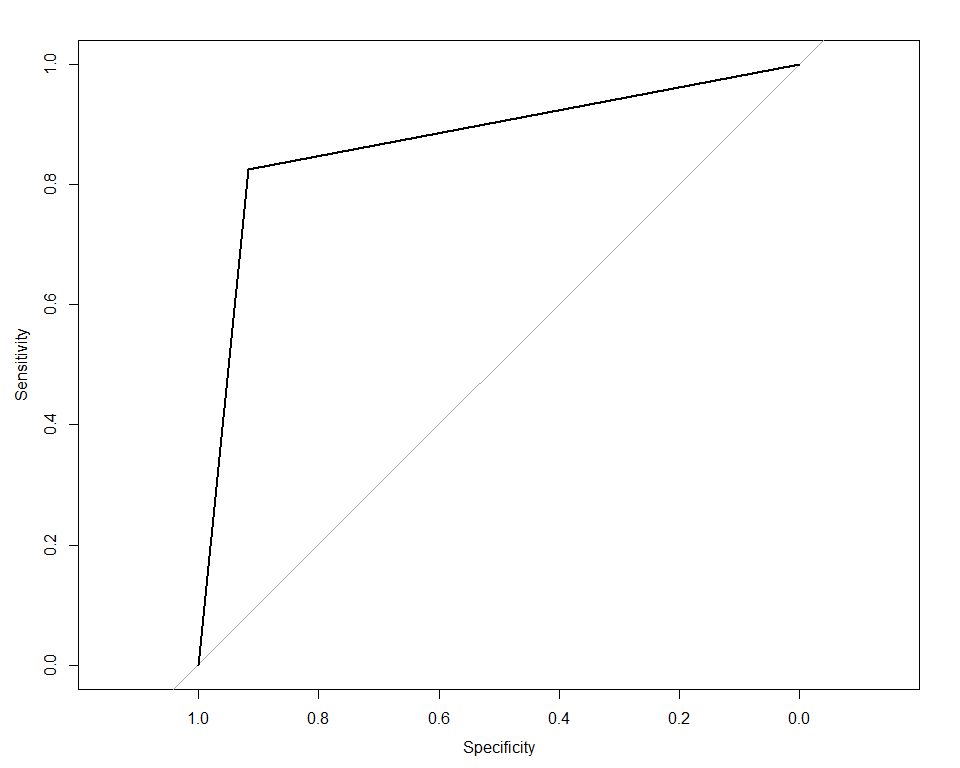
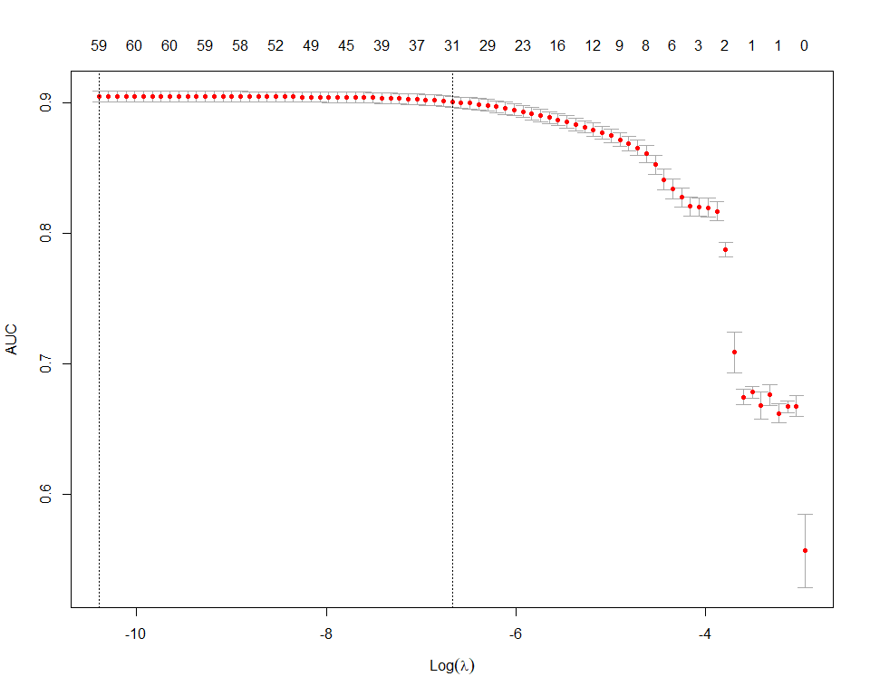

Modeling
================
Adam Shelton
2/19/2020

## Data Preparation

``` r
analysis_data = merged_crime_data %>% select(-c(id, case_number, description, block_id, location_description, reporting_dept)) %>% filter(in_ucpd_bound) %>% select(-in_ucpd_bound) %>% na.omit()

analysis_data %>% count(responding_dept) %>% kable()
```

<table>

<thead>

<tr>

<th style="text-align:left;">

responding\_dept

</th>

<th style="text-align:right;">

n

</th>

</tr>

</thead>

<tbody>

<tr>

<td style="text-align:left;">

both

</td>

<td style="text-align:right;">

2083

</td>

</tr>

<tr>

<td style="text-align:left;">

cpd

</td>

<td style="text-align:right;">

53809

</td>

</tr>

<tr>

<td style="text-align:left;">

ucpd

</td>

<td style="text-align:right;">

7328

</td>

</tr>

</tbody>

</table>

``` r
partition_data = function(data_set, y, p = 0.75, ...) {
  train_indices = createDataPartition(unlist(data_set[y]), p = p, ...) %>% unlist()
  list("training" = data_set[train_indices, ], "testing" = data_set[-train_indices, ])
}

arrest_data = analysis_data %>% partition_data("arrest")
dept_data = analysis_data %>% partition_data("responding_dept")
ucpd_data = analysis_data %>% filter(responding_dept != "both") %>% mutate(responding_dept = responding_dept == "ucpd") %>% rename("ucpd_respond" = "responding_dept") %>% partition_data("ucpd_respond")
both_alone_data = analysis_data %>% mutate(responding_dept = responding_dept == "both") %>% rename("both_respond" = "responding_dept") %>% partition_data("both_respond")
```

## Lasso Regression

``` r
glmnet_coefs_table = . %>% coef(s = .$lambda.1se) %>% as.matrix() %>% as_tibble(rownames = "var") %>% filter(`1` != 0) %>% mutate(`1` = round(`1`, 3)) %>% rename("Variable" = "var", "Est." = "1")

build_lasso_logit = function(part_data, dep_var) {
  mod_form = as.formula(paste(dep_var, "~", "."))
  lasso_mod = part_data$training %>% {model.matrix(mod_form, .)} %>% cv.glmnet(unlist(part_data$training[dep_var]), alpha = 1, type.measure = "auc", family = "binomial")
  lasso_test_roc = predict(lasso_mod, part_data$testing %>% {model.matrix(mod_form, .)}, type = "class") %>% as.logical() %>% as.numeric() %>%  roc(part_data$testing[dep_var] %>% unlist() %>% as.numeric())
  list("model" = lasso_mod, "coefs" = glmnet_coefs_table(lasso_mod), "roc" = lasso_test_roc)
}

mn_glmnet_coefs_table = function(obj) {
  coefs = coef(obj)
  out = coefs[[1]] %>% {tibble("Variable" = .@Dimnames[[1]], `1` = rep("", length(Variable)))}
  out$`1`[(coefs[[1]]@i)+1] = coefs[[1]]@x
  for (i in 2:length(coefs)) {
    out[as.character(i+1)] = rep("", nrow(out))
    out[as.character(i+1)][(coefs[[i]]@i+1),] = coefs[[i]]@x
  }
  names(out) = c("Variable", names(coefs))
  out
}
```

### Arrests

``` r
lasso_arrests_mod = build_lasso_logit(arrest_data, "arrest")
```

    ## Setting levels: control = 0, case = 1

    ## Setting direction: controls < cases

``` r
lasso_arrests_mod$coefs %>% arrange(-abs(`Est.`)) %>% kable(caption = "Arrest Model")
```

<table>

<caption>

Arrest Model

</caption>

<thead>

<tr>

<th style="text-align:left;">

Variable

</th>

<th style="text-align:right;">

Est.

</th>

</tr>

</thead>

<tbody>

<tr>

<td style="text-align:left;">

(Intercept)

</td>

<td style="text-align:right;">

106.491

</td>

</tr>

<tr>

<td style="text-align:left;">

primary\_typenarcotics

</td>

<td style="text-align:right;">

4.590

</td>

</tr>

<tr>

<td style="text-align:left;">

primary\_typeinterference with public officer

</td>

<td style="text-align:right;">

3.463

</td>

</tr>

<tr>

<td style="text-align:left;">

primary\_typeweapons violation

</td>

<td style="text-align:right;">

2.817

</td>

</tr>

<tr>

<td style="text-align:left;">

lat\_y

</td>

<td style="text-align:right;">

\-2.553

</td>

</tr>

<tr>

<td style="text-align:left;">

primary\_typetrespassing

</td>

<td style="text-align:right;">

2.226

</td>

</tr>

<tr>

<td style="text-align:left;">

primary\_typepublic peace violation

</td>

<td style="text-align:right;">

2.084

</td>

</tr>

<tr>

<td style="text-align:left;">

pop\_husb\_wife\_fam

</td>

<td style="text-align:right;">

2.074

</td>

</tr>

<tr>

<td style="text-align:left;">

pop\_asian

</td>

<td style="text-align:right;">

\-1.530

</td>

</tr>

<tr>

<td style="text-align:left;">

primary\_typehomicide

</td>

<td style="text-align:right;">

1.488

</td>

</tr>

<tr>

<td style="text-align:left;">

pop\_two\_plus\_races

</td>

<td style="text-align:right;">

\-1.448

</td>

</tr>

<tr>

<td style="text-align:left;">

primary\_typedamage

</td>

<td style="text-align:right;">

\-0.856

</td>

</tr>

<tr>

<td style="text-align:left;">

hu\_owned

</td>

<td style="text-align:right;">

\-0.757

</td>

</tr>

<tr>

<td style="text-align:left;">

pop\_latino\_other\_race

</td>

<td style="text-align:right;">

0.740

</td>

</tr>

<tr>

<td style="text-align:left;">

pop\_latino\_white

</td>

<td style="text-align:right;">

\-0.729

</td>

</tr>

<tr>

<td style="text-align:left;">

primary\_typeburglary

</td>

<td style="text-align:right;">

\-0.694

</td>

</tr>

<tr>

<td style="text-align:left;">

primary\_typedeceptive practice

</td>

<td style="text-align:right;">

\-0.616

</td>

</tr>

<tr>

<td style="text-align:left;">

primary\_typebattery

</td>

<td style="text-align:right;">

0.609

</td>

</tr>

<tr>

<td style="text-align:left;">

pop\_family\_hh

</td>

<td style="text-align:right;">

0.411

</td>

</tr>

<tr>

<td style="text-align:left;">

primary\_typetheft

</td>

<td style="text-align:right;">

\-0.329

</td>

</tr>

<tr>

<td style="text-align:left;">

hu\_occupied

</td>

<td style="text-align:right;">

\-0.322

</td>

</tr>

<tr>

<td style="text-align:left;">

aggravatedTRUE

</td>

<td style="text-align:right;">

0.282

</td>

</tr>

<tr>

<td style="text-align:left;">

armedTRUE

</td>

<td style="text-align:right;">

\-0.250

</td>

</tr>

<tr>

<td style="text-align:left;">

primary\_typeassault

</td>

<td style="text-align:right;">

0.214

</td>

</tr>

<tr>

<td style="text-align:left;">

primary\_typeharassment

</td>

<td style="text-align:right;">

\-0.192

</td>

</tr>

<tr>

<td style="text-align:left;">

pop\_other\_race

</td>

<td style="text-align:right;">

0.177

</td>

</tr>

<tr>

<td style="text-align:left;">

hu\_owned\_loan

</td>

<td style="text-align:right;">

\-0.142

</td>

</tr>

<tr>

<td style="text-align:left;">

primary\_typerobbery

</td>

<td style="text-align:right;">

\-0.092

</td>

</tr>

<tr>

<td style="text-align:left;">

pop\_one\_pers\_hh

</td>

<td style="text-align:right;">

\-0.089

</td>

</tr>

<tr>

<td style="text-align:left;">

monthmar

</td>

<td style="text-align:right;">

0.062

</td>

</tr>

<tr>

<td style="text-align:left;">

primary\_typesex crime

</td>

<td style="text-align:right;">

0.037

</td>

</tr>

<tr>

<td style="text-align:left;">

pop\_male

</td>

<td style="text-align:right;">

\-0.018

</td>

</tr>

<tr>

<td style="text-align:left;">

time

</td>

<td style="text-align:right;">

0.003

</td>

</tr>

<tr>

<td style="text-align:left;">

date

</td>

<td style="text-align:right;">

0.000

</td>

</tr>

<tr>

<td style="text-align:left;">

total\_pop

</td>

<td style="text-align:right;">

0.000

</td>

</tr>

</tbody>

</table>

``` r
plot(lasso_arrests_mod$model)
```

<!-- -->

``` r
plot(lasso_arrests_mod$roc)
```

<!-- -->

``` r
auc(lasso_arrests_mod$roc)
```

    ## Area under the curve: 0.8538

``` r
saveRDS(lasso_arrests_mod, here("Modeling", "lasso_arrests_results.rds"))
```

### Responding Department

#### Multinomial

``` r
lasso_dept_mod = dept_data$training %>% {model.matrix(responding_dept ~ ., .)} %>% cv.glmnet(dept_data$training$responding_dept, alpha = 1, type.measure = "class", family = "multinomial")
plot(lasso_dept_mod)
```

<!-- -->

``` r
dept_results = mn_glmnet_coefs_table(lasso_dept_mod) %>% filter(!((both == "") & (ucpd == "") & (cpd == "")))
dept_results %>% kable()
```

<table>

<thead>

<tr>

<th style="text-align:left;">

Variable

</th>

<th style="text-align:left;">

both

</th>

<th style="text-align:left;">

cpd

</th>

<th style="text-align:left;">

ucpd

</th>

</tr>

</thead>

<tbody>

<tr>

<td style="text-align:left;">

(Intercept)

</td>

<td style="text-align:left;">

657.819587743414

</td>

<td style="text-align:left;">

\-206.253990835094

</td>

<td style="text-align:left;">

\-451.56559690832

</td>

</tr>

<tr>

<td style="text-align:left;">

primary\_typeliquor law violation

</td>

<td style="text-align:left;">

</td>

<td style="text-align:left;">

</td>

<td style="text-align:left;">

1.339122659418

</td>

</tr>

<tr>

<td style="text-align:left;">

primary\_typeother

</td>

<td style="text-align:left;">

</td>

<td style="text-align:left;">

\-0.793419006916074

</td>

<td style="text-align:left;">

</td>

</tr>

<tr>

<td style="text-align:left;">

primary\_typerobbery

</td>

<td style="text-align:left;">

1.59777155420003

</td>

<td style="text-align:left;">

</td>

<td style="text-align:left;">

</td>

</tr>

<tr>

<td style="text-align:left;">

domesticTRUE

</td>

<td style="text-align:left;">

</td>

<td style="text-align:left;">

0.333032741816903

</td>

<td style="text-align:left;">

</td>

</tr>

<tr>

<td style="text-align:left;">

avg\_family\_size

</td>

<td style="text-align:left;">

</td>

<td style="text-align:left;">

</td>

<td style="text-align:left;">

\-0.0644496178418741

</td>

</tr>

<tr>

<td style="text-align:left;">

pop\_asian

</td>

<td style="text-align:left;">

</td>

<td style="text-align:left;">

\-3.04264350234911

</td>

<td style="text-align:left;">

</td>

</tr>

<tr>

<td style="text-align:left;">

pop\_black

</td>

<td style="text-align:left;">

</td>

<td style="text-align:left;">

0.334681428017972

</td>

<td style="text-align:left;">

</td>

</tr>

<tr>

<td style="text-align:left;">

pop\_family\_hh

</td>

<td style="text-align:left;">

</td>

<td style="text-align:left;">

</td>

<td style="text-align:left;">

\-2.65704403977373

</td>

</tr>

<tr>

<td style="text-align:left;">

pop\_in\_hus

</td>

<td style="text-align:left;">

</td>

<td style="text-align:left;">

</td>

<td style="text-align:left;">

\-0.595858530891377

</td>

</tr>

<tr>

<td style="text-align:left;">

pop\_white

</td>

<td style="text-align:left;">

</td>

<td style="text-align:left;">

\-1.10109451661344

</td>

<td style="text-align:left;">

</td>

</tr>

<tr>

<td style="text-align:left;">

lon\_x

</td>

<td style="text-align:left;">

</td>

<td style="text-align:left;">

</td>

<td style="text-align:left;">

\-12.6893799693881

</td>

</tr>

<tr>

<td style="text-align:left;">

lat\_y

</td>

<td style="text-align:left;">

</td>

<td style="text-align:left;">

20.7635859355577

</td>

<td style="text-align:left;">

</td>

</tr>

</tbody>

</table>

``` r
dept_results %>% write_csv(here("Modeling", "dept_results_old.csv"))

class_comp = tibble(actual = dept_data$testing$responding_dept, predict = predict(lasso_dept_mod, dept_data$testing %>% {model.matrix(responding_dept ~ ., .)}, type = "class")) %>% mutate(correct = predict == actual) %>% count(actual, correct) %>% kable()
accuracy = tibble(actual = dept_data$testing$responding_dept, predict = predict(lasso_dept_mod, dept_data$testing %>% {model.matrix(responding_dept ~ ., .)}, type = "class")) %>% mutate(correct = predict == actual) %>% select(correct) %>% unlist() %>% mean()
```

#### UCPD vs CPD

``` r
lasso_ucpd_mod = build_lasso_logit(ucpd_data, "ucpd_respond")
```

    ## Setting levels: control = 0, case = 1

    ## Setting direction: controls < cases

``` r
lasso_ucpd_mod$coefs %>% arrange(-abs(`Est.`)) %>% kable(caption = "UCPD Model")
```

<table>

<caption>

UCPD Model

</caption>

<thead>

<tr>

<th style="text-align:left;">

Variable

</th>

<th style="text-align:right;">

Est.

</th>

</tr>

</thead>

<tbody>

<tr>

<td style="text-align:left;">

(Intercept)

</td>

<td style="text-align:right;">

\-3833.656

</td>

</tr>

<tr>

<td style="text-align:left;">

lon\_x

</td>

<td style="text-align:right;">

\-69.334

</td>

</tr>

<tr>

<td style="text-align:left;">

lat\_y

</td>

<td style="text-align:right;">

\-53.638

</td>

</tr>

<tr>

<td style="text-align:left;">

pop\_latino\_native

</td>

<td style="text-align:right;">

\-8.166

</td>

</tr>

<tr>

<td style="text-align:left;">

pop\_other\_race

</td>

<td style="text-align:right;">

7.638

</td>

</tr>

<tr>

<td style="text-align:left;">

pop\_family\_hh

</td>

<td style="text-align:right;">

\-4.221

</td>

</tr>

<tr>

<td style="text-align:left;">

pop\_asian

</td>

<td style="text-align:right;">

3.696

</td>

</tr>

<tr>

<td style="text-align:left;">

primary\_typeliquor law violation

</td>

<td style="text-align:right;">

3.586

</td>

</tr>

<tr>

<td style="text-align:left;">

pop\_latino\_two\_plus\_races

</td>

<td style="text-align:right;">

\-3.278

</td>

</tr>

<tr>

<td style="text-align:left;">

primary\_typeharassment

</td>

<td style="text-align:right;">

2.127

</td>

</tr>

<tr>

<td style="text-align:left;">

pop\_white

</td>

<td style="text-align:right;">

1.973

</td>

</tr>

<tr>

<td style="text-align:left;">

domesticTRUE

</td>

<td style="text-align:right;">

\-1.552

</td>

</tr>

<tr>

<td style="text-align:left;">

primary\_typeother

</td>

<td style="text-align:right;">

1.519

</td>

</tr>

<tr>

<td style="text-align:left;">

primary\_typedeceptive practice

</td>

<td style="text-align:right;">

\-1.176

</td>

</tr>

<tr>

<td style="text-align:left;">

pop\_black

</td>

<td style="text-align:right;">

\-1.168

</td>

</tr>

<tr>

<td style="text-align:left;">

pop\_in\_hus

</td>

<td style="text-align:right;">

\-0.654

</td>

</tr>

<tr>

<td style="text-align:left;">

primary\_typeassault

</td>

<td style="text-align:right;">

\-0.634

</td>

</tr>

<tr>

<td style="text-align:left;">

primary\_typesex crime

</td>

<td style="text-align:right;">

\-0.593

</td>

</tr>

<tr>

<td style="text-align:left;">

pop\_one\_pers\_hh

</td>

<td style="text-align:right;">

0.576

</td>

</tr>

<tr>

<td style="text-align:left;">

primary\_typepublic peace violation

</td>

<td style="text-align:right;">

0.422

</td>

</tr>

<tr>

<td style="text-align:left;">

aggravatedTRUE

</td>

<td style="text-align:right;">

\-0.335

</td>

</tr>

<tr>

<td style="text-align:left;">

hu\_vacant

</td>

<td style="text-align:right;">

\-0.308

</td>

</tr>

<tr>

<td style="text-align:left;">

primary\_typebattery

</td>

<td style="text-align:right;">

\-0.271

</td>

</tr>

<tr>

<td style="text-align:left;">

primary\_typetheft

</td>

<td style="text-align:right;">

0.194

</td>

</tr>

<tr>

<td style="text-align:left;">

primary\_typenarcotics

</td>

<td style="text-align:right;">

\-0.142

</td>

</tr>

<tr>

<td style="text-align:left;">

monthnov

</td>

<td style="text-align:right;">

0.115

</td>

</tr>

<tr>

<td style="text-align:left;">

monthjun

</td>

<td style="text-align:right;">

\-0.087

</td>

</tr>

<tr>

<td style="text-align:left;">

arrestTRUE

</td>

<td style="text-align:right;">

\-0.085

</td>

</tr>

<tr>

<td style="text-align:left;">

monthoct

</td>

<td style="text-align:right;">

0.064

</td>

</tr>

<tr>

<td style="text-align:left;">

avg\_family\_size

</td>

<td style="text-align:right;">

\-0.057

</td>

</tr>

<tr>

<td style="text-align:left;">

hu\_owned\_loan

</td>

<td style="text-align:right;">

\-0.049

</td>

</tr>

<tr>

<td style="text-align:left;">

weekendTRUE

</td>

<td style="text-align:right;">

\-0.030

</td>

</tr>

<tr>

<td style="text-align:left;">

monthdec

</td>

<td style="text-align:right;">

\-0.023

</td>

</tr>

<tr>

<td style="text-align:left;">

avg\_household\_size

</td>

<td style="text-align:right;">

\-0.010

</td>

</tr>

<tr>

<td style="text-align:left;">

day\_of\_weektue

</td>

<td style="text-align:right;">

\-0.002

</td>

</tr>

<tr>

<td style="text-align:left;">

date

</td>

<td style="text-align:right;">

0.000

</td>

</tr>

</tbody>

</table>

``` r
plot(lasso_ucpd_mod$model)
```

<!-- -->

``` r
plot(lasso_ucpd_mod$roc)
```

<!-- -->

``` r
auc(lasso_ucpd_mod$roc)
```

    ## Area under the curve: 0.8565

``` r
saveRDS(lasso_ucpd_mod, here("Modeling", "lasso_ucpd_results.rds"))
```

#### Both vs Alone

``` r
lasso_both_mod = build_lasso_logit(both_alone_data, "both_respond")
```

    ## Setting levels: control = 0, case = 1

    ## Setting direction: controls < cases

``` r
lasso_both_mod$coefs %>% arrange(-abs(`Est.`)) %>% kable(caption = "Both Model")
```

<table>

<caption>

Both Model

</caption>

<thead>

<tr>

<th style="text-align:left;">

Variable

</th>

<th style="text-align:right;">

Est.

</th>

</tr>

</thead>

<tbody>

<tr>

<td style="text-align:left;">

(Intercept)

</td>

<td style="text-align:right;">

1076.707

</td>

</tr>

<tr>

<td style="text-align:left;">

lat\_y

</td>

<td style="text-align:right;">

\-19.450

</td>

</tr>

<tr>

<td style="text-align:left;">

pop\_latino\_asian

</td>

<td style="text-align:right;">

13.815

</td>

</tr>

<tr>

<td style="text-align:left;">

pop\_native

</td>

<td style="text-align:right;">

4.784

</td>

</tr>

<tr>

<td style="text-align:left;">

primary\_typehomicide

</td>

<td style="text-align:right;">

4.211

</td>

</tr>

<tr>

<td style="text-align:left;">

lon\_x

</td>

<td style="text-align:right;">

3.203

</td>

</tr>

<tr>

<td style="text-align:left;">

pop\_two\_plus\_races

</td>

<td style="text-align:right;">

2.788

</td>

</tr>

<tr>

<td style="text-align:left;">

primary\_typerobbery

</td>

<td style="text-align:right;">

2.735

</td>

</tr>

<tr>

<td style="text-align:left;">

pop\_other\_race

</td>

<td style="text-align:right;">

2.440

</td>

</tr>

<tr>

<td style="text-align:left;">

primary\_typeburglary

</td>

<td style="text-align:right;">

1.656

</td>

</tr>

<tr>

<td style="text-align:left;">

domesticTRUE

</td>

<td style="text-align:right;">

\-1.564

</td>

</tr>

<tr>

<td style="text-align:left;">

primary\_typeother

</td>

<td style="text-align:right;">

1.509

</td>

</tr>

<tr>

<td style="text-align:left;">

primary\_typeweapons violation

</td>

<td style="text-align:right;">

1.211

</td>

</tr>

<tr>

<td style="text-align:left;">

aggravatedTRUE

</td>

<td style="text-align:right;">

1.190

</td>

</tr>

<tr>

<td style="text-align:left;">

primary\_typedeceptive practice

</td>

<td style="text-align:right;">

\-1.076

</td>

</tr>

<tr>

<td style="text-align:left;">

pop\_asian

</td>

<td style="text-align:right;">

0.928

</td>

</tr>

<tr>

<td style="text-align:left;">

pop\_black

</td>

<td style="text-align:right;">

\-0.801

</td>

</tr>

<tr>

<td style="text-align:left;">

pop\_white

</td>

<td style="text-align:right;">

0.801

</td>

</tr>

<tr>

<td style="text-align:left;">

primary\_typesex crime

</td>

<td style="text-align:right;">

0.765

</td>

</tr>

<tr>

<td style="text-align:left;">

hu\_occupied

</td>

<td style="text-align:right;">

0.710

</td>

</tr>

<tr>

<td style="text-align:left;">

primary\_typeliquor law violation

</td>

<td style="text-align:right;">

\-0.692

</td>

</tr>

<tr>

<td style="text-align:left;">

primary\_typebattery

</td>

<td style="text-align:right;">

0.623

</td>

</tr>

<tr>

<td style="text-align:left;">

pop\_latino\_white

</td>

<td style="text-align:right;">

0.466

</td>

</tr>

<tr>

<td style="text-align:left;">

arrestTRUE

</td>

<td style="text-align:right;">

\-0.373

</td>

</tr>

<tr>

<td style="text-align:left;">

primary\_typedamage

</td>

<td style="text-align:right;">

\-0.364

</td>

</tr>

<tr>

<td style="text-align:left;">

hu\_owned

</td>

<td style="text-align:right;">

0.299

</td>

</tr>

<tr>

<td style="text-align:left;">

armedTRUE

</td>

<td style="text-align:right;">

0.281

</td>

</tr>

<tr>

<td style="text-align:left;">

primary\_typetheft

</td>

<td style="text-align:right;">

\-0.238

</td>

</tr>

<tr>

<td style="text-align:left;">

monthfeb

</td>

<td style="text-align:right;">

\-0.176

</td>

</tr>

<tr>

<td style="text-align:left;">

day\_of\_weekmon

</td>

<td style="text-align:right;">

\-0.060

</td>

</tr>

<tr>

<td style="text-align:left;">

monthoct

</td>

<td style="text-align:right;">

0.028

</td>

</tr>

<tr>

<td style="text-align:left;">

avg\_family\_size

</td>

<td style="text-align:right;">

0.028

</td>

</tr>

<tr>

<td style="text-align:left;">

day\_of\_weeksat

</td>

<td style="text-align:right;">

0.018

</td>

</tr>

<tr>

<td style="text-align:left;">

monthjun

</td>

<td style="text-align:right;">

0.010

</td>

</tr>

<tr>

<td style="text-align:left;">

time

</td>

<td style="text-align:right;">

0.005

</td>

</tr>

<tr>

<td style="text-align:left;">

date

</td>

<td style="text-align:right;">

0.000

</td>

</tr>

</tbody>

</table>

``` r
plot(lasso_both_mod$model)
```

<!-- -->

``` r
plot(lasso_both_mod$roc)
```

<!-- -->

``` r
auc(lasso_both_mod$roc)
```

    ## Area under the curve: 0.8189

``` r
saveRDS(lasso_both_mod, here("Modeling", "lasso_both_results.rds"))
```

## RandomForest

### Arrests

### Responding Department
